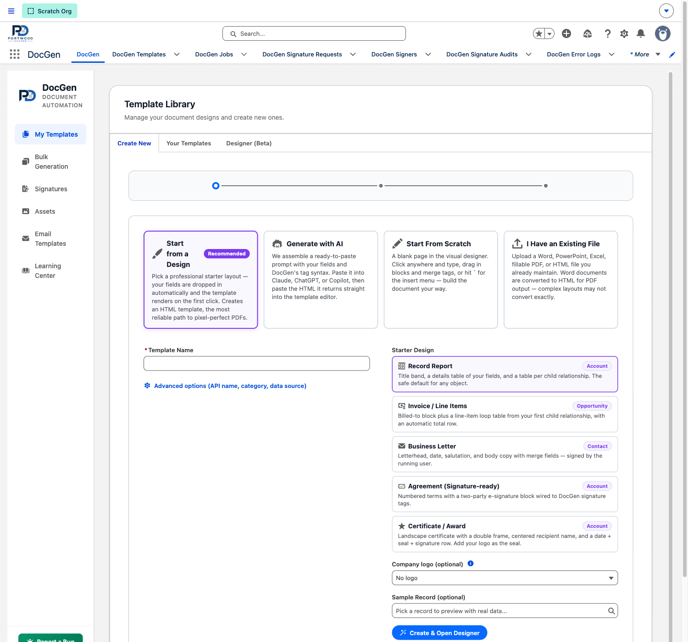
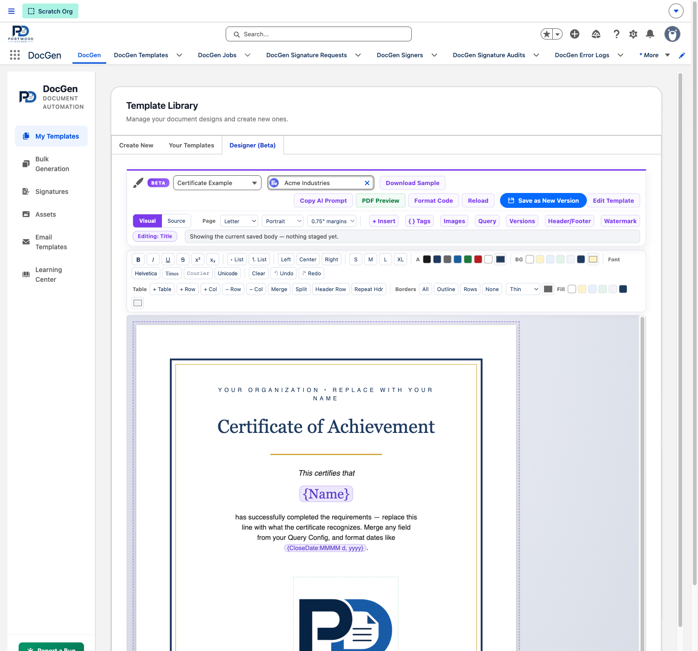
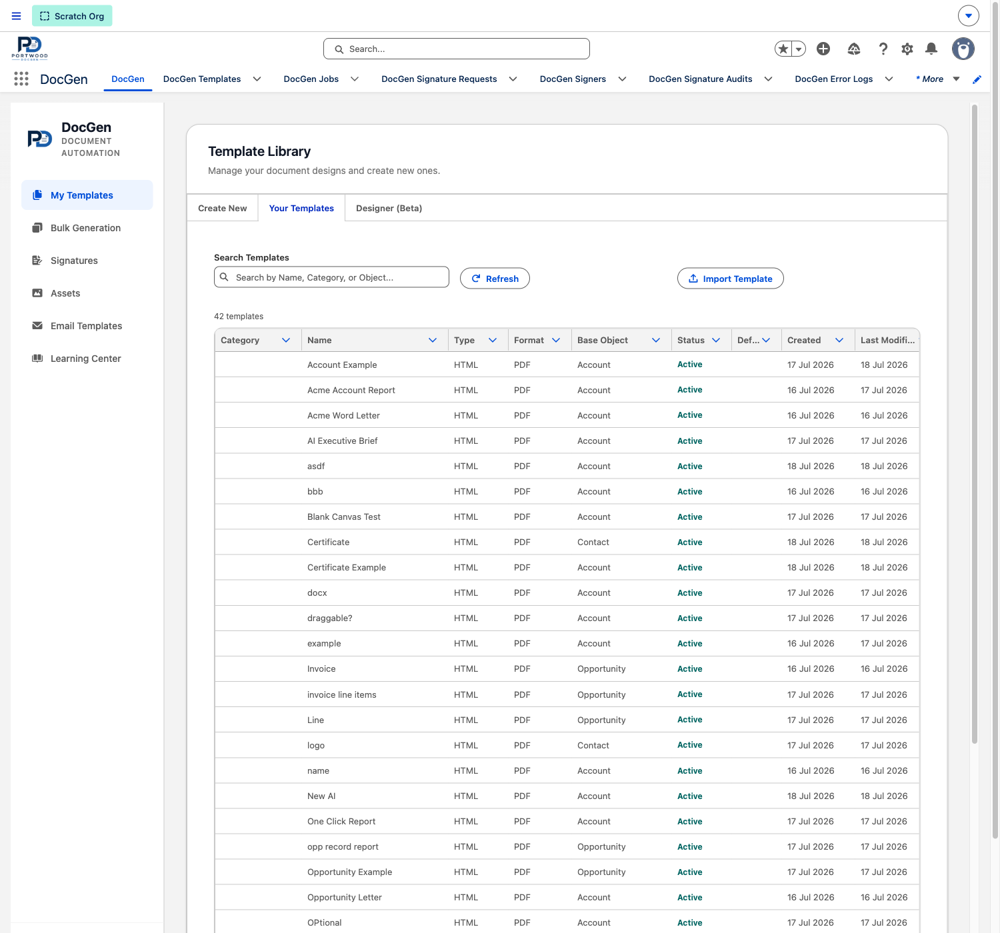
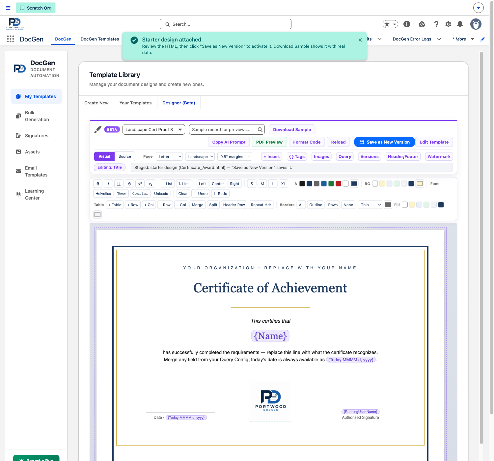

# Portwood DocGen — User Guide

Build polished Word and PDF documents from any Salesforce record. Author your template in Word, Google Docs, or any tool that exports HTML — drop in merge tags, and DocGen renders the rest. Everything runs natively inside your Salesforce org, with the same record sharing and field-level security your users already have.

PowerPoint and Excel templates are also supported as **alpha-stage** formats — see [§2](#2-what-docgen-does) for what to expect.

[Install in Production](https://login.salesforce.com/packaging/installPackage.apexp?p0=04tVx000000nI5RIAU) · [Install in Sandbox](https://test.salesforce.com/packaging/installPackage.apexp?p0=04tVx000000nI5RIAU) · [Support](https://portwood.dev/support) · [Expert Services](https://portwood.dev/services)

---

## Table of contents

1. [Five-minute quick start](#1-five-minute-quick-start) — install → first PDF in five steps
2. [What DocGen does](#2-what-docgen-does)
3. [Install & post-install setup](#3-install--post-install-setup)
4. [Permission sets](#4-permission-sets)
5. [Templates](#5-templates)
6. [Query builder](#6-query-builder) — including [Apex Data Provider (V4)](#66-apex-data-provider-v4--class-backed-templates)
7. [Merge tag reference](#7-merge-tag-reference)
8. [Document generation](#8-document-generation)
9. [Bulk generation](#9-bulk-generation)
10. [E-signatures](#10-e-signatures-v3)
11. [Flow automation cookbook](#11-flow-automation-cookbook)
12. [Apex API reference](#12-apex-api-reference)
13. [Admin & settings](#13-admin--settings)
14. [Limits & known constraints](#14-limits--known-constraints)
15. [Troubleshooting](#15-troubleshooting)

---

## 1. Five-minute quick start

The fastest path from a fresh install to your first generated PDF. Every step takes < 1 minute.

### Step 1 — Install

Pick the install link above for your environment. Production for live orgs, Sandbox for sandboxes/scratch orgs. Click **Install for Admins Only**, accept third-party access, and wait for the green checkmark.

### Step 2 — Assign yourself the admin permission set

1. **Setup → Users → Permission Sets**
2. Click **DocGen Admin** → **Manage Assignments** → **Add Assignments**
3. Check the box next to your user → **Next** → **Assign**

You can now create templates and generate documents.

### Step 3 — Enable the PDF rendering release update

DocGen renders PDFs through Salesforce's Visualforce PDF service, which sits behind a release update. Without this, image-heavy PDFs fail silently.

1. **Setup → Release Updates**
2. Find **"Use the Visualforce PDF Rendering Service for Blob.toPdf() Invocations"**
3. Click **Get Started** → **Enable**

One-time. Applies to the whole org.

If the release update page looks like it might already be enabled but the button is grayed out and says **Enable Test Run**, it is **not enabled** in that org. When the update is active, Salesforce shows **Disable Test Run**. If you cannot enable it yourself, open a Salesforce Support case and ask Salesforce to enable the Visualforce PDF Rendering Service for `Blob.toPdf()` invocations in the affected org. A common symptom is raw CSS appearing at the top of generated PDFs.

### Step 4 — Make your first template

1. **App Launcher → DocGen** (search "DocGen" if it's not pinned). You land on the **Template Library**.
2. On the **Create New** tab, choose how you want to build. **Start from a Design** is the recommended path — pick a professional starter layout and your template renders on the very first click, no file authoring needed:

    
    - **Start from a Design** — a starter gallery (Record Report, Invoice / Line Items, Business Letter, signature-ready Agreement, landscape Certificate / Award). Your object's real merge fields are dropped in automatically.
    - **Generate with AI** — DocGen assembles a ready-to-paste prompt (your fields + the full tag syntax + PDF rendering constraints). Paste it into Claude, ChatGPT, or Copilot, then paste the HTML it returns back into the wizard.
    - **Start From Scratch** — a blank page in the visual designer. Click anywhere and type; hit `` ` `` for the insert menu.
    - **I Have an Existing File** — upload a Word, PowerPoint, Excel, fillable PDF, or HTML file you already maintain.

3. Give it a **Template Name** (e.g. "My First Account Brief"), pick a **Starter Design**, optionally choose a company logo from your Asset Library and a **Sample Record** for live previews, then click **Create & Open Designer**.
4. The **visual designer** opens on your document — a WYSIWYG page where merge fields appear as purple pills, tables resize by dragging cell edges, and the toolbar covers text formatting, tables, borders, images, and page setup. Edit anything (or nothing), then click **Save as New Version** to activate it:

    

5. Click **Download Sample** in the designer toolbar to see the rendered PDF with your sample record's real data — before you ever leave the page.

### Step 5 — Generate

1. Open any Account record.
2. Click the **DocGen Runner** component on the page (placed there automatically by the install). If it's not visible, edit the page in Lightning App Builder and add the **DocGen Runner** component.
3. Pick **My First Account Brief** → click **Generate**.
4. The PDF appears in the record's **Files** related list, and downloads to your browser.

🎉 **You've now done the full lifecycle.** Real templates layer on richer content — child loops for tables (e.g., line items), images, conditional sections, charts, barcodes, e-signatures — all using the same merge-tag patterns. Your growing library lives on the **Your Templates** tab (searchable, sortable, with created/modified dates):



The rest of this guide covers each capability with worked examples.

> **Stuck?** The most common first-time issue is the runner not showing on the page layout. Edit the page → drag in the **DocGen Runner** component → save. If you see "Insufficient privileges," confirm Step 2 — the perm set assignment.

---

## 2. What DocGen does

A native Salesforce document generation engine that turns merge-tag templates into rendered files.

**Build with:**

- **Word (`.docx`)** templates — the most common authoring tool, fully supported.
- **HTML / Google Docs / Notion / ChatGPT** — any HTML source. Fully supported.
- **PowerPoint (`.pptx`)** for slide decks. _Alpha — see note below._
- **Excel (`.xlsx`)** for spreadsheets. _Alpha — see note below._

**Render to:**

- **PDF** — the universal share format (Word and HTML templates → PDF).
- **DOCX** — keep the native format if you'd rather edit in Word.
- **PPTX, XLSX** — output the native format. _Alpha — see note below._

> **PowerPoint and Excel are alpha-stage.** Core merge mechanics work — `{Field}`, parent lookups, basic loops, format suffixes. We're actively investing in these formats and the surface area will keep growing release over release. Until then, expect rough edges (PowerPoint→PDF isn't supported by the Salesforce platform, complex Excel formulas may not survive merging, advanced PPTX layouts are best-effort). For mission-critical decks and spreadsheets today, render to PDF or DOCX. Hit [portwood.dev/support](https://portwood.dev/support) with what you'd like prioritized.

**Pull data from:**

- Any Salesforce record — Account, Opportunity, Case, custom objects, anything
- Multi-level parent lookups (`{Account.Owner.Manager.Email}`)
- Child relationships at any depth (Opportunity → Line Items → Product → Pricebook)
- Many-to-many junctions
- External APIs / computed values via the [Apex Data Provider](#66-apex-data-provider-v4--class-backed-templates)

**Run from:**

- The record page (one-click Generate)
- The Bulk Generation tab (mass runs across thousands of records)
- Salesforce Flow (every major operation has an invocable action)
- Apex (call `DocGenService.generateDocument` from your own classes)
- Public Salesforce Sites (e-signatures with PIN verification, branded emails, audit trail)

**Built for the platform:**

- 100% native — no external services, no API callouts, no third-party data hand-offs
- Honors the running user's record sharing and field-level security automatically
- Handles small and huge datasets through the same Generate button — no async/sync toggle to think about
- Uses platform-native fonts in PDF; DOCX preserves whatever fonts your template already has

---

## 3. Install & post-install setup

### Install the package

```bash
sf package install --package 04tVx000000nI5RIAU --wait 10 --target-org <your-org>
```

Or use the install links at the top of this guide. The install bundles the merge engine, all Lightning components, custom objects, permission sets, and the e-signature Visualforce pages.

### Post-install checklist

1. **Assign the `DocGen_Admin` permission set** to yourself — Setup → Users → Permission Sets → DocGen Admin → Manage Assignments → Add. See [§4](#4-permission-sets) for who needs what.
2. **Add `HTML` and `Excel` to two `Type` picklists** _(one-time, see callout below)_ — required before you can create HTML or Excel templates.
3. **Enable the Visualforce PDF Rendering Service release update** — Setup → Release Updates → "Use the Visualforce PDF Rendering Service for `Blob.toPdf()` Invocations" → Get Started → Enable. Mandatory for PDF output. If the page shows a grayed-out **Enable Test Run** button, the update is still off for that org; open a Salesforce Support case and ask Salesforce to enable it.
4. **Open the DocGen app** from the App Launcher. The Command Hub is your home base for managing templates, running bulk jobs, and configuring signatures.
5. **For e-signatures only** — run through the [signature admin setup](#1012-admin-setup-one-time) before sending the first signature request: Site URL, Org-Wide Email Address, guest permission set on the site's guest user.

> ⚠️ **One-time picklist setup for HTML and Excel templates**
>
> Salesforce 2GP managed packages don't reliably propagate new picklist value-set additions on upgrade — the values defined in the package source can silently fail to install, leaving the runtime picklist behind. If you try to save an HTML (or Excel) template before doing this step, you'll see:
>
> ```
> INVALID_OR_NULL_FOR_RESTRICTED_PICKLIST, Type: bad value for restricted picklist field: HTML: [portwoodglobal__Type__c]
> ```
>
> Add the missing values **on both objects**:
>
> 1. Setup → Object Manager → **DocGen Template** → Fields & Relationships → **Type** → New under "Picklist Values" → add `HTML`, then `Excel`. Save.
> 2. Setup → Object Manager → **DocGen Template Version** _(separate object, similar name)_ → Fields & Relationships → **Type** → New → add `HTML`, then `Excel`. Save.
>
> No data migration needed — existing rows aren't touched. Once both picklists list all four values (Word, PowerPoint, Excel, HTML), the Save flow in the Command Hub works normally for every template type. A future package release will move these picklists to a Global Value Set so this step goes away.

---

## 4. Permission sets

Three permission sets ship with the package. Assign what each user needs.

| Permission set           | Who gets it                                           | What they can do                                                                                                                                                                                                                                  |
| ------------------------ | ----------------------------------------------------- | ------------------------------------------------------------------------------------------------------------------------------------------------------------------------------------------------------------------------------------------------- |
| `DocGen_Admin`           | Template authors, system admins                       | Full CRUD on templates, query configs, signature objects, settings. Can create/edit/delete templates. Can "Sign In Person" bypass for signatures.                                                                                                 |
| `DocGen_User`            | End users generating docs                             | Sees every active template in the picker — no sharing setup needed (v3.29+; audience narrowed by the §5.5 visibility controls). Generate single + bulk documents. Create signature requests. Can't create, edit, or delete templates or settings. |
| `DocGen_Guest_Signature` | The Salesforce Site guest user (for external signers) | Read access to signature requests, signers, and placements. Create access on audit records. Access to the signing pages. Required for external signers without a Salesforce login.                                                                |

### Assigning a permission set

1. **Setup → Users → Permission Sets**
2. Click the permission-set name (e.g., **DocGen Admin**)
3. Click **Manage Assignments → Add Assignments**
4. Check the box next to each user → **Next** → **Assign**

### Assigning DocGen_Guest_Signature to a Site guest user

Salesforce hides guest users behind several clicks. Full path:

1. **Setup → Sites** → click your e-signature site's name.
2. Click **Public Access Settings** — opens the site profile.
3. From the profile, click **View Users**, then select the e-signature site guest user.
4. On the user record, scroll to **Permission Set Assignments** and add **DocGen Guest Signature**.

### Adding custom fields to DocGen objects?

Update all three permission sets in the same change. Missed FLS grants silently break field access for the affected role (signer can't read it, generator can't populate it).

---

## 5. Templates

### 5.1 Creating a template

Open the DocGen app → **My Templates** → the **Create New** tab. The wizard offers four authoring paths:

- **Start from a Design** (recommended) — pick a professional starter (Record Report, Invoice / Line Items, Business Letter, signature-ready Agreement, landscape Certificate / Award). Your object's real merge fields are injected automatically and the template renders on the first click. Starters that need a specific page setup bring it along — the Certificate creates a landscape Letter page with 0.5" margins without you touching anything.
- **Generate with AI** — a six-step flow, top to bottom on one page: build your query in the full visual builder (fields, parent lookups, related lists with filters), pick your images, describe the document in your own words, copy the assembled prompt (it carries DocGen's full tag syntax and the PDF engine's CSS rules), paste it into Claude / ChatGPT / Copilot, then paste the returned HTML back. The prompt updates live as you build. The result opens in the designer.
- **Start From Scratch** — a blank page in the visual designer.
- **I Have an Existing File** — upload **Word** (`.docx`), **HTML** (`.html` / `.htm` / `.zip`), fillable **PDF** (_testing_), **PowerPoint** (`.pptx`, _alpha_), or **Excel** (`.xlsx`, _alpha_) containing `{FieldName}` merge tags.

Every path also asks for:

1. A **Template Name** (and optionally an API Name and Category under Advanced options).
2. A **base object** (Account, Opportunity, Case, any custom object). The picker ranks **standard objects first** — when an org has many namespaced custom objects whose names contain `Account`, `Opportunity`, etc. (common with payment processors and managed packages), the standard `Opportunity` always appears at the top of the list with a green **Standard** pill. Up to 50 matches render with a scroll.
3. The query — which fields, which child relationships (see [§6](#6-query-builder)). On the design/AI paths a field checklist builds it for you.
4. The default **output format** (PDF or the native format).
5. An optional **Sample Record**, so previews and Download Sample show real data.

**Output formats by template type:**

- Word (`.docx`) template → output PDF **or** DOCX (pick one when you save the template)
- HTML (`.html` / `.htm` / `.zip`) template → output PDF only (see [§5.7](#57-html-templates-google-docs-notion-any-html-source))
- PDF (`.pdf`) fillable template → output PDF only (PDF-to-PDF / AcroForm filling is currently in testing)
- PowerPoint (`.pptx`) template → output PPTX only (PowerPoint→PDF is not supported by the Salesforce platform)
- Excel (`.xlsx`) template → output XLSX only

> **One template → one output format.** Templates render in whatever format
> they were saved with — there's no runtime "Output As" picker. To offer the
> same source as both PDF and DOCX, save the template twice (one as PDF, one
> as Native) and let users pick the one they want.

> **Max template file size: 10 MB.** The uploader rejects anything larger with
> a clear toast. Almost every 20+ MB template is uncompressed images — in
> Word, right-click any image → **Compress Pictures → Email (96 ppi)** or
> **Web (150 ppi)** — most templates drop to 1–2 MB with no visible quality
> loss. See [§14.8](#148-template--output-size-guidance) for the full
> breakdown of why this limit exists and what generation flows it affects.

#### Fillable PDF templates (PDF-to-PDF, testing)

DocGen can upload a fillable PDF form, read its AcroForm fields in the browser, and map those fields to Salesforce data. The generated output stays a PDF: DocGen fills the mapped fields server-side so the same template can run for a single record, Generate Sample, Flow/API generation, and bulk generation.

This feature is currently in testing. It is designed for standard AcroForm PDFs. Many government forms work, including forms whose field dictionaries are stored in PDF object streams after the browser prepares a server-ready copy. XFA-only forms and unusual encrypted forms may still need additional support.

For bulk jobs, fillable PDF templates support **Individual Files** mode. Merged PDF / Merge Only modes are not available for fillable PDF templates because those modes combine HTML render snippets, while fillable PDFs are generated by filling the original PDF form directly.

Basic workflow:

1. Create or edit a template with **Type = PDF**.
2. Upload the fillable `.pdf`.
3. After upload, open the **Fillable Fields** tab. DocGen scans the PDF and lists the fields in page/position order.
4. Use **Label / Fillable Field** to add your own human label, such as `Checkbox 3c S-Corp`. The original PDF field name remains visible underneath for troubleshooting.
5. Pick a **Data Path** from the template query, or enter a static/formula-style value where appropriate.
6. For checkboxes/radio buttons (`Btn` fields), map the data path to a boolean-like value and set **Checked Value** to the PDF's on-state value when needed. Common Salesforce values such as `true`, `yes`, `1`, and `checked` are treated as checked.
7. Click **Save as New Version**. DocGen saves the field mapping snapshot and prepares a server-ready PDF body for generation.
8. Later edits to labels, mappings, or checked values can be made directly on the **Fillable Fields** tab with **Save Mapping**.

Important notes while the feature is in testing:

- The mapped field list is based on the PDF structure, not visual text recognition. Use the page, position, and friendly label to make large forms navigable.
- If DocGen says the mapping does not match the active PDF body, save the PDF as a new template version so the mapping and server-ready body are regenerated together.
- Browser-side scanning is used only to understand and normalize the PDF. Actual generation happens server-side, including Generate Sample and bulk generation.
- Fillable fields generally remain fillable/editable in the generated PDF. Flattening output is not the default behavior.

### 5.1.1 API Name — a stable key for automation (v3.28+)

Every template has an optional **API Name** — a unique developer key like `Opp_Close_Summary`. Flows reference it via the **Template API Name** input on the DocGen actions instead of a record Id, so automations survive sandbox→production deploys with nothing to remap. Letters, numbers, and underscores; must start with a letter; must be unique when set; existing templates work fine with it blank.

### 5.1.2 The Visual Designer (Beta)

HTML templates open in a full WYSIWYG designer — the page you see is the page that renders. Merge tags appear as purple pills (loop and section markers in green) that move and delete as single objects, so tag syntax can't be half-mangled while editing.



**Around the canvas:**

- **Toolbar** — Download Sample (rendered PDF with your sample record), Copy AI Prompt, PDF Preview, Format Code, Reload, **Save as New Version** (the one way to activate your edits), and Edit Template (jumps to the settings modal).
- **Page setup** — size, orientation, and margins pickers write a clean `@page` rule into your document. If your HTML declares its own `@page`, the engine defers to it.
- **Panels** — `+ Insert` (blocks, tables, charts, barcodes, special characters — or press `` ` `` anywhere on the page), `{} Tags` (your query's merge fields as clickable chips), Images (the shared Asset Library), Query (edit fields without leaving the designer), Versions, Header/Footer, and Watermark.

**Text formatting:** bold/italic/underline/strike (the buttons read as _pressed_ when your cursor sits on formatted text — click again to unformat), super/subscript, lists, alignment, a **numeric point-size box** with −/+ steppers (any exact 6–96pt value; it reads the size at your cursor), text and highlight colors, font families, Unicode-safe special characters, undo/redo.

**Merge tags style like the text around them (v3.36+).** A `{Name}` pill inside a 24pt serif heading renders in 24pt serif — what you see is what the merged value prints. You can also style a tag directly: click the pill and use the toolbar (bold, italic, underline, strike, color, font, size). The styling serializes as a styled span around the tag and survives save/reopen, so the engine merges the value _inside_ your formatting.

**Tables — Excel-level editing:**

- **Drag any cell edge** to resize columns (the neighbor gives way, so the table keeps its footprint); drag a bottom edge to change row heights. This works on _any_ table — pasted, Word-converted, or hand-written — not just designer-inserted ones.
- **Drag across cells** to select a rectangle (purple outline). Fill colors every selected cell; Merge combines them (and leaves the merged cell selected so Split is one click away).
- Add/remove rows and columns, header rows, repeat-header for multi-page tables.
- **Borders** — All / Outline / Rows / None styles, plus a thickness picker (Hairline to Heavy) and a border color; changing either restyles the table under your cursor live.
- Rows carry `page-break-inside: avoid` automatically, so a PDF page never splits mid-row.

**Images:** assets render as real images on the canvas. Drag the image body to move it anywhere in the text flow (a drop marker tracks your pointer); drag the bottom-right corner to resize (the size is written back into the merge tag); click it and use Left / Center / Right to align it; double-click it to edit the underlying tag (`{%asset:logo:120x}`) by hand. In header/footer HTML you can write `` and DocGen substitutes the image URL; unsized header/footer images are automatically clamped to fit the margin box.

**Query panel:** the designer's Query button opens the full visual query builder (see [§6.4](#64-using-the-visual-builder)) in a wide flyout — walk from the base object into fields, parent lookups, and related lists without leaving the designer. Changes flow straight into the tag palettes.

**The canvas owns the scroll** — the toolbar stays fixed above the page while the document scrolls, Google-Docs style.

**Watermark:** upload a background image on the Watermark panel and pick a **strength** (Light 15% / Medium 30% / Strong 50% / Original). The opacity is baked into the image at upload, so the PDF and the canvas preview match exactly. Requires a saved version first (the file attaches to the version record).

**Right-click** anywhere on the page for a searchable menu of every insert and table action.

Where you'll see it (v3.29+):

- **Create wizard** — the API Name auto-fills from the Template Name as you type (`Opp Close Summary` → `Opp_Close_Summary`). Edit it to take manual control, or clear it to re-sync with the name.
- **Template editor → Settings tab** — shown right under the Template Name, in the Template section.
- **Template record page** — on the DocGen Template layout, next to Name.
- **Cloning** (§5.2.1) gives the copy its own unique API Name automatically; **Export/Import** (§5.2.2) carries the API Name across orgs and only drops it if a template in the target org already claims it.

### 5.2 Template versions

Each save creates a new `DocGen_Template_Version__c` record. Only the version marked **Active** (`Is_Active__c = true`) is used by the runner.

- Older versions are preserved for rollback.
- When you save a new version, DocGen pre-extracts images from the DOCX/PPTX ZIP and caches them as ContentVersions for fast PDF rendering at generation time.
- The XML parts are also pre-cached so PDF generation can skip ZIP decompression at runtime.

**Version-pinned render config (v1.97+).** Editing a template's Output Format / Header HTML / Footer HTML / Document Title Format / Page Size / Page Orientation / Page Margins / Custom Margins used to silently rewrite the rendering of every previously-saved version, because the runner always read live template values. From v1.97 on, those eight fields are snapshotted onto the version at save time, and the render path overlays a non-null snapshot onto the template values. Practical effect: roll back to an older active version and you get the rendering that was authored at the time of that save, not whatever you've since changed the template to. Versions saved before v1.97 have no snapshot — those still fall back to the live template, so upgrading is non-breaking; the first re-save populates the snapshot.

**Changing a template's format (v3.29+).** Switching **Type** (e.g. Word → HTML) requires uploading a new body file in the new format: change the Type, upload the file on the Document tab, and click **Save as New Version** — format and body update together. A details-only save that changes the Type is **blocked with an error**, because the previous-format body and its cached artifacts would keep rendering (that's the stale-output bug fixed in v3.29). Relatedly, if you've uploaded a file but use a details-only save, DocGen warns that the upload isn't included — documents keep generating from the previous file until you Save as New Version.

**Deleting old versions (v1.92+).** Heavy iteration accumulates versions fast — each save creates the version record plus 5–7 ContentVersions (the body file + pre-decomposed XML parts). DocGen Admin → click into the template → **Versions** tab now exposes a **Delete** button next to each non-active version. Confirm the dialog, and the version record _plus_ its body and pre-decomposed files are cascade-deleted in one transaction. The currently active version can't be deleted — activate a different version first if you need to remove the current one.

### 5.2.1 Cloning a template (v3.29+)

**Your Templates → row menu → Clone** copies everything in one click: the template record (all settings, query config, signer inputs, e-signature defaults), the active version and its file, inline images, the watermark, and saved queries. Image extraction and pre-decomposition re-run automatically on the copy, so it's immediately generation-ready.

The copy is deliberately conservative:

- Named "`<original> (Copy)`" and opened in the editor right away so you can rename it.
- Starts **Inactive** and never **Default**, so it stays out of every picker until you flip it on.
- Gets its own unique API Name derived from the new name (the original's key stays untouched).

Use it to iterate safely on a production template — clone, edit the copy, verify with Generate Sample, then activate the copy and deactivate the original.

### 5.2.2 Exporting & importing templates

**Your Templates → row menu → Export** downloads a `.docgen.json` bundle containing the template settings, the active version's file, referenced inline-image assets, the watermark, and saved queries. **Import Template** (button above the list) recreates the whole thing in any org — shepherd image URLs are rewritten to the new org's files automatically, and image extraction/pre-decomposition re-run on arrival.

Notes:

- Only the **active** version travels; version history stays behind.
- The API Name is preserved on import (that's the point of a stable key) unless a template in the target org already uses it, in which case it's left blank.
- v3.29+ bundles include the newer fields (API Name, signer verification defaults, default e-sign email message, signer form-field config). Bundles exported from older versions still import fine — those fields just start blank.

### 5.3 Test record

Set `Test_Record_Id__c` on the template to pin a specific record for preview/validation. Useful during template development — you can always preview against a known-good record without picking it each time.

### 5.4 Output format locking

Check `Lock_Output_Format__c` on the template to prevent users from overriding the output format at runtime. If locked, the runner's "output as PDF/Word" toggle is hidden and any attempt to override via the Flow action or API throws a validation error.

Use this for compliance-sensitive documents where only one format is allowed (e.g., signed contracts must always be PDF).

### 5.5 Template visibility (audience control)

**Active / Inactive (v1.92+).** The simplest visibility control: each template has an **Active** checkbox (defaults to checked on new templates). When unchecked, the template is hidden from the document picker on every record page _while remaining fully editable_ in DocGen Admin. Use this to keep time-locked, seasonal, or work-in-progress templates from cluttering the daily picker without deleting them — the template list view in Admin shows an **Inactive** badge in the Status column so admins can find and re-activate them easily.

Restrict more narrowly which users see a template in their picker:

- **`Required_Permission_Sets__c`** (comma-separated permission-set names): only users with _at least one_ of these permission sets see the template.
- **`Specific_Record_Ids__c`** (comma-separated record IDs): only show the template for these specific records.
- **`Record_Filter__c`** (SOQL `WHERE` clause — for example, `StageName = 'Negotiation/Review' AND Amount > 10000`): dynamically show/hide based on the record's field values.

These can be combined. All three must match for the template to appear.

### 5.6 Template sharing

**v3.29+: no sharing setup needed.** The **DocGen User** permission set now includes read-only _View All_ on templates, so every DocGen user can see all active templates in the picker without manual shares, public groups, or sharing rules. Who should see which template is controlled by the visibility features built for exactly that (§5.5): the **Active** flag, **Required Permission Sets**, **Specific Record Ids**, and **Record Filter**. Write access is unchanged — only admins (DocGen Admin) can create or edit templates, and field-level security is still enforced on the merged data.

On older versions (≤3.28), template records default to Private sharing, so non-owner users saw an empty picker until an admin either shared the templates (manual share, public group, or sharing rule) or set Setup → Sharing Settings → _DocGen Template_ → Default Internal Access = **Public Read Only**. That workaround is no longer necessary after upgrading, but it's harmless to leave in place.

> **If you were relying on record-level sharing to hide templates from specific users:** that no longer restricts the picker. Move those rules onto **Required Permission Sets** (§5.5) — it's deploy-safe, visible on the template itself, and enforced consistently across the runner, bulk runner, signature sender, and Flow. Tip: the permission set doesn't need to grant anything — an empty "shell" permission set works as a pure membership token (create one per audience, list it on the template, assign it to the group).

**Keeping templates truly private (record-level sharing).** The sharing-based gate still exists — the packaged _View All_ is what bypasses it. If your org requires share-controlled template visibility, don't assign the packaged **DocGen User** permission set; clone its grants into your own permission set _without_ View All on DocGen Template. Those users get the pre-v3.29 behavior: sharing rules, manual shares, and role hierarchy govern their picker. Also note Required Permission Sets hides templates from _pickers_, not from the DocGen Templates object tab — a user with View All can still see that template records exist (names, descriptions, query configs). Use the custom-permset approach if template definitions themselves are sensitive.

### 5.7 HTML templates (Google Docs, Notion, any HTML source)

HTML templates let you author in any tool that produces HTML — Google Docs is the flagship workflow — and render to PDF. Every merge tag that works in Word templates works identically: `{Name}`, loops, conditionals, aggregates, images, `{Today}`, `{Now}`, `{%Image:N}`, etc.

**Why use them?** Word templates lock authors into Microsoft Word. HTML templates let content teams design where they already work (Google Docs, Notion, ChatGPT, Apple Pages, any rich-text editor that emits HTML). Same merge engine, much wider authoring surface.

#### 5.7.1 Authoring in Google Docs

1. Design the document in Google Docs. Normal formatting — headings, tables, images, colors, fonts.
2. Add merge tags as plain text: `{Name}`, `{Account.Name}`, `{Amount:currency}`, loops like `{#Contacts}...{/Contacts}`. Full syntax reference in [§7](#7-merge-tag-reference).
3. **File → Download → Web Page (.html, zipped)**. Google Docs produces a `.zip` with your HTML plus an `images/` folder.
4. In the Command Hub, create a template with **Type = HTML** (Output Format is forced to PDF). Upload the `.zip`.
5. DocGen unzips the file in your browser, saves each image as a ContentVersion linked to the template, and rewrites the HTML's `` references to `/sfc/servlet.shepherd/version/download/<cvId>` URLs that `Blob.toPdf` resolves natively.
6. Click **Save as New Version** — the template is live.

**Why unzip in the browser?** Salesforce's default File Upload Security blocks `.zip` uploads. DocGen's LWC reads zip bytes with a pure-JavaScript reader (native `DecompressionStream` + manual central-directory parse, zero dependencies), extracts just the HTML + images, and uploads those via Apex. The zip itself never becomes a ContentVersion, so the org setting never sees it. Bonus: unzipping client-side keeps Apex heap flat regardless of template size.

#### 5.7.2 Other authoring tools

- **Notion / Confluence** — export page as HTML
- **ChatGPT / Claude** — ask for HTML, save to a `.html` file
- **Apple Pages** — File → Export To → HTML
- **Hand-written HTML** — any text editor

For single-file uploads (`.html` / `.htm`), DocGen scans for inline `` URIs — common in Notion / ChatGPT / rich-text paste output — and extracts each to a ContentVersion with the `src` rewritten. `Blob.toPdf` can't decode data URIs directly, so this conversion is what makes those images render.

#### 5.7.3 CSS rules — what works, what doesn't, and an LLM prompt

PDF rendering goes through Salesforce's `Blob.toPdf()`, which is a Flying Saucer engine under the hood. **Flying Saucer is essentially a CSS 2.1 renderer with a small CSS 3 subset.** Modern layout primitives are silently ignored — the page still renders, but your layout collapses to default block flow. The result is a PDF that "looks wrong" without any error message.

This section gives you the rules and a paste-ready prompt for ChatGPT / Claude / Gemini so you can have an LLM produce templates that render correctly the first time.

##### Quick reference

| Use                                      | Don't use                                          | Replacement                                           |
| ---------------------------------------- | -------------------------------------------------- | ----------------------------------------------------- |
| `<table>` for side-by-side layout        | `display: flex`, `display: grid`                   | One `<table>` with one `<tr>`, columns become `<td>`s |
| Solid `background-color`                 | `linear-gradient(...)`, `radial-gradient(...)`     | Pick the dominant color, drop the gradient            |
| `padding`, `margin`                      | `gap` (CSS 3 grid/flex gap)                        | `padding` on cells, `margin` on blocks                |
| Fixed `width`/`height` in `pt`/`in`/`px` | `calc(...)`, CSS variables (`--foo`, `var(--foo)`) | Compute the literal value in your template            |
| `font-size` in `pt`                      | `rem`, `em` based on a non-default root            | Pt is most predictable for print                      |
| `border`, `border-radius` (basic)        | `box-shadow`, `text-shadow`                        | Drop shadows; they're print-noisy anyway              |
| `:nth-child(even)` for zebra striping    | `:has(...)`, `:is(...)`, container queries         | nth-child + nth-of-type are supported                 |
| `<table>`-based two/three-column layouts | `column-count`, `columns`                          | Tables work everywhere                                |
| `text-align`, `vertical-align` on `<td>` | `place-items`, `align-self`                        | Old-school alignment on cells                         |

##### Paste-ready LLM prompt

Copy this verbatim into ChatGPT / Claude / Gemini. Replace the bracketed sections with what you want:

```
Generate a single self-contained HTML file for Salesforce DocGen.

Audience: rendered to PDF by Flying Saucer (CSS 2.1 + small CSS 3 subset). Modern CSS layout features are silently ignored.

HARD RULES — never use these (Flying Saucer drops them):
- display: flex, display: grid, gap
- linear-gradient(...), radial-gradient(...), conic-gradient(...)
- calc(...), CSS variables (--name, var(--name))
- transform, transition, animation, @keyframes
- position: absolute or position: fixed (use @page running elements only)
- box-shadow, text-shadow
- :has(), :is(), :where(), container queries

USE INSTEAD:
- <table> for any side-by-side layout. One <tr>, columns are <td>s with explicit widths.
- Solid background-color (no gradients).
- padding/margin in pt or in. gap is not a thing.
- font-size in pt. Standard fonts: Helvetica, Arial, "Times New Roman", Courier.
- text-align / vertical-align on <td> for alignment.
- Fixed width/height in pt or in.

PAGE SETUP — put a single <style> in <head> with:
  @page { size: 8.5in 11in; margin: 0.6in; }    /* US Letter portrait */
  /* or @page { size: 8.27in 11.69in; margin: 1.5cm; }   for A4 */
  body { font-family: Helvetica, Arial, sans-serif; font-size: 11pt; color: #333; }
Do NOT include @media queries — Flying Saucer ignores them.

DOCGEN MERGE TAGS — use these as plain text:
- Field merge:        {FieldApiName}              e.g. {Name}, {Account.Name}, {Amount}
- Built-ins:          {Today}, {Now}, {RunningUser.Name}, {RunningUser.Email}
- Format suffixes:    {Amount:currency}, {CloseDate:MM/dd/yyyy}, {Quantity:#,##0}
- Loop:               {#RelationshipName} ... {/RelationshipName}
                      e.g. {#OpportunityLineItems} <tr>...</tr> {/OpportunityLineItems}
- Conditional:        {#IF Field = "Value"} ... {:else} ... {/IF}
                      Use double quotes around string literals; numeric needs no quotes.
- Page counters:      {PageNumber}, {TotalPages}   (only inside header/footer fields, not body)

OUTPUT: a single .html file. No external CSS, no <script>, no web fonts, no <link rel="stylesheet">.
Inline everything. The file uploads as one piece.

Now generate a [PURCHASE ORDER / QUOTE / INVOICE / etc.] template for the [Opportunity / Account / Order]
record, with these sections: [list your sections, e.g. header with logo + date, customer info, line items
table, totals, notes, signature]. Use the merge tag syntax above.
```

##### Skeleton template (copy + adapt)

A minimal CSS 2.1-clean starting point. Side-by-side header, two-column "for/from" block, line-item loop, totals, signature row, footer. Drop in your fields and adjust colors/typography:

```html
<!DOCTYPE html>
<html lang="en">
    <head>
        <meta charset="UTF-8" />
        <title>Document</title>
        <style>
            @page {
                size: 8.5in 11in;
                margin: 0.6in;
            }
            body {
                font-family: Helvetica, Arial, sans-serif;
                color: #08163a;
                font-size: 11pt;
            }
            table {
                width: 100%;
                border-collapse: collapse;
            }
            td {
                vertical-align: top;
            }

            .hdr {
                border-bottom: 3px solid #004693;
                padding-bottom: 8px;
            }
            .hdr-logo {
                font-size: 22pt;
                font-weight: bold;
                color: #004693;
            }
            .hdr-meta {
                font-size: 9pt;
                text-align: right;
            }
            .accent-bar {
                height: 4px;
                background-color: #35c6f4;
                margin: 8px 0 18px 0;
            }

            .section-title {
                font-size: 10pt;
                font-weight: bold;
                color: #004693;
                text-transform: uppercase;
                letter-spacing: 1px;
                border-bottom: 1px solid #e6ecf4;
                padding-bottom: 3px;
                margin-bottom: 6px;
            }

            .grid-table td {
                width: 50%;
                padding-right: 18px;
            }
            .grid-table td.r {
                padding-right: 0;
                padding-left: 18px;
            }

            .items th {
                background-color: #004693;
                color: #ffffff;
                font-size: 10pt;
                padding: 6px 8px;
                text-align: left;
            }
            .items th.r,
            .items td.r {
                text-align: right;
            }
            .items td {
                font-size: 10pt;
                padding: 6px 8px;
                border-bottom: 1px solid #edf1f7;
            }

            .totals tr.final td {
                font-size: 13pt;
                font-weight: bold;
                padding-top: 8px;
            }

            .sig-line {
                border-bottom: 1px solid #8899b5;
                height: 30px;
                margin-top: 4px;
            }
            .footer {
                margin-top: 36px;
                border-top: 1px solid #d9e2ef;
                padding-top: 8px;
                font-size: 8pt;
                color: #8899b5;
            }
        </style>
    </head>
    <body>
        <table class="hdr">
            <tr>
                <td>
                    <div class="hdr-logo">{Account.Name}</div>
                </td>
                <td class="hdr-meta">
                    Quote #: {Name}<br />
                    Date: {Today}
                </td>
            </tr>
        </table>
        <div class="accent-bar"></div>

        <table class="grid-table">
            <tr>
                <td>
                    <div class="section-title">Prepared For</div>
                    <strong>{Account.Name}</strong><br />
                    {Account.ShippingAddress}
                </td>
                <td class="r">
                    <div class="section-title">Prepared By</div>
                    {RunningUser.Name}<br />
                    {RunningUser.Email}
                </td>
            </tr>
        </table>

        <div class="section-title" style="margin-top: 18px;">Line Items</div>
        <table class="items">
            <thead>
                <tr>
                    <th>Product</th>
                    <th class="r">Qty</th>
                    <th class="r">Price</th>
                    <th class="r">Total</th>
                </tr>
            </thead>
            <tbody>
                {#OpportunityLineItems}
                <tr>
                    <td>{Product2.Name}</td>
                    <td class="r">{Quantity}</td>
                    <td class="r">{UnitPrice:currency}</td>
                    <td class="r">{TotalPrice:currency}</td>
                </tr>
                {/OpportunityLineItems}
            </tbody>
        </table>

        <table class="totals" style="margin-top: 8px;">
            <tr class="final">
                <td></td>
                <td class="r">Total</td>
                <td class="r">{Amount:currency}</td>
            </tr>
        </table>

        <table style="margin-top: 36px;">
            <tr>
                <td style="width: 50%; padding-right: 24px;">
                    Customer Signature
                    <div class="sig-line">{@Signature_Buyer}</div>
                </td>
                <td style="width: 50%; padding-left: 24px;">
                    Date
                    <div class="sig-line">{@Signature_Buyer:1:Date}</div>
                </td>
            </tr>
        </table>

        <table class="footer">
            <tr>
                <td>{Account.Name} &bull; {Account.BillingCity}, {Account.BillingState}</td>
                <td style="text-align: right;">{Account.Website}</td>
            </tr>
        </table>
    </body>
</html>
```

##### Common conversion patterns

When an LLM (or a designer) hands you a template using modern CSS, here are the mechanical rewrites:

**Flex header → table header**

```html
<!-- BEFORE: ignored by Flying Saucer -->
<div style="display: flex; justify-content: space-between;">
    <div class="logo">ACME</div>
    <div class="meta">Date: {Today}</div>
</div>

<!-- AFTER: works -->
<table style="width: 100%;">
    <tr>
        <td>ACME</td>
        <td style="text-align: right;">Date: {Today}</td>
    </tr>
</table>
```

**Grid columns → table columns**

```html
<!-- BEFORE -->
<div style="display: grid; grid-template-columns: 1fr 1fr; gap: 24px;">
    <div>Left content</div>
    <div>Right content</div>
</div>

<!-- AFTER -->
<table style="width: 100%;">
    <tr>
        <td style="width: 50%; padding-right: 12px;">Left content</td>
        <td style="width: 50%; padding-left: 12px;">Right content</td>
    </tr>
</table>
```

**Gradient → solid color**

```css
/* BEFORE */
.accent-bar {
    background: linear-gradient(to right, #004693, #35c6f4);
}

/* AFTER */
.accent-bar {
    background-color: #35c6f4;
}
```

**`gap` between rows → margin**

```css
/* BEFORE */
.stack {
    display: flex;
    flex-direction: column;
    gap: 12px;
}

/* AFTER */
.stack > * {
    margin-bottom: 12px;
}
```

##### `@page` rules — don't double-declare

Two ways to control the page size, margins, and orientation:

1. **Template fields** — `Page_Size__c`, `Page_Orientation__c`, `Page_Margins__c`, `Custom_Margins__c` on the DocGen Template record. DocGen wraps the template's HTML with an engine `<style>` block declaring `@page` from these fields.
2. **Source CSS** — your HTML's own `<style>` declares `@page { size: ... }`.

Pick one. If both are set, you get **two `<style>` blocks each declaring `@page`**, the cascade is non-deterministic, and dimensions can come out wrong. Recommended: leave the template fields blank when your source HTML already specifies `@page`. If you author in Google Docs (which sometimes injects an `@page` block on export) and then set `Page_Size__c` to "Legal", the conflict will silently produce a Letter document because the source CSS wins.

#### 5.7.4 Header / Footer fields

Two optional fields on a dedicated **Header / Footer** tab in the template edit modal (the tab shows for HTML templates, and the fields apply to **any** template type's PDF output — a Word→PDF template with Header/Footer HTML set gets them too):

- `Header_Html__c` — rendered in the top page margin of every PDF page
- `Footer_Html__c` — rendered in the bottom page margin of every PDF page

Each field has a WYSIWYG rich-text editor with a **Show HTML** / **Show Editor** toggle that flips to a monospace textarea showing the raw HTML (for image widths, inline styles, or any markup the rich editor can't expose). Every merge tag that works in the body works in these fields.

#### 5.7.5 Page numbers

Put `{PageNumber}` and `{TotalPages}` in the Header HTML or Footer HTML field. These compile to Flying Saucer CSS page counters inside the PDF's `@page` margin boxes — "Page 3 of 17" renders correctly on every page automatically.

Example footer HTML:

```html
<div style="text-align:center; font-size:9pt; color:#888;">Page {PageNumber} of {TotalPages}</div>
```

**Flying Saucer limitation:** page counters only resolve inside `@page` rules, not on DOM elements. When a header/footer contains counter tokens, DocGen renders that margin as plain text (no inline images or rich formatting). A header _without_ counters stays rich HTML via CSS running elements. Practical workaround: logo in the header (no counters), page count in the footer (counters only). Both fields can be populated simultaneously.

#### 5.7.6 Images

Three ways to get images into an HTML template:

1. **Google Docs zip** — images inserted in the Google Doc are bundled into the `.zip` and extracted automatically on upload.
2. **Inline data URIs** — `` in the HTML (Notion / ChatGPT / pasted rich text) is scanned on upload; each is saved as its own ContentVersion and the `src` is rewritten.
3. **`{%Image:N}` / `{%FieldName}` merge tags** — same syntax as Word templates. Renders the Nth record-attached image, or a ContentVersion ID stored in a field. Emits `` at merge time.

#### 5.7.7 Loops in tables

Loop auto-expansion works the same as Word. Either pattern produces one repeated row per record:

```html
<table>
    <thead>
        <tr>
            <th>Product</th>
            <th>Amount</th>
        </tr>
    </thead>
    <tbody>
        <!-- Pattern A: loop wraps the row -->
        {#OpportunityLineItems}
        <tr>
            <td>{Product2.Name}</td>
            <td>{TotalPrice:currency}</td>
        </tr>
        {/OpportunityLineItems}

        <!-- Pattern B: loop inside the row (DocGen expands to the <tr>) -->
        <tr>
            {#OpportunityLineItems}
            <td>{Product2.Name}</td>
            {/OpportunityLineItems}
        </tr>
    </tbody>
</table>
```

`<li>` list items auto-expand the same way.

#### 5.7.8 Bulk generation + Giant Query

HTML templates work with every generation path: single-record, bulk (individual PDFs or merged), and Giant Query (60K+ row child relationships via batched rendering). Same 12 MB Queueable heap envelope, same 50,000-row batch ceiling, same Flow action.

> **Giant-query limitation (HTML templates):** outside the giant loop itself — the title block, summary text, headers — only these tag families resolve: plain field/parent tags with format suffixes, `{Today}`/`{Now}`, `{RunningUser.X}`, aggregates, `{#ChartBucket}`, `{%Image:N}`, and `{%asset:…}`. Conditionals (`{#IF}`, `{^…}`), secondary child loops, barcodes, `{%FieldName}` image-field tags, and signature/form-field tags **print as raw text at the parent level** on this path. Keep the parent shell of a 2,000+-row HTML template to the supported tags. Word templates don't have this restriction — their parent content runs the full engine.

#### 5.7.9 Known limitations

- **Barcodes / QR codes** — `{*Field:qr}` / `{*Field:code128}` render in both Word **and** HTML templates (HTML support added in v3.15). They render as crisp CSS in the PDF — no external services.
- **DOCX output** — not applicable. HTML templates are PDF-only.
- **Signatures** — fully supported on HTML templates (as well as Word). `{@Signature_Role:Order:Type}` tags, guided field-to-field signing, draw-or-type, multi-signer, and the Certificate of Completion all work on HTML; HTML is in fact the recommended format for signature templates because the stamp-card layout has the most room to breathe.
- **Page counters + rich header/footer content** — see §5.7.5. Flying Saucer flattens the margin to text when counters are present.

#### 5.7.10 Troubleshooting

- **"Your company doesn't support the following file types: .zip"** — DocGen's LWC extracts the zip client-side and never uploads the zip itself, so this org-level File Upload Security error shouldn't appear in normal use. If you see it, hard-refresh the page (Cmd+Shift+R / Ctrl+Shift+R) to clear any cached LWC bundle.
- **Images show as broken squares in the PDF** — `Blob.toPdf` can only fetch images via relative `/sfc/` URLs; it can't reach arbitrary HTTPS URLs (no session ID). Make sure the image source is in the zip, a data URI in the HTML, a `{%Image:N}` tag, or a `{%FieldName}` pointing at a real ContentVersion.
- **Page numbers appearing without a configured header/footer** — your template's source HTML already has `@page { @bottom-center { content: counter(page) ... } }`. Google Docs' Web Page export sometimes includes this automatically. Either remove the `@page` block from the HTML body before upload, or accept it (many users actually want page numbers).
- **Merge tag shows up literally in the PDF (e.g. the text "{Name}")** — the tag didn't resolve. Check the field name is correct and in your Query Config, and that the WYSIWYG editor didn't HTML-encode the braces (DocGen decodes `&#123;` and `&#125;` automatically, but non-standard editors could still trip this).

### 5.8 Word template authoring tips

Word templates are the most common DocGen authoring path, and 95% of issues come from one of three quirks below. Worth a five-minute read before debugging a "but it looks fine in Word" rendering bug.

#### 5.8.1 Aligning columns across multiple tables — the "phantom width" trap

**Symptom.** Two or three tables that look identical in Word render with subtly different column widths in the PDF. Common variation: the middle columns of tables 2/3 collapse and the right-side columns push outward. Tables that look the same in Word do _not_ render the same.

**Why.** A `.docx` file describes table column widths in two places that must agree:

- `<w:tblGrid>` on each table — the column-grid definition (`<w:gridCol w:w="N"/>` per column, in twips; 1440 twips = 1 inch).
- `<w:tcW>` per `<w:tc>` (table cell) — a per-cell width override.

Word's display engine reconciles disagreements at render time and shows you a clean layout. **Flying Saucer (the Salesforce PDF engine) reads the XML literally** — small numeric differences become visible column-width differences. Common ways the two specs drift apart:

- A column boundary was dragged with the mouse, even briefly. Word may update some `<w:tcW>` values but not the `<w:tblGrid>`.
- AutoFit to Contents was on. Word recalculates column widths from cell content every time the table is touched — and any row with empty/sparse cells will collapse those columns toward minimum width.
- Cells were copy/pasted between tables. The cell brings its own `<w:tcW>` with it, which may not match the destination table's grid.

**Fix — in priority order.**

1. **Click in the table → Table Layout → AutoFit → Fixed Column Width.** This stops Word from recalculating widths on every save. Do this for _every_ table that needs to line up, not just the first one.
2. **Table Properties → Table tab → Preferred width = exact inches (or cm).** Not "Auto", not percentage. A literal measurement.
3. **Select each column → Table Properties → Column tab → Preferred width = exact inches.** Repeat for every column in every table.
4. **Build one table first, copy it to make the others.** After step 1–3 on Table 1, delete Tables 2 and 3 entirely, then paste-copy Table 1 below itself to create them. Edit only the cell _contents_ — never the column boundaries.

**If steps 1–4 don't fix it.** The `.docx` is a ZIP. Unzip it, open `word/document.xml` in a text editor, find each `<w:tbl>` block, and compare the `<w:tblGrid>` and `<w:tcW>` values. They should be byte-for-byte identical across the tables that need to align. If they're not, paste the values from your "good" table over the bad ones. Re-zip with the same compression and rename to `.docx`.

**Architectural alternative.** When in doubt, use **one big table** with borderless divider rows between sections instead of three separate tables. One grid means guaranteed alignment, with no Word arithmetic to fight.

#### 5.8.2 AutoFit settings — what each option does to the PDF

Word's Layout → AutoFit menu has three modes. They behave very differently when rendered to PDF.

| Mode                   | What Word does                                                          | What the PDF renderer sees                                                                                                        |
| ---------------------- | ----------------------------------------------------------------------- | --------------------------------------------------------------------------------------------------------------------------------- |
| **AutoFit Contents**   | Recalculates column widths from cell content on every save.             | Widths read from the recalculated `<w:tcW>` — empty cells collapse, full cells expand. _Avoid for multi-table layouts._           |
| **AutoFit Window**     | Tables expand to the page width, columns scale proportionally.          | Widths are percentages of page width — usually renders correctly _if_ the template doesn't fight with `@page` margins.            |
| **Fixed Column Width** | Locks widths to whatever you set in Table Properties. No recalculation. | Widths read exactly as written — predictable, reproducible. **Recommended for any table that has to line up with anything else.** |

#### 5.8.3 Inspecting a problematic `.docx`

Sometimes you just want to confirm what the XML actually says. A `.docx` is a ZIP file — change the extension to `.zip`, unzip it, and inspect `word/document.xml`. The structure that matters for table issues:

```xml
<w:tbl>
  <w:tblPr> ... </w:tblPr>
  <w:tblGrid>
    <w:gridCol w:w="1440" />   <!-- column 1: 1 inch -->
    <w:gridCol w:w="2880" />   <!-- column 2: 2 inches -->
    ...
  </w:tblGrid>
  <w:tr>
    <w:tc>
      <w:tcPr>
        <w:tcW w:w="1440" w:type="dxa" />   <!-- must match grid col 1 -->
      </w:tcPr>
      ...
    </w:tc>
    ...
  </w:tr>
</w:tbl>
```

For tables to align across the document, the `<w:tblGrid>` blocks of those tables must contain the same `<w:gridCol w:w="N"/>` values in the same order, and every `<w:tcW>` in column N must match `<w:gridCol>` N.

#### 5.8.4 Other Word authoring gotchas worth remembering

- **Track Changes.** Save with Track Changes off and all suggestions accepted/rejected. Tracked changes are stored in `<w:ins>` / `<w:del>` markup and the renderer treats them as live content.
- **Comments.** Same as above — `<w:commentRangeStart/>` markup can leave artifacts.
- **Embedded objects (Excel, drawings).** Native Word handles these; the PDF renderer treats them as static images and the result is hit-or-miss. Replace with screenshots if pixel-perfect output matters.
- **Section breaks with different page sizes.** Each section emits its own `@page` rule. Mixing portrait + landscape sections works in DOCX output but is fragile in PDF output (Flying Saucer applies the first section's page size to the whole document in some configurations).
- **Wingdings / custom symbol fonts.** See §14.2 — Flying Saucer ships with Helvetica, Times, Courier, Arial Unicode MS only. Wingdings checkboxes are auto-translated; other Wingdings glyphs render as empty boxes.
- **Image compression.** A 20MB Word template with uncompressed images will fail upload (10MB cap). Right-click any image → Compress Pictures → Email (96 ppi) or Web (150 ppi). A 20MB template typically drops to 1–2 MB with no visible quality loss.

---

## 6. Query builder

DocGen supports three query config formats. All three work — pick based on complexity.

### 6.1 V1 — Legacy flat string

Plain SOQL-like string. Single child relationship only.

```
Name, Industry, (SELECT FirstName, LastName FROM Contacts)
```

Detected when the config does NOT start with `{`.

### 6.2 V2 — JSON flat (junction support)

Adds junction-object support for many-to-many (e.g., Account ↔ Contact via AccountContactRelation).

```json
{
    "v": 2,
    "baseObject": "Opportunity",
    "baseFields": ["Name"],
    "parentFields": ["Account.Name"],
    "children": [{ "rel": "OpportunityLineItems", "fields": ["Name"] }],
    "junctions": [
        {
            "junctionRel": "OpportunityContactRoles",
            "targetObject": "Contact",
            "targetIdField": "ContactId",
            "targetFields": ["FirstName"]
        }
    ]
}
```

### 6.3 V3 — Query tree (multi-object, any depth)

Preferred. Tree of nodes — each node is one SOQL query, stitched into the parent's data map via `lookupField`.

```json
{
    "v": 3,
    "root": "Account",
    "nodes": [
        {
            "id": "n0",
            "object": "Account",
            "fields": ["Name"],
            "parentFields": ["Owner.Name"],
            "parentNode": null,
            "lookupField": null,
            "relationshipName": null
        },
        {
            "id": "n1",
            "object": "Contact",
            "fields": ["FirstName"],
            "parentFields": [],
            "parentNode": "n0",
            "lookupField": "AccountId",
            "relationshipName": "Contacts"
        },
        {
            "id": "n2",
            "object": "Opportunity",
            "fields": ["Name", "Amount"],
            "parentFields": [],
            "parentNode": "n0",
            "lookupField": "AccountId",
            "relationshipName": "Opportunities"
        },
        {
            "id": "n3",
            "object": "OpportunityLineItem",
            "fields": ["Quantity"],
            "parentFields": ["Product2.Name"],
            "parentNode": "n2",
            "lookupField": "OpportunityId",
            "relationshipName": "OpportunityLineItems"
        }
    ]
}
```

### 6.4 Using the visual builder

The visual query builder walks your schema like a tree: start from the base object, tick fields (blue pills), climb into **+ parent lookup**, and expand **+ related list** child sections — each child with its own Tag name, Filter (WHERE), Sort by, and Limit. It writes a V3 config. As of v3.37 the same builder appears everywhere a query gets built: **Edit Template → Query Configuration**, the **designer's Query panel**, and the **Generate-with-AI** step.

**Multi-hop parent traversal (v1.97+).** On any object's `parentFields` panel, expand a lookup and the builder now recurses into the parent's lookup tree — for example, on an Opportunity tab, expand `Account` → `Parent` → `Owner` → pick `Name`, and the resulting merge tag is `{Account.Parent.Owner.Name}`. The recursion is capped at 5 hops to keep schema-load latency bounded. Each hop loads its target object's fields lazily on expand. Use this when the data you need lives more than one lookup away from the base object and you don't want to compose `parentFields` paths by hand.

For direct JSON editing or V1 legacy configs, toggle **Manual Query** mode and the older `docGenQueryBuilder` appears.

### 6.5 Per-child filters, order by, limit

Each V3 child node supports:

- `fields`: scalar fields to SELECT
- `parentFields`: dotted lookup fields (e.g., `Product2.Name`)
- `where`: optional `WHERE` clause (sanitized for SOQL injection)
- `orderBy`: optional `ORDER BY` (sanitized)
- `limit`: optional `LIMIT`

Applies to both sync and giant-query paths.

### 6.6 Apex Data Provider (V4 — class-backed templates)

When the data you need to render isn't an SObject — external API responses, computed totals, cross-object aggregations, anything SOQL can't reach — implement the `portwoodglobal.DocGenDataProvider` interface in your org and bind a template to that class. The merge engine calls your class at render time and uses whatever Map you return.

#### Step 1 — write the provider class in your org

```apex
global with sharing class MyAccountBriefProvider implements portwoodglobal.DocGenDataProvider {
    global Map<String, Object> getData(Id recordId) {
        // recordId is whatever the caller passes at generate time (an Account
        // here, but it could be any SObject — or you can ignore it entirely
        // and assemble data from somewhere else).
        Account a = [
            SELECT Id, Name, Industry, AnnualRevenue, Owner.Name
            FROM Account
            WHERE Id = :recordId
            LIMIT 1
        ];

        // Compute / call out / aggregate — anything Apex can do.
        Decimal score = a.AnnualRevenue == null ? 0 : Math.min(100, Math.log(a.AnnualRevenue.doubleValue() + 1) * 6);

        // Pull child collections.
        List<Object> contacts = new List<Object>();
        for (Contact c : [
            SELECT FirstName, LastName, Email, Title
            FROM Contact
            WHERE AccountId = :recordId
        ]) {
            contacts.add(
                new Map<String, Object>{
                    'FullName' => c.FirstName +
                    ' ' +
                    c.LastName,
                    'Title' => c.Title,
                    'Email' => c.Email
                }
            );
        }

        // Return the Map<String, Object> the merge engine consumes.
        // The shape mirrors what every other DocGen path produces.
        return new Map<String, Object>{
            // Simple fields → {Name}, {Industry}, {AnnualRevenue}
            'Name' => a.Name,
            'Industry' => a.Industry,
            'AnnualRevenue' => a.AnnualRevenue,
            // Computed field — no SOQL equivalent → {CustomerScore}
            'CustomerScore' => score,
            // Parent lookup → {Owner.Name}
            'Owner' => new Map<String, Object>{ 'Name' => a.Owner.Name },
            // Child loop → {#Contacts}…{/Contacts} + {COUNT:Contacts}
            'Contacts' => new Map<String, Object>{ 'records' => contacts, 'totalSize' => contacts.size() }
        };
    }

    global List<String> getFieldNames() {
        // Powers the field-pill cheat sheet in the template wizard.
        // Use dot-notation for parent lookups; '#'/'/' wrap loop boundaries.
        return new List<String>{
            'Name',
            'Industry',
            'AnnualRevenue',
            'CustomerScore',
            'Owner.Name',
            '#Contacts',
            'Contacts.FullName',
            'Contacts.Title',
            'Contacts.Email',
            '/Contacts'
        };
    }
}
```

Two methods are required, both `global`. `getData` returns a `Map<String, Object>`; `getFieldNames` returns the list of merge tags shown in the wizard.

The interface lives in the managed package — reference it with the full namespace: `portwoodglobal.DocGenDataProvider`.

#### Step 2 — bind a template to the class

In the DocGen app → New Template:

1. **Step 1 — Data Source**: pick **Apex Class (Data Provider)** instead of Salesforce Record.
2. **Data Provider Class**: search for your class name (e.g., `MyAccountBriefProvider`). The picker filters to classes implementing `portwoodglobal.DocGenDataProvider`. Select yours.
3. The wizard validates the class, calls `getFieldNames()`, and displays the available merge tags.
4. **Step 2** lands directly on the connected-provider view. Compose your template body using the merge tags as you would for any other template.
5. **Step 3** — review and save.

Behind the scenes the template's `Query_Config__c` becomes `{"v":4,"provider":"MyAccountBriefProvider"}`. You can also flip an existing SOQL-backed template to v4 from the **Edit modal → Query Configuration → Use Apex data provider** link.

#### Step 3 — generate

Same as any template. The DocGen app's Generate button, the **Generate Document** Flow action, the Apex `DocGenService.generateDocument()` API — all of them detect the v4 binding automatically and call your class.

```apex
// From Apex — exactly the same call shape as a SOQL-backed template
Id contentDocId = portwoodglobal.DocGenService.generateDocument(templateId, accountId, null);
```

#### Common patterns

- **External callout**: do the callout in `getData`, parse the response, return the parsed Map. Bear in mind callouts subject to governor limits and DML-before-callout rules.
- **Cross-object aggregations**: query whatever you need, build aggregates in Apex, expose them as merge tags.
- **Custom Metadata-driven**: read Custom Metadata Type records to resolve the data shape dynamically.
- **Standalone (no recordId)**: ignore the `recordId` parameter and return data assembled from elsewhere. Useful for "render a report for the current user" templates.

If you don't want template-side binding at all — the data is already in a Flow variable or an Apex wrapper — use **runtime data injection** instead: the **Generate Document** Flow action accepts a `JSON Data` invocable variable, and `DocGenService.generatePdfBlobFromData(templateId, dataMap)` accepts an Apex Map directly. Same merge engine, same tags, no class to write.

#### 6.6.1 JSON Data (from Flow) — template authoring mode

When a template will _only_ ever receive its data from a Flow via `DocGenFlowAction.jsonData`, pick **JSON Data (from Flow)** as the Data Source in Step 1. The wizard then skips the Base Object picker, the SOQL query builder, and the Apex Provider class picker — there's nothing to configure between naming the template and uploading the document.

Behind the scenes the template stores `Base_Object_API__c = 'FlowJsonData'` (a sentinel value) and `Query_Config__c = {"v":4,"source":"flowJsonData"}`. The sentinel keeps the template invisible to the standard record-page Generate-Document launcher (whose query is `WHERE Base_Object_API__c = :objectApiName`) — JSON Data templates are intentionally Flow-only. To invoke one, pass `jsonData` into the **Generate Document** Flow action; the merge engine resolves `{Field}`, `{Parent.Field}`, and `{#Loop.records}` against your JSON shape just like any other template.

---

## 7. Merge tag reference

Every tag DocGen recognizes. Tags are case-insensitive for functions (`{SUM:...}` == `{sum:...}` in processXml; the giant-query assembler's aggregate regex is case-sensitive — use uppercase to be safe).

### 7.1 Field merge

```
{FieldName}
{!FieldName}              Salesforce-style prefix — treated identically to {FieldName}
{Account.Name}            Parent lookup
{Owner.Profile.Name}      Multi-level lookup (any depth)
```

Null/missing fields render as empty string — no error, no placeholder.

Tag names are case-sensitive, and there's **no escape or comment syntax** — any `{…}` pair is treated as a tag (an unknown name resolves to empty string, so `{like this}` silently disappears), and an unclosed `{` fails the merge with a "Malformed merge tag" error. If a document needs literal braces: in HTML templates use the entities `&#123;` and `&#125;`; in Word templates avoid brace-wrapped prose.

### 7.2 Format specifiers

Append `:format` to a field tag.

#### Date formatting

```
{CloseDate:MM/dd/yyyy}          Java SimpleDateFormat pattern
{CloseDate:MMMM d, yyyy}        April 17, 2026
{CloseDate:date}                User's locale default
{CloseDate:date:de_DE}          17.04.2026 (German)
{CloseDate:date:ja_JP}          2026/04/17 (Japanese)
{CloseDate:date:en_GB}          17/04/2026 (British)
```

Locale defaults: `en_US` → `MM/dd/yyyy`; `en_GB/AU/NZ/IE/IN` → `dd/MM/yyyy`; `de_*`, `ru_*`, `pl_*`, `cs_*`, `hu_*`, `tr_*` → `dd.MM.yyyy`; `fr_*`, `es_*`, `it_*`, `pt_*` → `dd/MM/yyyy`; `nl_*` → `dd-MM-yyyy`; `ja_*` → `yyyy/MM/dd`; `zh_*` and Nordic → `yyyy-MM-dd`; `ko_*` → `yyyy. MM. dd`.

#### Currency formatting

```
{Amount:currency}               $500,000.00 (US default)
{Amount:currency:EUR}           €500,000.00
{Amount:currency:EUR:de_DE}     500.000,00 € (German formatting)
{Amount:currency:JPY}           ¥500000 (no decimals)
{Amount:currency:GBP}           £500,000.00
```

Supported currencies: USD, EUR, GBP, JPY, CNY, CHF, CAD, AUD, INR, KRW, BRL, MXN, SEK, NOK, DKK, PLN, CZK, HUF, TRY, ZAR, SGD, HKD, NZD, THB, MYR, PHP, IDR, TWD, ILS, RUB, NGN, KES, AED, SAR, COP, CLP, PEN, ARS, EGP, GHS.

Zero-decimal currencies (JPY, KRW, CLP, VND, HUF, ISK, TWD) format without decimals automatically.

##### Auto-detecting the currency from the record

Use `:currency:auto` when the symbol should follow the **record's own currency** rather than a fixed ISO code — ideal for multi-currency orgs.

```
{Amount:currency:auto}                       Reads the standard CurrencyIsoCode field
{Amount:currency:auto=CustomerCurrency__c}   Reads a named currency field (e.g. an ERP field)
{Amount:currency:auto:en_GB}                 auto + an explicit locale for separators/placement
{Amount:currency:auto=CustomerCurrency__c:de_DE}
```

How it works and what to know:

- **The source field must hold an ISO 4217 code** (`GBP`, `USD`, `EUR`, …) — its value is matched against the supported-currency list above.
- **List the source field in your template's Query Config.** DocGen builds its query from the Query Config (it does not scan the template body), so a field referenced only inside `:currency:auto=...` must be added to the Query Config like any other merge field. The standard `CurrencyIsoCode` is added automatically in multi-currency orgs, so bare `:currency:auto` works without listing it.
- **Safe fallback:** if the source field is missing, blank, or not a recognized ISO code, the tag falls back to the default `$` format — it never errors or prints a raw code.
- **Bare `:currency` is unchanged** — it always emits `$`. Auto-detection is strictly opt-in via `:auto`.
- **Aggregates** support it too: `{SUM:Lines.Amount:currency:auto=CustomerCurrency__c}` uses the **parent** record's currency for the symbol (values are summed as stored — no exchange-rate conversion).

#### Number formatting

```
{Quantity:number}               1,234 (US separators)
{Quantity:number:de_DE}         1.234 (German — dot-as-thousands)
{Quantity:number:fr_FR}         1 234 (French — space-as-thousands)
{Quantity:#,##0}                Custom pattern — always US separators
{Quantity:#,##0.00}             1,234.56
{Quantity:0,000}                Custom pattern with leading zeros
```

#### Percent formatting

```
{Rate:percent}                  15.5%
{Rate:percent:de_DE}            15,5 %
```

#### Checkbox formatting

```
{IsActive:checkbox}             [X] when true, [ ] when false
```

Uses ASCII box-drawing characters — works in any font.

#### Picklist label formatting

```
{Status__c}                     Stored API value
{Status__c:label}               User-facing picklist label
```

Use `:label` when a picklist stores integration-friendly API codes but the document should show the label users see in Salesforce.

### 7.3 Loops

Repeat a block for each child record.

```
{#Contacts}
  {FirstName} {LastName} — {Email}
{/Contacts}
```

**Container auto-expansion.** If the loop tags sit inside a table row or a bulleted/numbered list paragraph, DocGen detects it and repeats the **entire row/paragraph** instead of just the inner content. This is how invoice line-item tables work — drop `{#OpportunityLineItems}` and `{/OpportunityLineItems}` anywhere inside the row and every line item gets its own row automatically.

**Repeating the column header (`{RepeatHeader}`).** Add the text `{RepeatHeader}` anywhere inside the header row (the row with your column labels) to mark it as a repeating header. DocGen strips the marker and groups that row as the table's `<thead>`, which reprints at the top of the table and at each section break in very large (giant-query) documents. Place it once, in the header row only:

```
| {RepeatHeader}Short Code | Cost to send | Cost to receive |
| {#ShortCodes} {Code} | {Send} | {Receive} {/ShortCodes} |
```

This works in **Word (`.docx`) templates**; **HTML templates** use a native `<thead>…</thead>`. _(For large datasets that use the giant-query path, re-save the template once after adding `{RepeatHeader}` so the change is captured.)_

> **Note on per-page repetition.** The PDF engine (Flying Saucer) does not reliably reprint a header on _every_ page of a large bordered table — so on multi-page tables the header repeats per section, not strictly per page. (DocGen previously attempted true per-page repeat via the engine's `-fs-table-paginate`, but that caused severe mis-pagination on real templates with running headers/footers and was removed.)

Nested loops are supported:

```
{#Opportunities}
  Opp: {Name}
  {#OpportunityLineItems}
    · {Product2.Name} × {Quantity}
  {/OpportunityLineItems}
{/Opportunities}
```

Empty loops (null or empty child list) render nothing — no error.

**Group into a table (or block) per value — `{#GroupBy}` (v3.42+).** When you want one table per _type_ / _category_ / _status_ — and you don't want to hand-write a separate loop for every value — group a child relationship by a field and repeat the block once per distinct value:

```
{#GroupBy OpportunityLineItems by Product2.Family}
  <h3>{GroupName}</h3>
  <table>
    {#OpportunityLineItems}
      <tr><td>{Product2.Name}</td><td>{TotalPrice:currency}</td></tr>
    {/OpportunityLineItems}
    <tr><td>Subtotal</td><td>{SUM:OpportunityLineItems.TotalPrice:currency}</td></tr>
  </table>
{/GroupBy}
```

- `{#GroupBy <Relationship> by <Field>}` repeats its whole block once per **distinct value** of `<Field>` among the relationship's records. 50 distinct values → 50 tables, automatically — no need to know the values in advance.
- Groups render in **first-seen order**, so add `ORDER BY <Field>` to that relationship in the Query Config to control (e.g. alphabetize) group order.
- `<Field>` may be a **dot-path** on the child (e.g. `Product2.Family`, `Owner.Name`).
- Inside the block: **`{GroupName}`** is the group's value (use it as the header); the inner **`{#<Relationship>}…{/<Relationship>}`** loops only that group's members; and **`{SUM|COUNT|AVG|MIN|MAX:<Relationship>.Field}`** aggregate just that group.
- Works identically in Word and HTML templates. An empty/absent relationship renders nothing.

### 7.4 Conditionals

#### Boolean conditional

```
{#IsActive}
  Account is active.
{/IsActive}

{#IsActive}
  Active.
{:else}
  Inactive.
{/IsActive}
```

Truthy values: Boolean `true`, non-empty lists, any non-null non-false non-empty-string value.

#### Inverse conditional

Show when falsy. Opposite of `{#Field}`.

```
{^Closed__c}
  Still open.
{/Closed__c}

{^IsActive}
  Inactive.
{:else}
  Active.
{/IsActive}
```

#### IF comparison expressions

Supports `>`, `<`, `>=`, `<=`, `=` (or `==`), `!=`. Values can be field refs, quoted strings, or numbers.

```
{#IF Amount > 100000}
  Large deal — requires approval.
{/IF}

{#IF StageName = 'Closed Won'}
  Congratulations!
{:else}
  Keep pushing.
{/IF}

{#IF Priority != 'Low'}
  Escalate this case.
{/IF}
```

String comparisons are case-sensitive.

#### AND / OR / NOT

Combine comparisons with boolean operators. Both word-form (`AND`, `OR`, `NOT` — case-insensitive) and symbolic form (`&&`, `||`, `!`) work. Parentheses control precedence.

```
{#IF Amount > 100000 AND Stage = 'Negotiation/Review'}
  Large deal in negotiation — escalate.
{/IF}

{#IF Stage = 'Closed Won' OR Stage = 'Closed - Pending Funding'}
  Pipeline closed.
{/IF}

{#IF NOT IsPrivate__c}
  Public record.
{/IF}
```

Default precedence (highest first): `NOT` → comparisons → `AND` → `OR`. Use parens to override:

```
{#IF (Amount > 100000 OR Strategic__c) AND IsClosed = false}
  Large or strategic, still open.
{/IF}
```

Arbitrarily long chains and grouping work:

```
{#IF (Region = 'NA') OR (Region = 'EU' AND Tier__c = 'Gold') OR (Strategic__c)}
  Eligible for premium support.
{/IF}
```

Quoted strings are opaque — `AND` / `OR` inside quotes is treated as part of the string, not as an operator.

#### Live example — Project Status Showcase

Repository ships a complete worked example exercising every IF feature. Three files:

- `dev-only-deploy/main/default/classes/ProjectStatusDemoProvider.cls` — a V4 Apex Data Provider that returns synthetic project data (no SOQL — works without test data setup).
- `scripts/template-project-status.html` — the full HTML template body. Demonstrates nested IF, AND/OR/NOT, parens, comparison, bare-boolean IF, empty-rel `totalSize=0`, inverse loops with `{:else}`.
- `scripts/demo-project-status-template.apex` — anonymous Apex script that creates the DocGen template, links the provider, and renders one PDF attached to a record.

To run it:

```bash
# 1. Deploy the provider class
sf project deploy start --source-dir dev-only-deploy/main/default/classes/ProjectStatusDemoProvider.cls --target-org <your-org>

# 2. Create the template + render a sample PDF
sf apex run --target-org <your-org> -f scripts/demo-project-status-template.apex
```

The script logs a Salesforce URL where the rendered PDF is attached. Open it to see all the IF features rendering against real data — including the empty-rel sections that correctly suppress.

#### Nested IF blocks

`{#IF}…{/IF}` blocks can be nested arbitrarily deep. Common pattern: an outer IF gates a whole section, inner IFs gate sub-sections within it.

```
{#IF Work_Tasks__r.totalSize != 0}
  WORK TASKS
  …table with Work Tasks loop…
  {#IF Work_Task_Step_Count__c != 0}
    …Steps table with Steps loop…
  {/IF}
{/IF}
```

`Rel.totalSize` returns 0 (not null) when the child relationship is empty, so `{#IF Rel.totalSize != 0}` is the canonical "render this section if there are rows" check.

### 7.5 Aggregates

Grand totals across a child relationship. Works in sync and giant-query paths.

```
{COUNT:OpportunityLineItems}                          1000
{COUNT:OpportunityLineItems:number}                   1,000
{SUM:OpportunityLineItems.TotalPrice}                 50000
{SUM:OpportunityLineItems.TotalPrice:currency}        $50,000.00
{SUM:Lines.Amount:currency:EUR:de_DE}                 50.000,00 €
{AVG:OrderItems.UnitPrice:currency}                   $127.50
{MIN:Quotes.Amount:currency}                          $100.00
{MAX:Deals.Amount:currency:GBP}                       £999,999.00
{SUM:Lines.Amount:currency:auto=CustomerCurrency__c}  uses the parent record's currency
```

All five functions support any format suffix (`currency`, `number`, `percent`, custom patterns), including `currency:auto` (see [Auto-detecting the currency from the record](#auto-detecting-the-currency-from-the-record)).

**Aggregate fields don't need to be rendered columns** — you can aggregate `UnitPrice` even if your loop table only shows `Product2.Name` and `Quantity`. The resolver validates field names against the child object's schema.

### 7.6 Charts

Render **nine chart styles** inline in your generated documents — bar, column, pie, donut, pivot, stacked, clustered, line, and area. Charts produce real PNG images via a pure-Apex rasterizer (no `<canvas>`, no external services, no JavaScript libraries), so they render reliably in **every** output format DocGen ships:

| Output             | How charts get there                                                  |
| ------------------ | --------------------------------------------------------------------- |
| HTML → browser     | ``            |
| HTML → PDF         | Same `` — Flying Saucer (`Blob.toPdf`) fetches it server-side    |
| Word `.docx`       | `<w:drawing>` referencing a PNG embedded in `word/media/`             |
| Word → PDF         | Word → HTML → PDF chain; the embedded PNG flows through transparently |
| PowerPoint `.pptx` | `<p:pic>` referencing a PNG in `ppt/media/`                           |
| Excel `.xlsx`      | (Coming in a follow-up release)                                       |

**Zero external callouts.** The chart engine is 100% native Apex — same constraint that makes DocGen suitable for AppExchange security review and managed-package customers. Charts work in Flow actions, batch jobs, Queueables, and Apex tests as well as the runner LWC.

**Two authoring paths:**

1. **`{Chart:relationship:field:style:opts}`** — one-line tag. The engine resolves bucket data via SOQL aggregate (constant cost regardless of row count), rasterizes to PNG, embeds the image. Works in **all** template types. **This is the canonical path — use it for 95% of cases.**
2. **`{#ChartBucket:relationship:field}…{/ChartBucket}`** — hand-authored loop. You write the chart HTML body yourself with `{key}` / `{count}` / `{percent}` placeholders. Use only when you need a custom layout the engine doesn't ship (e.g., embedded sparklines inside a table cell).

#### 7.6.0 One-line `{Chart:...}` blocks

A single tag that expands into a complete chart image at render time. **Tag syntax:**

```
{Chart:RELATIONSHIP:FIELD:STYLE:OPTS}
```

| Position       | Required | Meaning                                                |
| -------------- | -------- | ------------------------------------------------------ |
| `RELATIONSHIP` | yes      | Child relationship name on the parent record (one-hop) |
| `FIELD`        | yes      | Field on the child to group by                         |
| `STYLE`        | no       | One of nine styles (default: `bar`)                    |
| `OPTS`         | no       | `key=value&key=value` modifiers                        |

**All nine styles:**

| Style       | Visual                                                                       | Cross-tab? | Best for                                                 |
| ----------- | ---------------------------------------------------------------------------- | ---------- | -------------------------------------------------------- |
| `bar`       | Horizontal bar per bucket, label left, count+% right                         | no         | One question, one dimension. Long category labels.       |
| `column`    | Vertical bar per bucket, labels under, % above                               | no         | One question, one dimension. Short labels.               |
| `pie`       | Pie chart with right-side legend showing count + %                           | no         | "Share of total" framing, ≤8 slices                      |
| `donut`     | Pie with a center hole, same legend                                          | no         | Same as pie, lighter visual weight                       |
| `pivot`     | Cross-tab table — rows = buckets, cols = `groupBy` values + Total            | required   | Numeric matrix readout. CSS-bar path (HTML-friendly).    |
| `stacked`   | Horizontal stacked bar — one row per bucket, segments by `groupBy`           | required   | "How does each row break down across the 2nd dimension?" |
| `clustered` | Vertical clustered bars — one cluster per bucket, mini-bar per col           | required   | Side-by-side comparison across the 2nd dimension         |
| `line`      | Polyline through (bucket index, count). Multi-series when `groupBy` present. | optional   | Trend / ordering matters. Single or multi-series.        |
| `area`      | Line chart with semi-transparent fill below each series                      | optional   | Trend + accumulated volume                               |

**Worked examples** (against the canonical Commute Survey Demo — 425 responses, 6 modes, 2 locations):

```
{Chart:Survey_Responses__r:Selected_Answer__c:bar:title=Commute Mode Distribution}
{Chart:Survey_Responses__r:Selected_Answer__c:column:title=Commute Mode (Vertical)}
{Chart:Survey_Responses__r:Selected_Answer__c:pie:title=Commute Mode Share}
{Chart:Survey_Responses__r:Selected_Answer__c:donut:title=Commute Mode Share (Donut)}
{Chart:Survey_Responses__r:Selected_Answer__c:stacked:groupBy=Location__c&colSort=8000 Marina,3260 Bayshore&title=Location Mix per Mode}
{Chart:Survey_Responses__r:Selected_Answer__c:clustered:groupBy=Location__c&colSort=8000 Marina,3260 Bayshore&title=Mode by Location Comparison}
{Chart:Survey_Responses__r:Selected_Answer__c:line:groupBy=Location__c&colSort=8000 Marina,3260 Bayshore&title=Commute Trend by Location}
{Chart:Survey_Responses__r:Selected_Answer__c:area:groupBy=Location__c&colSort=8000 Marina,3260 Bayshore&title=Commute Volume by Location}
{Chart:Survey_Responses__r:Selected_Answer__c:pivot:groupBy=Location__c&colSort=8000 Marina,3260 Bayshore&title=Mode by Location (Table)}
```

#### 7.6.1 Complete modifier reference

Modifiers come after the style, joined with `&`. **Order doesn't matter.** Values containing `&` or `=` are not supported (use `where=` for SOQL with operators — see below).

| Modifier      | Applies to                        | Example                                                  | What it does                                                                                                                                                           |
| ------------- | --------------------------------- | -------------------------------------------------------- | ---------------------------------------------------------------------------------------------------------------------------------------------------------------------- |
| `title=`      | all styles                        | `title=How satisfied are you with your role?`            | Chart header text drawn above the chart. Becomes the `` attribute on the HTML side.                                                                       |
| `width=`      | all styles                        | `width=420`                                              | Logical-pixel width of the chart. Defaults: 540 (stacked/clustered), 500 (bar/column/line/area), 360 (pie/donut). Word/PDF downsample bigger PNGs for free AA.         |
| `height=`     | all styles                        | `height=240`                                             | Logical-pixel height. Defaults vary per style (see source); bar auto-grows by bucket count.                                                                            |
| `where=`      | all styles                        | `where=Survey_Question__r.Display_Order__c=1`            | SOQL fragment appended to the chart's `WHERE`. Identifier-only, sanitized through the same keyword blocklist as Query Builder. Forces server-side aggregation.         |
| `groupBy=`    | stacked/clustered/pivot/line/area | `groupBy=Department__c`                                  | Cross-tab dimension. **Required** for `stacked`/`clustered`/`pivot`; **optional** for `line`/`area` (omit → single-series). Field on the same child object as `FIELD`. |
| `colSort=`    | stacked/clustered/pivot/line/area | `colSort=Engineering,Sales,Marketing,Support,Operations` | Author-controlled column ordering. Named values appear first in this order; remaining values alpha-sorted; synthetic `Total` always last (pivot path only).            |
| `colors=`     | all styles                        | `colors=#1e40af,#b91c1c,#16a34a`                         | Override the default 8-color palette. Cycles by row/series index. Each color is `#hex` (6 chars).                                                                      |
| `split=`      | all (bucket-shape only)           | `split=;`                                                | Multi-select delimiter. Each respondent's pick contributes to every value they selected. Percentages sum to >100% by design.                                           |
| `scale=`      | all (raster path only)            | `scale=2`                                                | Supersample multiplier. Default 1 for stacked/clustered/line/area, 2 for bar/column/pie/donut. Larger = sharper PNG but slower; 4 is the practical ceiling.            |
| `htmlRender=` | HTML browser preview              | `htmlRender=svg`                                         | (HTML only, opt-in.) Inline `<svg>` instead of ``. **Browser-only — Flying Saucer drops SVG**. Default `` works in both HTML view and PDF.                   |

**Composability:** every modifier composes with every other modifier where it makes sense:

```
{Chart:Survey_Responses__r:Mode__c:stacked:groupBy=Location__c&colSort=Marina,Bayshore&colors=#1e40af,#b91c1c&where=CreatedDate=THIS_YEAR&title=Modes by Office, 2026}
```

**Inside a relationship loop**, the chart's relationship resolves against the iterating record:

```html
{#Survey_Questions__r}
<h2>Q{Display_Order__c}: {Question_Text__c}</h2>
{Chart:Survey_Responses__r:Selected_Answer__c:bar} {/Survey_Questions__r}
```

Here `Survey_Question__c.Survey_Responses__r` is the child relationship from Question (not from the outer Survey). One chart per question, no `where=` needed.

**Error handling.** Malformed tags render an inline error block in HTML output (red border, monospace tag dump) and a `[Chart error: …]` text placeholder in Word — you see the problem at first preview rather than chasing a silent miss. Errors include the original tag verbatim so you can diff it against a working sample.

#### 7.6.2 Output-format matrix — what flows where

The chart engine emits PNG (universal) with one opt-in alternative (inline SVG for browser-only HTML). The runner LWC, Flow actions, batch jobs, and the Apex `generate*` entry points all orchestrate chart preparation automatically — **you do not call `prepareChartImages` in your template; just write the tags.**

| Template Type | Output           | Image format                                  | Engine path                                                                                   |
| ------------- | ---------------- | --------------------------------------------- | --------------------------------------------------------------------------------------------- |
| HTML          | HTML download    | `` referencing CV URL                    | Browser fetches the CV via lightning subdomain                                                |
| HTML          | PDF              | `` referencing CV URL                    | Flying Saucer's `Blob.toPdf` fetches the CV server-side (relative URL — managed-package safe) |
| HTML          | Browser preview  | `` (default) OR inline `<svg>` (opt-in)  | Lightning UI / Experience Cloud render natively                                               |
| Word          | DOCX             | PNG embedded in `word/media/`                 | LWC orchestrates: SVG → canvas → PNG → CV → client-side ZIP assembly fetches CV bytes         |
| Word          | PDF              | PNG embedded in `word/media/`, then converted | Same DOCX assembly, then DocGenHtmlRenderer → `Blob.toPdf`                                    |
| Word          | Sample PDF       | PNG embedded                                  | Same path                                                                                     |
| PowerPoint    | PPTX             | PNG in `ppt/media/` via `<p:pic>`             | Server-side OOXML embed                                                                       |
| Flow / batch  | any of the above | PNG via pure-Apex rasterizer                  | `DocGenChartImageController.prepareChartImagesServerSide` — no browser canvas, no callouts    |

**Cleanup.** Each generated chart produces a transient `docgen_chart_*` ContentVersion. The runner cleans them up after the document downloads/saves. A daily orphan reaper (`DocGenChartCleanupSchedulable`) sweeps stragglers (failures or browser-closed-mid-flow).

#### 7.6.3 LLM authoring prompt — copy this to generate a template

Paste the block below into Claude / GPT / Gemini with one substitution: `${MY_DATA_DESCRIPTION}` should describe your child relationship name, the dimension field you want bucketed, and (optionally) the cross-tab field plus its expected values. The LLM will produce a complete HTML template you can upload.

```text
You are writing a Salesforce DocGen HTML template that renders 8 chart styles using DocGen's
{Chart:...} tag syntax. DocGen is a native Salesforce 2GP package; the template is a single
HTML file uploaded as a ContentVersion against a DocGen_Template__c with Type__c='HTML'.

Hard constraints (Flying Saucer PDF engine, CSS 2.1 + small CSS 3 subset):
- Use <table>/<tr>/<td> for layout OR <div> with display:table/table-row/table-cell.
- Do NOT use: flex, grid, gap, linear-gradient, calc(), CSS variables. Silently ignored.
- Do NOT use <svg> for charts — Flying Saucer drops it. {Chart:...} emits  by default.
- Wrap @page in a <style> at the top. Do not also set Page_Size__c / Page_Orientation__c /
  Custom_Margins__c on the template if the source HTML declares @page.

Chart tag syntax: {Chart:RELATIONSHIP:FIELD:STYLE:OPTS}
  - RELATIONSHIP: child relationship name on the parent record (e.g. Survey_Responses__r)
  - FIELD: field on the child to bucket by (e.g. Selected_Answer__c)
  - STYLE: bar, column, pie, donut, pivot, stacked, clustered, line, area
  - OPTS: key=value&key=value (any order). All optional unless noted.

Available modifiers:
  - title=...                — chart header text, becomes img alt text
  - width=N  height=N        — logical pixels (defaults: 500x ~by-style)
  - where=SOQL_FRAGMENT      — appended to chart's WHERE. Identifier-only.
  - groupBy=FIELD            — cross-tab dimension. REQUIRED for stacked/clustered/pivot;
                               optional for line/area (omit → single-series).
  - colSort=val1,val2,...    — author-controlled column order. Required when groupBy is used.
  - colors=#hex,#hex,...     — palette override, cycles by row/series index
  - split=DELIM              — multi-select picklist delimiter (sums to >100% by design)
  - scale=N                  — PNG supersample (default 1-2). 4 max.

Required output:
1. A single self-contained HTML file (<!DOCTYPE html>...</html>) with inline <style>.
2. A title row with {Name} of the parent record.
3. Eight H2 sections — one per chart style. Each section:
   - H2 heading numbered and named (e.g. "5. Stacked (cross-tab)")
   - A one-line description of when to use this style
   - The {Chart:...} tag itself, wrapped in <div class="chart">
   - <h2 class="page-break"> on sections 2-8 so each chart gets its own page
4. A footer line acknowledging "DocGen Chart Engine — pure-Apex PNG rasterization".

Data shape — ${MY_DATA_DESCRIPTION}
(Example: "Survey__c parent. Child relationship Survey_Responses__r. Bucket by Selected_Answer__c.
Cross-tab dimension Location__c with values 8000 Marina, 3260 Bayshore.")

Use the bucket field for bar/column/pie/donut single-dimension styles. Use the cross-tab field
in groupBy for stacked/clustered/line/area/pivot. ColSort must match the cross-tab values.

Return the complete HTML file, ready to upload as a DocGen HTML template. No commentary.
```

#### 7.6.4 Reference templates

A ready-to-upload showcase ships in `docs/`:

- **`docs/ChartEngineShowcase.html`** — all 8 chart styles against the Commute Survey Demo (Selected_Answer**c bucketed by Location**c). Upload as `Type=HTML`, set `Base_Object_API__c=Survey__c`, set `Query_Config__c=Survey_Questions__r` (omit `Survey_Responses__r` — see §7.6.5 for why).
- **`docs/ChartEngineShowcase.docx`** — same template, Word format. Same chart tags, drops directly into the Word body as plain text.
- **`docs/SurveyChartExample.html`** — per-question single-dimension chart pattern (one chart per question via outer `{#Survey_Questions__r}` loop).
- **`docs/CommuteSurveyExample.html`** — full composition of all five chart modifiers using the `<div>` table-row layout.

The showcase HTML is short enough to read end-to-end. Highly recommended starting point if you're authoring a template from scratch.

#### 7.6.5 Resolution paths — `Query_Config__c` setup

How you configure `Query_Config__c` determines whether your charts work at 30K rows, 300K rows, or fail. The engine picks one of four resolution paths automatically:

1. **In-memory** — the child collection is already loaded into the data map (small relationship, eagerly queried), no `where=` / `groupBy=` used. Aggregation runs in Apex. Fastest path, zero extra SOQL.
2. **SOQL fallback (recommended for >2000 rows)** — the relationship is **NOT** in `Query_Config__c`, OR `where=` / `groupBy=` is present. The engine issues one `GROUP BY` aggregate. **Constant cost regardless of row count.**
3. **Parent-level** — chart sits outside any loop (header/summary). Same in-memory / SOQL behavior as above.
4. **Giant-query parent** — chart targets a relationship in giant-query templates (>2000 rows under the "giant" child). Same modifiers, same shape, server-side aggregation.

**Author's rule of thumb — applies to the chart's target relationship specifically:**

> ✅ **DON'T pre-load the relationship the chart aggregates.** Leave it out of `Query_Config__c` (or omit it from any nested subquery). The chart aggregates it server-side at constant cost.
>
> ✅ **DO pre-load the relationship the chart's parent loop iterates.** If the chart sits inside `{#Survey_Questions__r}`, the **Questions** subquery is still required — but it must NOT include a nested `(SELECT … FROM Survey_Responses__r)` underneath it.
>
> ❌ **DON'T pre-load the chart's target AND also chart against it at >2000 rows** — that triggers the giant-query path looking for a traditional loop body that isn't there.

The engine throws an actionable error pointing you to the fix when this misconfiguration is detected.

**Worked example — Survey with 30K responses, per-question chart inside a Question loop:**

```
Name, (SELECT Id, Question_Text__c, Display_Order__c FROM Survey_Questions__r ORDER BY Display_Order__c ASC)
```

- `Name` loads onto the Survey for the title bar.
- The `Survey_Questions__r` subquery loads each Question's Id, prompt, and order — needed because the template iterates `{#Survey_Questions__r}`.
- **`Id` in the question subquery is required** — the chart's SOQL fallback uses each question's Id as the parent record to scope its `GROUP BY` aggregate.
- **No nested `(SELECT … FROM Survey_Responses__r)`** — that's what keeps responses out of Apex heap and lets the chart's server-side aggregate handle them at constant cost.

The per-question chart tag inside the loop runs against each question's Id automatically. CPU stays under 500ms and SOQL queries stay under 10 regardless of whether the survey has 425 responses or 30,000.

**Subquery syntax note (V1 Query Config):** the V1 flat-string format uses standard SOQL-style subqueries — `(SELECT field1, field2 FROM RelationshipName)`. Bare `RelationshipName(field1,field2)` does NOT parse and silently drops the relationship.

#### 7.6.6 Security — FLS, sharing, and SOQL injection

Charts run with **`AccessLevel.USER_MODE`** — Salesforce enforces object permissions, field-level security, sharing rules, and record-level access at the database layer. A user without read access to the child object or grouped field sees empty buckets (catch with `{:else}`), never a leaked aggregate.

The chart resolver **validates every dynamic identifier** (relationship, child object, group field, lookup field, `groupBy` column) against `Schema.SObjectType.fields.getMap()` and `Schema.SObjectType.fields.ChildRelationship` before interpolation, and **sanitizes `where=` fragments** through the same keyword blocklist that protects Query Builder. SOQL injection is structurally impossible — identifiers are checked, values are bound.

#### 7.6.7 Governor budget

DocGen caps chart aggregates at **50 SOQL queries per transaction** (static budget inside `DocGenChartBucketResolver`). When the budget is exhausted, remaining charts render a single sentinel bucket labeled `"Chart limit reached"` — they never silently render as empty. Re-author the template to consolidate charts (or use a pivot instead of N single-dimension charts) if you hit the ceiling.

Per-chart CPU budget is tracked too — the rasterizer auto-tunes `scale=` defaults so an 8-chart document fits comfortably in the 10-second synchronous Apex limit.

#### 7.6.8 Hand-authored `{#ChartBucket:...}` loops

When you want a custom layout the `{Chart:...}` engine doesn't ship (e.g., a chart inside a Word table cell, or a sparkline next to a text column), drop down to the underlying section tag. The aggregation is identical — same modifiers, same body fields, same SOQL fallback at scale.

**Basic syntax:**

```html
{#ChartBucket:Survey_Responses__r:Selected_Answer__c}
<tr>
    <td>{key_label}</td>
    <td><div style="background:{color};width:{percent}%;height:14px;"></div></td>
    <td>{count} ({percent}%)</td>
</tr>
{/ChartBucket}
```

Buckets sort **descending by count**, alpha by key for ties. Null/blank values collapse into a single bucket labeled `"Not Specified"`.

**Body fields:**

| Tag             | Type    | What it returns                                                                  |
| --------------- | ------- | -------------------------------------------------------------------------------- |
| `{key}`         | String  | Raw group value (HTML-escaped)                                                   |
| `{key_label}`   | String  | Picklist label if available, else `{key}`; `"Not Specified"` for blanks          |
| `{count}`       | Integer | Records in this bucket                                                           |
| `{percent}`     | Decimal | Percent of total, 1 decimal place (use directly as `width:{percent}%`)           |
| `{percent_int}` | Integer | Rounded integer percent                                                          |
| `{max_percent}` | Decimal | Percent normalized so the largest bucket = 100 (for "longest bar = full" charts) |
| `{index}`       | Integer | 1-based bucket index                                                             |
| `{color}`       | String  | Cycled palette color, `#hex` form (override with `colors=` modifier)             |
| `{color_hex}`   | String  | Same color without the leading `#` — for Word `w:shd w:fill` attributes          |

Empty bucket lists render the body zero times. Add `{:else}No responses yet.` before the closing `{/ChartBucket}` for a fallback (`{:else}` splits the branch — it has no closing tag of its own).

**Modifiers** (pass as a third colon segment using `key=value&key=value`):

| Modifier   | Example                                              | What it does                                                                                                                             |
| ---------- | ---------------------------------------------------- | ---------------------------------------------------------------------------------------------------------------------------------------- |
| `colors=`  | `colors=#1e40af,#b91c1c,#16a34a`                     | Override the default 8-color palette; cycles by row index.                                                                               |
| `where=`   | `where=Mode__c='Drive Alone' AND Reasons__c != null` | SOQL fragment appended to the chart's WHERE. Forces server-side aggregation.                                                             |
| `split=;`  | `split=;`                                            | Treat the field as multi-select (semicolon-separated).                                                                                   |
| `groupBy=` | `groupBy=Location__c`                                | Cross-tab pivot. Each bucket exposes a `cols` sub-list — iterate with `{#cols}{key}={count} ({percent}%){/cols}`. Total column appended. |
| `colSort=` | `colSort=8000 Marina,3260 Bayshore`                  | (Pairs with `groupBy=`.) Column ordering.                                                                                                |

**Pivot tables (`groupBy=`).** The body becomes a row containing another loop, `{#cols}`. Each col is one value of the `groupBy` field plus a final `Total` column:

```html
<div class="row">
    <div class="cell">{key_label}</div>
    {#cols}
    <div class="cell">{count} ({percent}%)</div>
    {/cols}
</div>
```

Inside `{#cols}` you get the standard bucket fields (`{key}` / `{key_label}` / `{count}` / `{percent}` / `{percent_int}` / `{color}` / `{color_hex}` / `{index}`) plus two pivot-only fields:

- `{percent_of_row}` — Decimal — this cell's count as a percent of its row's total.
- `{percent_of_row_int}` — Integer — same, rounded.

Use these when you want each row's segments to sum to 100% (stacked-bar composition) rather than each cell's value as a percent of the overall total.

**Layout gotcha for pivot bodies:** DocGen's HTML container auto-expansion reacts to nested loops by duplicating the nearest open `<tr>`. If you put `{#cols}` directly inside `<tr>`, every column gets a whole row. **Use `<div>` + `display:table-row` + `display:table-cell` for pivot bodies, not `<tr>`/`<td>`.** See `docs/CommuteSurveyExample.html` for the canonical pattern.

#### 7.6.9 CSS 2.1 reminders (PDF output)

Because Flying Saucer renders PDFs as CSS 2.1:

- ✅ `<table>` + `<tr>` + `<td>` for non-pivot charts
- ✅ `<div>` with `display: table` / `table-row` / `table-cell` for pivot charts
- ✅ Solid `background:#hex;` for bar fills (`{color}` returns `#hex` strings)
- ❌ `flex`, `grid`, `gap`, `linear-gradient(...)`, `calc(...)` — silently ignored, layout collapses
- ❌ CSS variables — `var(--brand)` is dropped

For DOCX output, an HTML-authored chart template still renders the same way; Word treats the chart `<div>` blocks as styled boxes.

#### 7.6.10 Word templates — supported as of v1.92

The `{Chart:...}` PNG-via-CV pipeline (shipped this release) made Word a **peer of HTML** for chart output. All 9 styles render correctly in `.docx` output. The legacy "Word doesn't do pivot/stacked/clustered" caveat is **no longer in effect**.

What's supported in Word today:

- ✅ All 9 styles via `{Chart:...}` tags
- ✅ All five modifiers (`colors=`, `where=`, `split=`, `groupBy=`, `colSort=`)
- ✅ Outer record loops driving page-per-iteration layout (page-breaks via `<w:pageBreakBefore/>`)
- ✅ Hand-authored `{#ChartBucket:...}` simple-bar pattern (legacy)

What's still Word-specific:

- Hand-authored cross-tab `{#ChartBucket}` with `{#cols}` inside `<w:tr>` — **still hits the row auto-expansion limitation.** Use `{Chart:...:stacked}` or `{Chart:...:clustered}` instead, which generate PNGs server-side and embed them via `<w:drawing>`.

Reference Word template: `docs/ChartEngineShowcase.docx` (all 8 chart styles, one per page). Open in Word to see how the `{Chart:...}` tags drop in as plain paragraph text. The engine handles every conversion downstream.

### 7.7 Images

**Option 1 — record-attached (easiest).** `{%Image:N}` renders the Nth oldest image attached to the current record. No ContentVersion ID field, no query-builder setup — drag a photo onto the record in Files and the tag picks it up. Filters to PNG/JPG/GIF/BMP/TIFF/SVG automatically (non-image attachments are skipped).

```
{%Image:1}                First image attached to the record, natural size
{%Image:1:200}            Max 200px in either dimension (preserves aspect)
{%Image:1:200x200}        Explicit 200px × 200px
{%Image:1:400x}           400px wide, auto height
{%Image:1:x150}           Auto width, 150px tall
{%Image:2}, {%Image:3}    Second, third, … attached image
```

Inside a `{#Relationship}` loop, `{%Image:N}` scopes to the iterating record's images — ideal for inspection reports, real estate listings, product catalogs. Out-of-range indexes render empty silently.

**Option 2 — image field (advanced).** When you need to pick a specific image that isn't the Nth attachment, store the ContentVersion ID (starts with `068`) in a text field and reference it:

```
{%ImageField}                   Embed an image from a rich text field or Files
{%LogoImage:200x100}            Width × height in pixels (see §7.7.2 for sizing in PDF)
```

Handles multiple sources automatically:

- Rich text HTML `` — decoded and embedded
- Raw base64 strings (100+ chars) — decoded and embedded
- ContentVersion IDs (18-char, starts with `068`) — looked up and fetched
- Salesforce file URLs (`/sfc/servlet.shepherd/...`) — resolved to blob
- HTTPS URLs — embedded as URL references for PDF rendering

**PDF path (special behavior).** For ContentVersion IDs, the PDF pipeline skips blob loading entirely — it uses relative Salesforce URLs (`/sfc/servlet.shepherd/version/download/<cvId>`) and `Blob.toPdf()` fetches them natively via the VF rendering engine. This is what enables unlimited images in PDFs without heap pressure.

**Image size limits.** PDFs with attached images are limited to roughly **30MB of total image content** for reliable Save-to-Record. Above that threshold, the save operation will error out (Salesforce platform limits on the ContentVersion insert path). If you need to include more images than this threshold allows, use **Download** instead of Save-to-Record — downloads work at a higher ceiling because they don't go through the same save pipeline. A typical inspection report with 20–30 phone photos fits within the 30MB ceiling; 50+ high-resolution photos may need to be downloaded and attached manually.

#### 7.7.1 Shared assets (`{%asset:<key>}`)

Use a **shared asset** when the same image — a logo, a footer band, a letterhead — appears in many templates and you want to update it in one place. Instead of pasting the same image (or its file ID) into every template, you reference the asset by a short, stable key. When you upload a new version of the asset, **every template that uses its tag picks up the new image automatically** — no template edits.

**Set one up** from the **Command Hub → Assets** tab: give the asset a friendly name (e.g. "Primary Footer"), choose its **tag key** (a short, human-readable handle such as `footer`, suggested from the name and checked for availability as you type), upload an image, and copy its merge tag. The key is **permanent** — renaming the asset later never changes the key, so templates keep working — and it is case-insensitive (`{%asset:Footer}` and `{%asset:footer}` are the same asset).

**Finding assets in a growing library (v3.30+).** The Assets tab shows a **thumbnail preview** of each asset's current image, and a **search box** filters the list live by name, tag key, merge tag, or category. Assets can carry an optional free-text **Category** ("Logos", "Footers", "Backgrounds" — any label you like, set when creating the asset or later via the row's **Edit** action); once at least one asset is categorized, a **category dropdown** appears next to the search box, including an _Uncategorized_ bucket. Categories are purely organizational — they never affect how the merge tag resolves.

```
{%asset:footer}            Latest version of the asset whose key is "footer"
{%asset:companylogo}       (any key you chose when creating the asset)
{%asset:companylogo:200x100}   Fixed 200×100 px
{%asset:companylogo:600x}      Fixed 600 px wide, height auto (keeps aspect)
{%asset:companylogo:x80}       Fixed 80 px tall, width auto
```

> **Assets in email templates (v3.32+):** the same `{%asset:<key>}` tag works inside **signature email templates** (Command Hub → Email Templates) — there it resolves to the asset's **public image URL** instead of embedding the image, so you write and size your own markup: ``. This is the easiest way to host email images in Salesforce Files: reference any asset in your email HTML, and replacing the asset's image later updates every email automatically. Size suffixes are ignored in emails (use CSS); saving or previewing the template publishes the referenced assets so recipients' email clients can load them. See §10.14.

A size token must contain an `x` (the width × height separator); a bare number with no `x` is ignored. **Pixels (`px`, or a bare number) and percentages (`50%x`) are the supported units** — see **§7.7.2** for exactly what works in HTML → PDF (and the named-unit / max-width limits to be aware of).

- Resolves to the asset's **latest** uploaded version every time a document is generated, so an updated logo flows through to all referencing templates at once.
- Works across **Word, HTML, PDF, and PowerPoint** output, in the document body and in headers/footers — including very large datasets.
- **Cross-user by design:** an asset one administrator creates renders correctly in documents other users generate.
- **Deactivate** an asset (rather than deleting it) to retire it without losing history. A tag that points at a deactivated or unknown key renders a small `[missing asset: <key>]` placeholder so you notice it in review — it never breaks document generation.

**What the tag produces.** The tag resolves to the asset's current image and then flows through DocGen's normal image pipeline, so it behaves like an inline image native to each format. You place the tag **where you want the image to appear** — you do not wrap it in your own `` or pass it to a `src`; the tag _is_ the image.

| Output                          | What `{%asset:key}` becomes                                                                                                                                                                                                                                                                                                                                                                                             |
| ------------------------------- | ----------------------------------------------------------------------------------------------------------------------------------------------------------------------------------------------------------------------------------------------------------------------------------------------------------------------------------------------------------------------------------------------------------------------- |
| **HTML / PDF (HTML template)**  | An `` element. The relative URL is fetched at render — exactly what the PDF engine (Flying Saucer) needs; no absolute URLs or data URIs required. A size token on the tag (`:300x`, `:200x100`, `:50%x`) is honored precisely; with no token the image renders at its natural size (capped to `max-width:100%`). See **§7.7.2** for the supported units and limits. |
| **Word (`.docx`)**              | The image bytes are **embedded** directly in the document. The `.docx` is self-contained and shows the image offline.                                                                                                                                                                                                                                                                                                   |
| **PDF (Word template)**         | Referenced by relative URL via the zero-heap path, so large images don't exhaust heap on big jobs.                                                                                                                                                                                                                                                                                                                      |
| **PowerPoint (`.pptx`)**        | Embedded as a picture shape on the slide.                                                                                                                                                                                                                                                                                                                                                                               |
| **Excel (`.xlsx`)**             | Image assets are **not** rendered in Excel output in v1 — the tag is removed cleanly (no error).                                                                                                                                                                                                                                                                                                                        |
| **Large datasets (>2000 rows)** | Tags in headers, footers, and grand-summary areas resolve the same way (the high-volume rendering path emits the same ``).                                                                                                                                                                                                                                                                                         |

**Permissions:** administrators (DocGen Admin) create and manage assets; standard DocGen users get read-only access, which is all that is needed to generate documents that reference them.

> **v1 scope:** shared assets are **images** only. Text/HTML snippet assets and pinning a template to a specific asset version are planned follow-ups.

#### 7.7.2 Sizing images in HTML → PDF

The size token on any image tag — `{%Image:N:…}`, `{%ImageField:…}`, `{%asset:key:…}` — controls the rendered size in **HTML-template → PDF** output. (As of **v3.26** these are honored precisely; earlier versions could collapse every size of the same image to one.) The rules below are specific to the PDF engine (Flying Saucer); Word/DOCX output is more flexible because Word does its own layout.

**Supported units: pixels and percent only.**

| Token         | Result                                                                                         |
| ------------- | ---------------------------------------------------------------------------------------------- |
| `:300x100`    | 300 px wide × 100 px tall (exact — may stretch off-aspect)                                     |
| `:300x`       | 300 px wide, height **auto** (keeps aspect)                                                    |
| `:x100`       | 100 px tall, width **auto** (keeps aspect)                                                     |
| `:50%x`       | 50% of the page content width, height auto                                                     |
| `:300` (bare) | `{%Image:N}` only → 300 px wide; on `{%Field}`/`{%asset}` a bare number with no `x` is ignored |

A blank side means **auto** (aspect-preserving): `{%LogoImage:100x}` is the same as 100 px wide with auto height. Pixels map to physical size at **96 DPI** (so `:96x` ≈ 1 inch wide, `:288x` ≈ 3 inches).

**Named units are not parsed.** `in`, `pt`, `cm`, `mm`, `pc` (e.g. `:3inx`, `:x25mm`) are silently ignored and the image falls back to natural size. Convert to pixels at 96 DPI:

| 1 in  | 1 cm    | 1 mm    | 1 pt    | 1 pc  |
| ----- | ------- | ------- | ------- | ----- |
| 96 px | 37.8 px | 3.78 px | 1.33 px | 16 px |

So `:3inx` → `:288x`, `:x25mm` → `:x95`.

**`max-width` / `max-height` are _not_ honored in PDF.** Flying Saucer applies only an explicit `width`/`height` to these images — a CSS `max-width`, `max-height`, or a "max size" token is ignored and the image renders at its natural size. There is no "cap large, leave small alone" sizing in PDF.

- **Fitting a row of mismatched logos** (partner firms upload very different dimensions): give them all a **uniform width**, `` tag, you control the CSS directly, but two caveats apply:

1. Only `width`/`height` take effect — `max-width` does not (same engine limit as above).
2. The renderer computes one rendered size **per image URL** and reuses it. If you reference the **same** file at two different sizes, both come out the same. Add a throwaway query parameter to make each distinct (`…/068…?n=1`, `…/068…?n=2`). DocGen's `{%}` tags do this automatically, so prefer the tag unless you specifically need raw markup. (A grid of _different_ logos — different files — isn't affected.)

### 7.8 Barcodes & QR codes

```
{*OrderNumber}                  Code 128 barcode (default)
{*TrackingId:code128}           Explicit type
{*SKU:code128:300x80}           300×80 px
{*ProductCode:qr}               QR code
{*URL:qr:200}                   200px QR code
```

Barcodes render in Word **and** HTML templates (HTML support added in v3.15) across PDF and DOCX output. Types supported: `code128`, `qr` — **only** those two. A typo'd or unsupported type (e.g. `{*SKU:code39}`) renders nothing, silently; leaving the type off defaults to Code 128.

QR codes are generated natively in Salesforce with Level Q error correction and support values up to 600 characters. For printed or mailed documents, short URLs or tokens under 120 characters are recommended for 1 inch square QR codes.

### 7.9 Signatures

See [§10](#10-e-signatures-v3) for the full signature feature. Tag syntax:

```
{@Signature_Buyer}                  v2 — typed full signature (default)
{@Signature_Buyer:1:Full}           v3 — role=Buyer, order=1, type=Full signature
{@Signature_Buyer:1:Initials}       v3 — initials
{@Signature_Buyer:1:Date}           v3 — auto-filled signed date
{@Signature_Buyer:1:DatePick}       v3 — user-chosen date
{@Signature_Loan_Officer:2:Full}    Role names with underscores for multi-word
{@Signature_Buyer:1:Full:inline}    v3 — compact in-place mark, no stamp card (tight layouts)
```

- **Role**: any string (Buyer, Seller, Witness, Loan_Officer, etc.). Underscores become spaces in the UI.
- **Order**: sequence number per-role (optional, defaults to 1). Used for sequential signing and multi-placement per signer.
- **Type**: `Full` | `Initials` | `Date` | `DatePick` (optional, defaults to `Full`).
- **Style** (optional): add `:inline` as a final suffix (e.g. `{@Signature_Buyer:1:Full:inline}`, `{@Signature_Buyer:1:Date:inline}`) to render a **compact in-place mark** instead of the stamp card. See [§10.7.2](#1072-stamp-card-vs-inline-how-a-signature-renders).

Pre-signing, tags are preserved in the output (not replaced). Post-signing, each tag position carries the signer's mark as a **stamp card** — drawn ink or typed name in a signature font, with a "Signed by X · date" caption (see §10.10). Date tags stamp the signed date as text.

#### Signature loop block — `{#Signatures}` (variable signer count)

Role tags above pin each signer to a **fixed spot** — perfect when you know the parties (Buyer + Seller). But when the **number of signers varies** (a quote signed by one person today, three next week), you'd otherwise need a separate template per count, and any unused role tag leaks as literal text.

The `{#Signatures}` loop block solves this: author **one** signature layout and it repeats **once per signer**, for any count, wherever you place it in the document.

```
{#Signatures}
  ______________________________
  {Name}
  Electronically signed on {SignedDate}
  {Role} · {Email}
{/Signatures}
```

Per-row fields available inside the block:

| Field              | Value                                                                                           |
| ------------------ | ----------------------------------------------------------------------------------------------- |
| `{Name}`           | The name the signer typed at signing (their e-signature); the invited name if none was captured |
| `{RegisteredName}` | The name the signer was invited under                                                           |
| `{Role}`           | The signer's role (defaults to `Signer`)                                                        |
| `{Email}`          | The signer's email                                                                              |
| `{SignedDate}`     | The date they signed (blank before signing)                                                     |
| `{Status}`         | `Pending` before signing, `Signed` after                                                        |

**Styling is yours.** The block is plain template content, so style `{Name}` however you like — a cursive web font for a handwritten look, a bordered box, a two-column table of signers, etc. (HTML templates have full CSS control within the Flying Saucer CSS 2.1 subset; Word templates can style the line too.)

Notes:

- **Backwards-compatible and additive.** Role tags (`{@Signature_Role}`) are unchanged and continue to work exactly as before — use them when you want signatures in fixed, scattered positions. A template **without** a `{#Signatures}` block renders identically to previous releases. You can even combine both in one template.
- **Where it applies.** The loop is populated by the snapshot/PDF-viewer signing flow (the flow that re-renders the document from a send-time data snapshot and attaches the completed PDF + certificate to the record). Before signing, the block previews the invited signers with a `Pending` status; on completion it shows each signer's typed signature and signed date.
- **Typed-name signatures** today (drawn-signature images are a planned future enhancement; the loop already supports per-row image fields for when that lands).

### 7.10 Rich text fields

When a field value contains HTML (`<p>`, `<div>`, `<br>`, `<b>`, `<i>`, `<u>`, `<strong>`, `<em>`, `<span>`, ``, `<a>`), DocGen preserves the formatting in the output — paragraphs, line breaks, bold/italic/underline, hyperlinks, and embedded images all carry through. Works in **Word templates** (DOCX or PDF output) and **HTML templates** (PDF output). PowerPoint strips HTML to plain text.

**Inline images in rich text** (the kind you paste directly into a Rich Text Area field) render across all three target formats — Word→PDF, Word→DOCX, and HTML→PDF — when you generate from the runner on a record page. Behind the scenes DocGen handles three flavors of image source automatically:

- **Lightning inline images** (`/servlet/rtaImage?...&refid=…`) — refids that resolve to a `ContentVersion` (068/069 prefix) are rewritten to relative `/sfc/servlet.shepherd/…` URLs. `0EM` Lightning ContentReference refids aren't queryable, so they keep their absolute `*.file.force.com` URL — works in authenticated server-side rendering, but not in environments that lack reach to the file subdomain.
- **Inline data URIs** (``) — DOCX and Word→PDF embed them; HTML→PDF drops them (Flying Saucer's `Blob.toPdf` can't decode data URIs).
- **Hosted Salesforce file URLs** (`/sfc/servlet.shepherd/...`) — pass through to all targets.

A few caveats:

- The **Generate Sample** button in the template builder doesn't render inline rich-text images — they show as broken placeholders. Test the real output via the runner instead.
- For pixel-perfect images, use the `{%Image:N}` tag with an attached File rather than inline rich text — DOCX image quality is slightly lossy when sourced from rich-text inline images.
- Inline-image rotation isn't preserved. Rotate the source before pasting.
- **Pre-size images before pasting.** Lightning's rich text editor doesn't write `width=`/`height=`/`style=` to the HTML it stores — even when you drag-resize the image in the editor, the displayed size never makes it into the saved markup. (In Chrome, drag-resize is disabled outright; Firefox lets you drag but the resize still doesn't persist.) DocGen falls back to a 4-inch default for DOCX output and to natural pixel dimensions for PDF output, so a phone photo pasted at 4000×3000 will render correctly in DOCX but bleed off the page in PDF. The reliable fix is to **resize the image to your intended dimensions in an editor BEFORE pasting** — once it's in the rich text field, the size is locked to whatever the source pixels were. For pixel-precise sizing across both formats, prefer `{%Image:N}` with `:WxH` (§7.7).

Plain multiline (long text, textarea) fields work too — newlines in the field value render as proper line breaks in the output across all three targets. No manual `<br>` needed.

### 7.11 Watermarks / page backgrounds (PDF output)

Two ways to add a full-page watermark or background image to your PDF output:

**Option A: Upload via the template builder (recommended).** In the template editor, click the **Watermark / Background** tab and upload a pre-sized image. This bypasses Word's Watermark dialog entirely and gives you exact pixel-level control over the output.

**Option B: Insert via Word's Design → Watermark dialog.** Word's built-in watermark works too, with these constraints:

- **Scale must be set to 100%.** Word's "Auto", "50%", etc. scale settings are ignored by the PDF renderer — only the source image's pixel dimensions matter.
- **Washout must be OFF.** Leave the Washout checkbox unchecked. To get a faded look, pre-fade the image in an editor (~15–20% opacity over white) BEFORE inserting in Word.
- **No rotation.** Word's 315° diagonal default isn't honored. If you need a rotated watermark, save the image pre-rotated as a PNG.

Both options use the same rendering pipeline — `@page { background-image: url(...) }` extending edge-to-edge across the full page bleed.

**Pre-resize your watermark image to the page dimensions at 96 DPI** (the resolution Flying Saucer renders at — NOT the standard 72 DPI you might assume from PDF specs):

| Page size            | Pixels at 96 DPI  |
| -------------------- | ----------------- |
| Letter (8.5 × 11 in) | **816 × 1056 px** |
| A4 (8.27 × 11.69 in) | **794 × 1123 px** |
| Legal (8.5 × 14 in)  | **816 × 1344 px** |

Other limitations (apply to both options):

- **Text watermarks** ("DRAFT", "CONFIDENTIAL" via Word's text watermark option) are not supported. Use a picture watermark with the text rendered into a PNG.
- **DOCX output preserves whatever Word would render natively** — these constraints only apply to PDF output.

### 7.12 Built-in date/time tags

Two special merge tags resolve to the current date/time without needing a formula field. They accept the same format suffixes as any date field:

```
{Today}                         2026-04-20 00:00:00 (bare tag carries a midnight time — add a format suffix for a clean date)
{Today:MM/dd/yyyy}              04/20/2026
{Today:MMMM d, yyyy}            April 20, 2026
{Today:date}                    Running user's locale default
{Today:date:de_DE}              20.04.2026 (German)
{Now}                           2026-04-20 14:30:00 (current DateTime)
{Now:yyyy-MM-dd HH:mm}          2026-04-20 14:30
{Now:date:ja_JP}                2026/04/20 (Now formatted as Japanese date)
```

Case-insensitive for the keyword itself (`{today}` works). Works in sync, giant-query, bulk, and signature-stamped documents. All format suffixes from §7.2 apply.

### 7.13 Running user tags (Prepared by:)

`{RunningUser.X}` resolves against the **executing user's** record (whoever clicks Generate, runs the Flow, or owns the bulk job). No configuration — works on every template, every record, every output format.

```
Prepared by: {RunningUser.Name}
Email:       {RunningUser.Email}
Title:       {RunningUser.Title} · {RunningUser.Department}
Phone:       {RunningUser.Phone}
```

**Allowlist** — these are the only User fields exposed (other field names resolve to empty by design, so signed templates can't be edited to leak arbitrary User columns):

| Group     | Fields                                                              |
| --------- | ------------------------------------------------------------------- |
| Identity  | `Id`, `Name`, `FirstName`, `LastName`, `Email`, `Username`, `Alias` |
| Title/org | `Title`, `Department`, `CompanyName`, `EmployeeNumber`              |
| Contact   | `Phone`, `MobilePhone`, `Extension`, `Fax`                          |
| Address   | `Street`, `City`, `State`, `PostalCode`, `Country`                  |
| Locale    | `TimeZoneSidKey`, `LocaleSidKey`, `LanguageLocaleKey`               |

Case-insensitive for the namespace (`{runninguser.name}` works). Format suffixes from §7.2 apply: `{RunningUser.Phone}`, `{RunningUser.Name:!}` (no formatter needed for strings — most useful for date-typed extensions).

Works in sync generation, bulk runs, giant-query PDFs (headers/footers/title blocks), Flow-triggered docs, and HTML templates. The User row is queried **once per transaction** and cached, so a 60K-row PDF with `{RunningUser.Name}` in the header costs one extra SOQL total.

### 7.14 Checkmarks & symbols (PDF-safe)

Salesforce's PDF engine (Flying Saucer) only ships with four fonts (Helvetica, Times, Courier, Arial Unicode MS) and **cannot load Wingdings, Symbol, or any custom font**. Most "decorative" Word symbols (Wingdings checkboxes, custom dingbats) silently render as a blank box.

DocGen handles this for you in two ways:

1. **Word checkbox glyphs** (Insert → Symbol → Wingdings 0xFE / 0xA8, or Word content-control checkboxes) are auto-translated to their Unicode equivalents at PDF render time.
2. **Unicode symbols** typed directly in Word, Google Docs, Notion, or any HTML template are auto-wrapped in an Arial Unicode MS span so they render instead of dropping to tofu.

#### Copy-paste symbol palette

These all render reliably in PDF and DOCX. Highlight + copy any of them into your template:

**Checkboxes**
| Symbol | Name | Codepoint |
|---|---|---|
| ☐ | Empty checkbox | U+2610 |
| ☑ | Checked checkbox | U+2611 |
| ☒ | Crossed checkbox | U+2612 |

**Checks & crosses**
| Symbol | Name | Codepoint |
|---|---|---|
| ✓ | Check mark | U+2713 |
| ✔ | Heavy check mark | U+2714 |
| ✗ | Ballot X | U+2717 |
| ✘ | Heavy ballot X | U+2718 |

**Bullets & arrows**
| Symbol | Name | Codepoint |
|---|---|---|
| • | Bullet | U+2022 |
| ▪ | Black square | U+25AA |
| ▶ | Right-pointing triangle | U+25B6 |
| ► | Right-pointing pointer | U+25BA |
| → | Right arrow | U+2192 |
| ← | Left arrow | U+2190 |
| ↑ | Up arrow | U+2191 |
| ↓ | Down arrow | U+2193 |
| ⇒ | Heavy right arrow | U+21D2 |

**Stars & rating**
| Symbol | Name | Codepoint |
|---|---|---|
| ★ | Filled star | U+2605 |
| ☆ | Empty star | U+2606 |
| ♥ | Heart | U+2665 |
| ♦ | Diamond | U+2666 |

**Punctuation & misc**
| Symbol | Name | Codepoint |
|---|---|---|
| § | Section | U+00A7 |
| ¶ | Pilcrow | U+00B6 |
| † | Dagger | U+2020 |
| ‡ | Double dagger | U+2021 |
| … | Ellipsis | U+2026 |
| — | Em dash | U+2014 |
| – | En dash | U+2013 |
| © | Copyright | U+00A9 |
| ® | Registered | U+00AE |
| ™ | Trademark | U+2122 |
| ° | Degree | U+00B0 |
| ± | Plus-minus | U+00B1 |
| × | Multiplication | U+00D7 |
| ÷ | Division | U+00F7 |

#### Conditional checkbox pattern

Combine the checkbox glyphs with `{Field:checkbox}`, or use `{#IF}` with `{:else}` to render dynamic checked/unchecked state from a Salesforce checkbox field:

```
Approved: {#IF IsApproved}☑{:else}☐{/IF}
```

Or in tabular form for surveys / inspection forms (the inverse section `{^Field}` works too):

| Item             | Status                                                              |
| ---------------- | ------------------------------------------------------------------- |
| Pre-flight check | {#IF Preflight_Complete\_\_c}☑{:else}☐{/IF}                         |
| Safety briefing  | {#IF Safety_Done\_\_c}☑{/IF}{^Safety_Done\_\_c}☐{/Safety_Done\_\_c} |

> There is no `{#IFNOT}` tag — use `{:else}` inside an `{#IF}`, or the inverse section `{^Field}…{/Field}` (§7.4).

#### What does NOT work

- **Wingdings / Webdings glyphs** other than checkboxes — Flying Saucer can't render them at all. DocGen translates the common checkbox/check codepoints (Wingdings F0A8, F0FE, F0FD, F0FB, F0FC, F0A2; Wingdings 2 F050–F053, F0A3, F0A4); anything else falls back to a neutral □ placeholder.
- **Emoji** (😀 🎉 etc.) — out of Arial Unicode MS coverage, render as tofu in PDF. Use the Unicode symbols above instead.
- **Custom decorative fonts** (script, brand, etc.) — generate as DOCX and open in Word. See [§14.2](#142-pdf-font-limitations).

### 7.15 Classic Approvals related list — `{#Approvals}` (v1.92+)

Render the host record's Salesforce **Classic Approvals** process history (submission, every approval/rejection step) directly in a generated document. Common use cases: Purchase Orders showing every approver up the chain in the final PDF, NDAs stamped with each signatory's role + timestamp, change-management forms with the approval audit trail rendered alongside the form data.

**Opt-in via Query_Config\_\_c.** Add the standalone word `Approvals` somewhere in the template's Query_Config**c (case-insensitive, word-boundary — `MyApprovalsList**c`doesn't activate it). When DocGen sees the token, it queries`ProcessInstance`+`ProcessInstanceStep`for the host record and exposes the flattened step list as a child collection at the`Approvals` key.

Example Query_Config\_\_c entry:

```
Name, Status__c, Amount__c, Approvals
```

Example template body:

```
{#Approvals}
{ActorName} ({ActorTitle}) — {StepStatus} — {CreatedDate:MM/dd/yyyy h:mm a}
Comments: {Comments}

{/Approvals}
```

**Fields available inside the loop:**

| Field               | Source                                                                                                 |
| ------------------- | ------------------------------------------------------------------------------------------------------ |
| `ActorName`         | `Step.Actor.Name` — who actually took the action                                                       |
| `ActorTitle`        | `Step.Actor.Title` — title on the User who acted                                                       |
| `ActorEmail`        | `Step.Actor.Email`                                                                                     |
| `OriginalActorName` | `Step.OriginalActor.Name` — useful when an approval was reassigned (delegated to)                      |
| `StepStatus`        | `Started`, `Approved`, `Rejected`, `Removed`, `NoResponse` — see Salesforce docs for the full list     |
| `Comments`          | Approver's comments (empty string when omitted)                                                        |
| `CreatedDate`       | When the step occurred — works with the standard `{CreatedDate:MM/dd/yyyy}` format specifiers (§7.2)   |
| `ProcessStatus`     | The parent `ProcessInstance.Status` — the overall outcome of the approval process this step belongs to |
| `SubmittedByName`   | Who originally submitted for approval (constant within one ProcessInstance)                            |
| `SubmittedByTitle`  | Submitter's User.Title                                                                                 |

**Sorting.** Steps are sorted earliest-first within each ProcessInstance, and ProcessInstances are sorted earliest-first. So a record that was submitted, rejected, then resubmitted and approved produces the steps in chronological order across both submissions.

**What's not included (yet).** Only steps that have been _acted on_ appear — pending approval items (`ProcessInstanceWorkitem`) are not in the list. If you need "still awaiting approver X", that's a separate query. Flow-based approval orchestration is a different object model and out of scope; this tag covers the Classic Approvals process only.

**Cost.** One extra SOQL query per generation when the token is present. Templates that don't reference `Approvals` in Query_Config\_\_c skip the query entirely — no overhead.

### 7.16 Not implemented

- **Custom fonts in PDF** — the Salesforce PDF engine only supports Helvetica, Times, Courier, and Arial Unicode MS. `@font-face` is not supported. See [§14.2](#142-pdf-font-limitations). For custom fonts, generate as DOCX and open in Word — DOCX preserves template fonts.

---

## 8. Document generation

### 8.1 From a record page (single doc)

1. Open any record (Account, Opportunity, Case, etc.).
2. The **DocGen Runner** LWC appears (placed via Lightning App Builder or via the Command Hub's "Generate from Record" flow).
3. Pick a template.
4. Choose **Save to Record** (attaches as ContentDocumentLink) or **Download** (sent to your browser).
5. Optional: override output format if the template isn't locked (§5.4).
6. Click **Generate**.

**Picker order & grouping.** Templates are grouped by their **Category** field, the object's **Default** template (★) floats to the top, and **Sort Order** (lower = higher) breaks ties — blank Sort Order falls back to Default-first, then name. A category dropdown filters the list when you have many templates. All three are plain fields on the template (Settings tab).

**Where the runner can live.** Record pages, App Builder pages, the Command Hub, Experience Cloud pages, Flow screens, and the utility bar. In App Builder, per-placement toggles let you hide **Download**, **Save to Record**, **Document Packet**, **Combine PDFs**, or **Combine with existing PDFs** for that page. On mobile, the runner is save-to-record only (mobile browsers can't take the download hand-off); packets and combines are download-only, so they're desktop features.

### 8.2 What happens behind the scenes

- The runner **scouts child record counts** before generating.
- If the dataset is small enough for sync heap, it runs the full in-memory merge and returns a base64 blob (sub-second response for most templates).
- If the dataset is too big, it transparently switches to a giant-query batch path. The runner makes that call automatically — you never need to pick "sync vs async."
- For Word output, the client assembles the DOCX in-browser (bypasses the 4MB Aura payload limit).
- For PDF output, the server renders via `Blob.toPdf()` and returns the base64 (or async fragments for huge datasets).

### 8.3 Output format override

If the template isn't locked (`Lock_Output_Format__c = false`), users see a toggle to switch between native and PDF. Flow actions also support the override via `outputFormatOverride` parameter.

### 8.4 PDF merge (combine with existing PDFs)

When the template output is PDF and the record has PDF ContentVersions attached, the runner shows a "Merge PDFs" option. Selected PDFs are appended to the generated doc into one final PDF. Useful for adding signed contracts, terms attachments, or exhibits.

**Standalone Combine PDFs mode.** The runner also has a **Combine PDFs** segment that merges two or more of the record's _existing_ PDFs into one — no template, no generation. Pick the files, order them, combine, download.

### 8.5 Document packets

A packet is multiple templates generated in one action and merged (or sent as a signature packet). Select multiple templates in the runner, hit Generate, and they're combined. A packet can also **fold in existing record PDFs** — check "include existing PDFs" and pick which files ride along after the generated documents. For signature packets, see [§10.3](#103-packets-multi-template-signing).

### 8.6 One-click quick action button (v3.28+)

For the "this object always generates this one template" case, add the **DocGen Button** quick action to a record page — one click generates and downloads the document, with no Runner and no Flow wrapper. Community-contributed.

**Configure a button — from the UI (v3.42+, recommended).** Open the DocGen app → **Command Hub → Buttons** tab. Click **New Button**, then pick the **object**, the **template**, and (optionally) which **record types** the button appears for, a document title, output-format override, save-to-record, sort order, and active flag. Saving writes the configuration for you (behind the scenes it deploys a **DocGen Button** custom metadata record — this is asynchronous, so a new button appears in the list a few seconds later). No Setup navigation, no hand-typed API names. The list view shows every button with its object, sort order, record types, and status; edit or deactivate from there.

> **Who can use the Buttons tab (v3.43+).** Because creating a button deploys custom metadata via the Metadata API, this is a deliberately elevated capability, kept **separate from DocGen Admin**. The tab appears only for a user who has **both** (1) the **`DocGen Button Manager`** permission set — a standalone grant you assign to the specific admins who should manage buttons — **and** (2) the platform **Customize Application** (or **Modify Metadata Through Metadata API Functions**) permission. DocGen intentionally does **not** grant that metadata permission; it stays with your Salesforce administrators. A user missing either simply won't see the tab. (The classic Setup path below is unaffected — it's governed by normal Custom Metadata Types access.)

**Configure a button — via Setup (classic).** Setup → Custom Metadata Types → **DocGen Button** → Manage Records → New. Set **Object API Name** (e.g. `Opportunity`) and **Template API Name** (the template's API Name field — environment-stable, deploys cleanly) or **Template Id** (org-specific; takes precedence when both are set). Optionally **Save To Record**, **Output Format Override**, **Document Title**, **Sort Order**, and **Record Type Developer Names** (see below). Only Active records are offered. (Put the fields on the CMDT layout first — non-required fields don't auto-place.)

**Show a button only for certain record types (v3.42+).** The **Record Type Developer Names** field limits a button to specific record types of the object — a comma-separated list of RecordType **Developer Names** (e.g. `Standard_Invoice, Credit_Note`), matched against the record's record type. Leave it blank to show the button for **every** record type. This is enforced both when the button list is built and when it generates, so it can't be bypassed. (In the Command Hub builder this is the record-type checklist; it only appears for objects that actually have record types.)

**Then, two more steps:**

1. **Grant access** — the standard **DocGen User** / **DocGen Admin** permission sets already include the button (v3.28+). The standalone **DocGen Quick Action** permission set exists for granting the button on its own.
2. **Place the action on the record page** — Object Manager → your object → Buttons, Links, and Actions → New Action → Lightning Web Component → `docGenButton`, then add that action to the object's Lightning record page (or Page Layout actions). Creating the button configuration does **not** place it on the page automatically — this step surfaces it.

When an object has one active configuration (matching the record's type) the click generates immediately; with several, a small picker appears. **Save To Record** additionally attaches the file to the record's Files.

> **Limitation:** this is a synchronous path — templates over the giant-query threshold (~2,000 child rows) will show an error instead of downloading. Use the Runner or a Flow with the Bulk/Giant actions for those.

### 8.7 Document naming — Document Title Format tokens

The template's **Document Title Format** field (Settings tab → Document Title editor) names every generated file — runner, bulk, Flow, quick action, and signed PDFs alike. Blank = the template name. Supported tokens, resolved against the source record:

| Token                                         | Example                                                                                                               |
| --------------------------------------------- | --------------------------------------------------------------------------------------------------------------------- |
| `{Field}` / `{Parent.Field}`                  | `Invoice - {Name}`, `{Account.Name} Summary`                                                                          |
| `{Today}` / `{Now}` + any date pattern        | `Waiver {Today: MM/DD/YYYY}`                                                                                          |
| `{RunningUser.X}` (allowlisted fields, §7.13) | `Prepared by {RunningUser.FirstName}`                                                                                 |
| Format suffixes                               | `:label` (picklist label), `:date`, `:date:locale`, date patterns, number patterns — same grammar as body tags (§7.2) |

Fields used in the title don't need to be in the Query Config — the title resolver loads them itself. A `documentTitle` passed at runtime (Flow input, quick-action CMDT) wins over the template's format.

## 9. Bulk generation

Mass-generate documents for many records in one batch.

### 9.1 Running a bulk job

1. Command Hub → **Bulk Generation** tab.
2. Pick a template.
3. Supply a **filter** — either:
    - A SOQL `WHERE` clause (e.g., `StageName = 'Closed Won' AND CloseDate = THIS_QUARTER`), or
    - A **saved query** you've built previously.
4. Choose:
    - **Combined PDF** — all records merged into one PDF (memory-efficient, compliance bundles).
    - **Individual files** — one PDF per record saved to that record.
    - **Both** — individual files + a combined bundle.
5. Adjust batch size if needed (1–200; default 1 — one record per batch execution is the safest for heap-heavy templates; raise it for small, simple templates).
6. Submit.

**Preview one record first.** Before launching a big job, use **Generate Sample** — pick a sample record and the bulk runner produces one real PDF from it so you can sanity-check the output.

### 9.2 Saved queries

Save a filter as a reusable `DocGen_Saved_Query__c`. Gives non-technical users a drop-down of pre-built filters without writing SOQL. Created and managed in the Bulk Generation UI.

**Report-import auto filter.** If the selected template's Query Config was built from a report import (it carries a WHERE clause), the bulk runner automatically applies that filter on selection and saves it as a **"From Report"** saved query so it's one click on every future run.

### 9.3 Job history

Command Hub → **Job History** tab. Every bulk job shows:

- Status (Draft, Harvesting, Running, Completed, Completed with Errors, Recovering, Failed)
- Record count + success/failure counts
- Generated PDFs (clickable links)
- Start + end time
- Error messages (for failed jobs)

### 9.4 Governor-limit analysis

Before a big bulk job submits, the runner calls `analyzeJob()` which estimates:

- SOQL query count
- DML operation count
- Peak heap usage

If any projection exceeds governor limits, the runner **blocks submission** and suggests mitigations (reduce batch size, split the filter into multiple jobs, switch to async).

### 9.5 Heap estimation for merge mode

Combined-PDF mode is memory-heavy. `estimateHeapUsage()` flags risky jobs ahead of time and suggests individual-files mode for large datasets.

### 9.6 Oversized records — automatic giant-query recovery

A record with a very large number of related rows (thousands of children) can be too big to render inside a standard bulk batch — these are the same records that, generated one at a time, automatically route through the **giant-query** path. In a bulk run they used to be flagged in the error log with "generate this one individually," leaving you to re-run each by hand.

Bulk jobs now **recover these records automatically**. When a bulk job finishes and some records failed because they were oversized:

- The job status moves to **`Recovering`**, and each oversized record is dispatched — one at a time — back through the giant-query path that's built for high row counts. Each recovered record produces its own document (and its own job entry) exactly as if you'd generated it individually.
- Once every oversized record has been dispatched, the original job is marked **`Completed with Errors`** (the records that succeeded the normal way are already done; the oversized ones complete as their individual giant-query jobs finish).
- Recovery is capped at the first **100** oversized records per job. If a single filter somehow produces more than that, the overflow is reported in the job's error log ("…N more must be generated individually by hand") — never silently dropped.

No setup is required; this happens on its own. **Combined-PDF (merge) mode is the exception** — an oversized record there is still flagged in the error log rather than auto-recovered, because merging an individually-rendered giant PDF into a combined bundle isn't supported.

---

## 10. E-signatures (v3)

Typed-name electronic signatures with PIN verification, audit trail, packets, and sequential signing.

### 10.1 Sending a signature request

1. Open any record.
2. The **DocGen Signature Sender** LWC appears on the page layout (if placed).
3. Pick one or more templates (packets).
4. Add signers:
    - **Select from Contacts** (picker shows any Contact on the record).
    - **Manual entry** (name + email + role, for people not yet in Salesforce).
5. For each signer, choose:
    - **Role** (Buyer, Seller, Witness — matches `{@Signature_Role}` in the template)
    - **Order** (1, 2, 3 — for sequential flows, controls send order)
6. Pick signing order: **Parallel** (all get emails simultaneously), **Sequential** (each signer emailed only after the previous completes), or **Single** (an explicit one-signer document — behaves like Parallel for delivery).
7. Click **Send**. Each signer receives a branded invitation email.

> **Placement authoring rule.** Put each `{@Signature_…}` / initials / date tag in its **own table cell or on its own line** — never inline in the middle of a sentence. Each completed field renders as a polished signature stamp card (signature + a "Signed by … · Portwood DocGen" caption), which needs a little whitespace around it; a tag dropped mid-paragraph falls back to a plain inline mark so it never covers your text, but a dedicated cell/line looks best. The signature block at the bottom of a contract (a two-column table with "Buyer Signature" / "Seller Signature" labels) is the canonical pattern. If your layout is tight and you'd rather skip the card entirely, append `:inline` to the tag — see [§10.7.2](#1072-stamp-card-vs-inline-how-a-signature-renders).

> **Triggering from Flow.** The **DocGen: Create Signature Request** invocable action gives you the exact same guided signing experience as the Send-for-Signature UI — pass a Template Id, Related Record Id, and a collection of signers. As long as the template has `{@Signature_…}` tags, signers walk the guided field-to-field flow and the signed PDF is stamped and named from your template's **Document Title Format**.

> **Email setup (admin).** Invitation and completion emails send through the Org-Wide Email Address you configure in **DocGen → Signatures settings**. That OWA must have **Allow All Profiles** enabled (guest signers trigger the completion email) and its sending **domain must be DKIM-authenticated** (Setup → Email → DKIM Keys, then publish the CNAME records in your DNS) — Salesforce blocks unauthenticated custom-domain sends. Without these, signing still works but emails won't deliver (the reason is logged on the request's **Email Status** field).

### 10.2 Signature tag syntax

See [§7.9](#79-signatures).

### 10.3 Packets (multi-template signing)

Send multiple templates in one session. The signer sees all documents and signs them all before completion. One email, one signing session, **one combined signed PDF** with a **single verification certificate at the very end** of the packet.

Useful for contract bundles (MSA + SOW + NDA), onboarding packets, etc.

### 10.4 Sequential vs parallel

- **Parallel**: everyone gets the invite right away. First to sign = first done. Good for lightweight approvals.
- **Sequential**: signers are emailed in order (by `Sort_Order__c`). Next signer is automatically emailed when the previous signs. Good for hierarchical approvals (employee → manager → VP → CFO).
- **Single**: an explicit one-signer document. Behaves like Parallel for delivery, but says clearly that only one person signs.

> **Upgrading from an older version? Add the `Single` value to the picklist.** The **Single** option was added to the **Signing Order** picklist (`Signing_Order__c` on **DocGen Signature Request**) after the package's first release. Salesforce does **not** push new values into a managed package's **restricted** picklists on upgrade — only **fresh installs** receive them automatically. So if your Flow (or process) sets Signing Order to `Single` and you upgraded from an earlier version, the insert fails with:
>
> ```
> INVALID_OR_NULL_FOR_RESTRICTED_PICKLIST, Signing Order: bad value for restricted picklist field: Single
> ```
>
> **One-time fix (admin):** Setup → Object Manager → **DocGen Signature Request** → Fields & Relationships → **Signing Order** → under Values, **New** → add `Single` → Save. The error clears immediately; no package change is needed. (`Parallel` and `Sequential` shipped with the original release, so they're already present.)

### 10.5 PIN verification

By default, every signer verifies a one-time email PIN before they can view the document. Protects against leaked signing URLs.

- Signer clicks link → lands on the verify-PIN page.
- They request a PIN → it's emailed from your Org-Wide Email Address.
- They enter the PIN → the signing page unlocks.

PIN hashes are stored (not the PIN itself). Timestamps on `PIN_Verified_At__c`.

#### Making verification configurable (on/off, pre-fill)

Email verification can be turned **off** (or forced on) at three levels — the most specific wins:

1. **Per-send** — in the Signature runner (single-template), the **Signer Verification** picker (Default / Require / No verification) and **Email Pre-fill** picker. The `DocGen: Create Signature Request` Flow action exposes the same as optional inputs.
2. **Per-template** — on the DocGen Template record, **Signer Verification** (Inherit / Required / Off) and **Pre-fill Signer Email** (Inherit / Yes / No).
3. **Org default** — DocGen Command Hub → **Signatures** settings → **Require Email Verification** and **Pre-fill Signer Email** toggles.

The setting is resolved when the request is sent and stored on the request, so later config changes don't affect in-flight requests. With verification **off**, the signer goes straight to the document — no PIN. The signed audit record's **Verification Method** field records `Email PIN`, `None`, or `In-Person` either way, so you always know how (or whether) identity was checked.

**Pre-fill** (when verification is on) skips the "type your email" step and sends the code straight to the signer's known address. The code still only goes to the real inbox — it's a convenience, not a reduction in security. Default off.

### 10.6 In-person signing (PIN bypass)

Admins with `DocGen_Admin` permission set see a **Sign In Person** button on the signer row. When clicked:

- Browser confirm dialog asks them to attest they've verified the signer's identity in person.
- The signing URL opens in a new tab without requiring PIN.
- An audit record captures who bypassed, when, and the attestation.

As of **v3.42+** the **Sign In Person** button is also available on the **Previous Requests** list — so you can bypass the PIN for a request that was sent earlier or after a page refresh, not only on the request you just created. It appears for any signer who hasn't already Signed/Cancelled/Declined, and the same `DocGen_Admin`-only gate and audit logging apply.

### 10.7 Signing page experience

Guided, mobile-friendly. States: PIN verify → signing → review → submit.

- Full document HTML renders inline.
- A sticky action bar at the bottom shows progress (e.g., "2 of 5 signatures").
- An arrow points to the current placement.
- Tap/click a placement to sign: type full name, initials, or pick a date.
- Signer can leave and resume — progress persists (PIN re-verify required on return).
- Before final submit, a consent checkbox.
- Alternative: **Decline** with optional reason.

**Two signing-page experiences.** DocGen ships two signer-facing pages, and which one a signer lands on is determined by the action that created the request — they coexist, with no org-wide switch:

- **Typed-name page** (`DocGenSignature`, the default) — the placement-driven experience described above, used by the **Create Signature Request** action and the bundled "Send for Signature" component. Signatures are stamped at `{@Signature_Role}` tag positions.
- **PDF-viewer page** (`DocGenSignaturePdf`) — renders the **real generated PDF** in the browser and guides the signer through a modal. Used by the **Send Existing Document for Signature** action (see [§11.7](#117-recipe--send-a-document-for-signature-on-the-pdf-viewer-page)). On a template-snapshot send it also supports the [`{#Signatures}` loop block](#signature-loop-block--signatures-variable-signer-count) and, on completion, re-renders the document from the send-time data snapshot, appends the certificate page, and attaches the signed PDF to the related record.

### 10.7.1 Guided sign-spot signing on the PDF viewer (drawn or typed)

For templates that use `{@Signature_Role:Order:Type}` placement tags, the PDF-viewer page can walk signers field-to-field **on the real rendered PDF**, with hand-drawn or typed signatures:

- The actual generated PDF renders in the browser. Each of the signer's sign-spots gets a positioned chip — **SIGN HERE**, **INITIAL HERE**, or **DATE** — with a "field _N_ of _M_" counter, the current field highlighted, and auto-scroll to the next one.
- At each spot the signer can **draw** a signature/initials (mouse or finger) **or type** them. Each field's modal offers **Save** (save and scroll to the next field so the signer can read before signing) and **Save & Next** (save and open the next field immediately). An **auto `Date`** field stamps today's date silently with no prompt; a **`DatePick`** field opens a native date picker and the chosen date is formatted to match. Submission is gated until every required field is done.
- The final step is a **consent-only** confirmation — it doesn't re-ask for the name (every field was already signed); the signer just affirms the e-signature consent and submits.
- On completion the captured values are composited onto the PDF **in the browser**, each signature carries a small attribution caption (signer name + date), and a **Certificate of Completion** page is appended — per signer: name, role, email, signed timestamp, email-verified status, **IP address**, consent, plus a **SHA-256 hash** of the signed content and an ESIGN/UETA attestation. The final PDF is attached to the related record.
- **Multi-signer**: each signer sees only their own spots; the document chains signer-to-signer (each party's marks are baked in before the next signs), and the certificate lists all parties.

Created via `createGuidedPdfSignatureRequest` (HTML templates).

> **Authoring tip — give signature fields room.** A mark stamps exactly where its tag sits, so place `{@Signature_Role:Order:Type}` tags **on their own line or in a right-hand cell** with whitespace around them — not inline mid-paragraph — or the mark will overlap nearby text. For initials, use a dedicated line like `Initials: {@Signature_Buyer:1:Initials}`. This mirrors how every e-sign tool reserves space for a signature block. If your layout is tight and you don't want a card at all, use the [`:inline` style](#1072-stamp-card-vs-inline-how-a-signature-renders).

### 10.7.2 Stamp card vs. inline — how a signature renders

When a signer finishes, each field is composited onto the real PDF in one of two styles:

- **Stamp card (default).** A polished signature block: the drawn or typed ink, an opaque white backdrop, a brand-blue border + accent bar, and a small caption (`Signed by <name> · <date> · Portwood DocGen`). It's deliberately a little bigger than the field line, so it needs a bit of whitespace. The renderer is **whitespace-aware** — it reads the text around the tag and grows the card into whichever side (above/below) has more room, so it doesn't cover the line above or a label below. If **neither** side has room (a tag dropped mid-sentence), it **automatically** degrades to the inline mark below so it never covers your text. This is why the authoring tip above says to give the tag its own line or cell — the card looks best with room to breathe.
- **Inline mark (opt-in, or the auto-fallback).** Just the ink — the drawn signature/initials image, or the typed name in a signature font — sized to the line height, with **no card, border, or caption**. It occupies only the field's own footprint, so it can sit right after a label (`Member Signature: {@Signature_Member:1:Full:inline}`) without overlapping it. Date fields already render as plain inline text and are unaffected.

**Force inline rendering** by adding `:inline` as the final suffix on the tag:

```
Member Signature: {@Signature_Member:1:Full:inline}     ← compact ink, no card
Date: {@Signature_Member:1:Date:inline}                 ← (date is already inline)
Initials: {@Signature_Member:1:Initials:inline}
```

Use `:inline` when your template is space-constrained or you simply prefer the signature to land exactly where the field is, with no surrounding card. Leave it off to get the full attributed stamp card (recommended for formal contracts, where the caption doubles as a visible audit cue). Either way, the full audit trail (signer, timestamp, IP, consent, document hash) is always recorded on the **Certificate of Completion** page — the on-page caption is presentation only.

> **Why a card at all?** The caption (`Signed by … · Portwood DocGen`) makes a signed document self-evidently signed at a glance, the way commercial e-sign tools stamp their marks. `:inline` trades that visible cue for a tighter footprint; the legal audit record is identical.

### 10.8 Link expiration, reminders & request management

**Link expiration (v3.31)** — signing links expire after the org-wide **Link expiration (days)** default in Signature Settings (default 2 days, matching the historical 48-hour window). Individual sends can override it per request — the **Link Expiration in Days** field on the send screen, or the **Link Expiration (Days)** input on the `DocGen: Create Signature Request` Flow action (1–365 days). The window is stamped on the request at send time, so changing the org default never affects requests already in flight. Resending a request opens a fresh window.

**Reminders (v3.31: multiple)** — enable in Signature Settings and enter a comma-separated schedule of hour offsets after send, e.g. `24, 72, 168` to nudge pending signers after 1, 3, and 7 days. A scheduled job runs hourly and sends each due reminder once; a single-entry schedule behaves exactly like the classic one-shot reminder. Reminders stop once the request's signing window expires, and missed offsets (e.g. the job was paused) collapse into one catch-up reminder rather than a burst.

**Managing sent requests (v3.31)** — the signature sender component's **Previous Signature Requests** list offers per-request actions: **View** opens the request record, **Resend** rotates every unsigned signer's link (old links stop working, PIN verification resets) and re-emails them, and **Revoke** permanently invalidates all unsigned links. Resend and Revoke are unavailable once a request is Signed or Cancelled.

**Completed-document delivery (v3.31)** — when the last signer completes, every signer's completion confirmation and the sender's all-signed notification automatically include the finalized, signed PDF as an attachment (documents over 20 MB send the notification without the attachment; the signed PDF is always saved to the related record either way).

### 10.9 Audit trail

Every signature action creates an immutable `DocGen_Signature_Audit__c` record with:

- IP address (captured server-side)
- User agent
- Timestamp
- Consent hash
- PIN verification timestamp
- Action type (viewed, signed, declined, PIN_bypassed)

Audit records are read-only and appear on the signature request related list.

### 10.10 Signed PDF

Once all signers complete:

1. **Guided PDF signing (the standard path):** each signer's marks — drawn ink or typed name — are composited onto the document as **stamp cards** ("Signed by X · date · Portwood DocGen") right where the `{@Signature_…}` tags sit; drawn and typed get identical treatment. A **Certificate of Completion** page is appended listing each signer, email, signed timestamp, IP address, consent, verification method, the document's **SHA-256 hash**, and a link to the verify page.
2. In rare fallback cases (the signer's browser couldn't load the source PDF, or a returning signer whose in-session marks are gone), the server stamps "Electronically signed by X on DATE" text instead — functionally signed, just without the stamp-card visual.
3. The signed PDF is saved to the source record (named per the template's Document Title Format, falling back to "<name> - Signed").
4. The request creator is emailed a link to the signed doc.

### 10.11 Decline flow

Any signer can decline with an optional reason. On decline:

- The request is marked Declined.
- Pending signers are NOT emailed.
- The creator receives a decline notification with the reason.

### 10.12 Admin setup (one-time)

Before signatures work in production, complete the checklist in **Signature Settings**:

- ✅ Site URL configured (Experience Cloud Site or Salesforce Site) — paste the site's **base URL only, with no trailing `/s`**. Copying an Experience Cloud URL from the browser or from Digital Experiences setup often includes a trailing `/s` (e.g. `https://yourdomain.my.site.com/signing/s`); with it, every signing link opens to an **"Invalid page"** error (§15.10). Custom (branded) domains work fine once the `/s` is removed.
- ✅ Active Salesforce Site exists
- ✅ Org-Wide Email Address configured + verified (green checkmark)
- ✅ Guest permission set assigned to the Site's guest user
- ✅ Signature VF pages deployed (`DocGenSignature`, `DocGenSignaturePdf`, `DocGenVerify`, `DocGenSign`) — and **added to the site itself**. If you switch which site serves signing (e.g. migrating from a classic Salesforce Site to an Experience Cloud site), re-add the pages to the new site; they don't carry over.
- ✅ **Experience Cloud sites only:** guest file access enabled — your site → **Workspaces → Administration → Preferences** → check **"Let guest users view asset files, library files, and CMS content available to the site."** Without it, guest signers get **"Document unavailable"** even though everything else is configured correctly (§15.9). Classic Salesforce Sites (`*.my.salesforce-sites.com`) don't need this.

The Settings panel shows each check as pass/fail with a fix link.

#### Assigning the guest permission set

Salesforce hides the guest user behind a few clicks. The full path:

1. **Setup → Sites** — click the name of your e-signature site.
2. Click **Public Access Settings**. This opens the site profile.
3. From the profile, click **View Users**, then select the e-signature site guest user.
4. On the user record, scroll to **Permission Set Assignments** and add **DocGen Guest Signature**.

### 10.13 Email branding

> **Changed in v3.27:** Email content and branding are now managed entirely in the **Email Templates** tab (§10.14) — subject, wording, layout, brand color, logo, and footer are all set there, per template, with a live preview. The old brand-color / logo / subject / message / footer fields have been **removed from the Signature Settings page** to avoid two places editing the same thing.

The **Signature Settings** page now covers setup only: public site URL, the **Send Emails From** address (Org-Wide Email Address), automated reminders, and signer verification defaults. Any branding values previously saved there are preserved and still act as the org-wide fallback when a template doesn't override them. Reply-to is automatically set to the request creator so signer replies route correctly.

### 10.14 Email Templates (Command Hub tab)

Every email DocGen sends is a fully editable, brandable template — open **DocGen Command Hub → Email Templates**. Pick the email to edit from the dropdown:

| Template                | Sent to | When                                  |
| ----------------------- | ------- | ------------------------------------- |
| Signature Request       | Signer  | A request is sent                     |
| Signature Reminder      | Signer  | Scheduled reminder for pending signer |
| Email Verification Code | Signer  | Signer requests the PIN to sign       |
| Signer Completed        | Sender  | A signer finishes                     |
| All Signatures Complete | Sender  | Everyone has signed                   |
| Signer Declined         | Sender  | A signer declines                     |
| Completion Confirmation | Signer  | Everyone has signed                   |

For each template you can edit the **subject** and **body**, preview it live with sample data, send a **test email**, and **Reset to Default**. Leave the body blank to use the built-in default.

**Two layout modes** (per template):

- **DocGen layout** (default) — edit just the body in a rich-text editor; DocGen wraps the branded header (logo + brand color) and footer around it. You can override **brand color / logo / footer** per template here. Best when you want consistent branding with minimal effort.

    **Logo options (v3.32+):** the **Logo URL Override** accepts URLs of any length (long CDN or Salesforce Files delivery links included). Or skip URLs entirely with **"…or override with an Asset file"** — link the template to a Shared Asset image (Command Hub → Assets) and DocGen publishes a permanent public file link for it. The link is resolved to the asset's **latest** image at send time — replacing the asset's file (even with a brand-new upload) updates your email logo everywhere, with no template edits. Typing a URL manually unlinks the asset. **Logo height (px)** controls the rendered size in the branded header (default 48 px, up to 200; width scales proportionally) — upload a transparent PNG at 2× the rendered size for crisp retina display. (Asset links require Content Deliveries enabled — Setup → Content Deliveries and Public Links.)

- **Full custom HTML** — paste your **entire** HTML email document (your own table layout, inline styles, and `` images). DocGen sends it exactly as authored, resolving only merge tokens and widgets — no added header/footer. Use this for pixel-perfect, fully on-brand emails. **Images must use absolute, publicly reachable URLs** (your website/CDN, or Shared Assets — see below); internal Salesforce file links won't load in a recipient's inbox. Reference any Shared Asset image with `{%asset:<key>}`, which resolves to the asset's public link: `` — place and size it freely, and use as many assets as you like. `{LogoUrl}` additionally resolves the _logo_ cascade (linked asset → template override → org default). You can still reference org values with `{CompanyName}` and `{BrandColor}`, and drop in `{ActionButton}`/`{VerificationCode}` so the signing button/code keep working.

**Merge tokens** resolve at send time and are HTML-escaped: `{SignerName}`, `{SenderName}`, `{CompanyName}`, `{DocumentTitle}`, `{RoleName}`, `{ExpirationHours}`, `{RequestId}`, `{LogoUrl}` (the effective logo — asset link, template override, or org default), `{%asset:<key>}` (any Shared Asset image's public link — v3.32+), and `{Message}`. Four **widget tokens** render branded blocks — place them anywhere in the body:

- `{ActionButton}` — the "Review & Sign Document" button (request/reminder)
- `{DocumentInfo}` — the document title + signer role callout
- `{SecurityNote}` — the link-expiry note + fallback URL
- `{VerificationCode}` — the large PIN block (verification email)

> **Out of the box:** a default record for each template is created on install, so emails work immediately with zero setup. Delete a record to fall back to the built-in default.

**Send-time customization.** When sending a single-template request (from the Signature Sender or the `DocGen: Create Signature Request` Flow action), you can type a **Custom Email Subject** and/or **Custom Email Message** that override the saved template for that one send. The subject supports merge tokens; the branded layout and signing button are always kept. Bulk/packet sends always use the saved templates.

**Per-template default message (v3.28+).** Each DocGen Template has a **Default Email Message** field (Command Hub → template editor). When set, it becomes the `{Message}` text for signature requests sent from that template — pre-filled in the sender so you see exactly what will go out, and used automatically by Flow sends that leave the message blank. Resolution order: send-time custom message → template default → the email template's generic text. A quote template can say "Please see the attached proposal…" while an NDA template carries different copy, with no per-send typing.

---

## 11. Flow automation cookbook

DocGen ships six Flow invocable actions plus three helpers for custom signing UIs. Each one fits a different job-to-be-done. Below: which to pick, plus a worked recipe for each. (One of the six — "DocGen: Send Existing Document for Signature" — is **deprecated**; it still works but new Flows should use "DocGen: Create Signature Request," which covers the same in-browser PDF signing. The sixth, "DocGen: Write Back Signer Form Fields," re-runs signer-input writeback for a completed request — normally automatic, exposed for retry/custom flows.)

### 11.1 Picking the right action

| You want to…                                                                  | Use this action                                   |
| ----------------------------------------------------------------------------- | ------------------------------------------------- |
| Generate a single document for one record (most common)                       | **DocGen — Generate Document**                    |
| Auto-detect "is this dataset big enough to need async?" and route accordingly | **DocGen — Generate Document (Auto Giant Query)** |
| Run a template against many records in one batch                              | **DocGen — Generate Bulk Documents**              |
| Email a document for typed-name signature                                     | **DocGen: Create Signature Request**              |
| Send a generated document for signature on the in-browser PDF viewer          | **DocGen: Send Existing Document for Signature**  |

The first is the workhorse. The other three exist because Flow can't always tell at design time whether a dataset will be small (sync) or huge (async), and bulk + signatures need different inputs.

### 11.2 Recipe — When an Opportunity closes won, generate a PDF and attach it

The bread-and-butter "trigger automation generates a doc" recipe.

**Trigger:** Record-Triggered Flow on Opportunity, **Updated only**, Entry condition: `IsClosed = TRUE AND IsWon = TRUE`.

**Step:** Add an **Action** element → search "DocGen" → pick **Generate Document**.

| Input             | Value                                                                                                                                                                                                         |
| ----------------- | ------------------------------------------------------------------------------------------------------------------------------------------------------------------------------------------------------------- |
| Template API Name | `Opp_Close_Summary` (v3.28+ — set the API Name field on the template; identical in every environment, so nothing to remap on deploy. Or pass Template ID; older versions: store record Ids in Custom Labels.) |
| Record ID         | `{!$Record.Id}`                                                                                                                                                                                               |
| Save to Record    | `{!$GlobalConstant.True}`                                                                                                                                                                                     |
| Output Format     | _(leave blank to use the template's default)_                                                                                                                                                                 |
| Document Title    | `{!$Record.Name} — Close Summary`                                                                                                                                                                             |

**Output:** `contentDocumentId` — the new file's Id, available downstream if you want to email it or pass it to another action.

**Result:** every closed-won Opportunity gets a generated PDF in its Files related list, automatically.

### 11.3 Recipe — Email a generated PDF without keeping a copy

**Use case:** generate a quote PDF and email it to the customer, but don't store a copy on the record.

1. **DocGen — Generate Document** with **Save to Record = True**. Capture `contentVersionId`.
2. **Send Email** action with `contentVersionId` wired into the attachment input.
3. _(Optional)_ **Delete Records** on the ContentDocument afterward to remove the file.

For a truly storage-less path, drop into Apex: `DocGenService.generatePdfBlob(templateId, recordId)` returns the Blob without persisting anything (see [§12.1](#121-docgenservice--synchronous-generation)).

### 11.4 Recipe — Mass-generate quarterly statements

**Trigger:** Scheduled Flow, runs first day of quarter at 6:00 AM.

**Step:** **DocGen — Generate Bulk Documents**.

| Input                      | Value                                                      |
| -------------------------- | ---------------------------------------------------------- |
| Template ID                | `{!$Label.QuarterlyStatementTemplateId}`                   |
| WHERE Condition            | `Active__c = TRUE AND Status__c = 'Current'`               |
| Job Label                  | `Q{!$Flow.CurrentQuarter} {!$Flow.CurrentYear} Statements` |
| Combined PDF Only          | `{!$GlobalConstant.False}`                                 |
| Also Keep Individual Files | `{!$GlobalConstant.True}`                                  |
| Batch Size                 | `25`                                                       |

**Output:** `jobId` — track in the **Job History** tab in the DocGen Command Hub.

**Result:** every eligible record gets its own statement PDF attached. The job runs async — Flow continues immediately. Failed records are logged on the job record with the specific error.

### 11.5 Recipe — Generate when dataset size is unpredictable

**Use case:** a customer-portal screen Flow generates an invoice. Most invoices have 5–20 line items, but a few customers have 5,000+. You can't know at design time which path is right.

**Step:** **DocGen — Generate Document (Auto Giant Query)**.

| Input          | Value                         |
| -------------- | ----------------------------- |
| Template ID    | `{!$Label.InvoiceTemplateId}` |
| Record ID      | `{!$Record.Id}`               |
| Save to Record | `{!$GlobalConstant.True}`     |

**Outputs:**

- `contentDocumentId` — populated when sync (small dataset)
- `jobId` — populated when async (large dataset)
- `isGiantQuery` — boolean so your Flow can branch

**Pattern:** add a Decision element after the action. If `isGiantQuery = true`, send the user to a "your invoice is being prepared" screen with a polling component that watches the job. If `false`, present the file immediately.

### 11.6 Recipe — Send a contract for signature on Opportunity approval

**Trigger:** Record-Triggered Flow on Opportunity. Entry: `Approval_Status__c → 'Approved'`.

**Step 1 — Get Records:** fetch the primary Contact for the Opportunity.

**Step 2 — Build the signers collection.** First create a Flow **Variable** resource with **Data Type = Apex-Defined** and **Apex Class = `DocGenSigner`** (a single record), plus a second **collection** variable of the same type to hold them. Then add an **Assignment** element to populate the signer:

```
name      = {!PrimaryContact.Name}    // full legal name — single field, not first/last
email     = {!PrimaryContact.Email}
role      = "Buyer"                   // matches {@Signature_Buyer:1:Full} in the template; blank → "Signer"
contactId = {!PrimaryContact.Id}      // optional — links the audit trail to the Contact
```

Only **`name`** and **`email`** are required. Add the populated record into your `signers` collection variable (a second Assignment, `signers Add {!signer}`).

> **Don't see `DocGenSigner` in the Apex Class list?** You need package **v2.7.0 or later** — that's the version that introduced the standalone `DocGenSigner` type. (Flow only exposes top-level Apex classes as Apex-Defined variables; the earlier inner `DocGenSignatureFlowAction.Signer` could never appear, regardless of version.) On older versions, use the legacy primitive inputs instead: **Signer Names**, **Signer Emails**, **Signer Roles**, and **Signer Contact Ids** (each a Text collection, matched by position).

**Step 3 — DocGen: Create Signature Request.**

| Input                  | Value                                                                                                                                                 |
| ---------------------- | ----------------------------------------------------------------------------------------------------------------------------------------------------- |
| Template API Name      | `MSA_Agreement` _(v3.28+ — see note below)_                                                                                                           |
| Related Record ID      | `{!$Record.Id}`                                                                                                                                       |
| Signers                | `{!signers}`                                                                                                                                          |
| Signing Order          | `Sequential`                                                                                                                                          |
| Send Branded Emails    | leave blank / `{!$GlobalConstant.True}` to let DocGen email signers; `{!$GlobalConstant.False}` to send your own emails using the `signerUrls` output |
| Link Expiration (Days) | _(optional, v3.31+)_ how many days the signing links stay valid (1–365); leave blank for the org default from Signature Settings                      |

> **Template API Name (v3.28+).** Set the **API Name** field on the template (Command Hub → template editor), then pass it here instead of a record Id — it survives sandbox→production deploys, so no Custom Label or Get Records is needed. `Template ID` still works and takes precedence when both are set.

> **Send Branded Emails (fixed in v3.28).** Explicitly setting `False` now truly suppresses DocGen's invitation emails — the request and signer URLs are still created for your Flow to deliver its own message (pair it with the Email Templates system or your own send). Left blank, DocGen sends as before. Note that **PIN verification emails still require an Org-Wide Email Address** in DocGen settings even when you send your own invites.

**Outputs:**

- `success` — `true` if the request was created. Branch on this; on `false` read `errorMessage`.
- `signatureRequestId` — the `DocGen_Signature_Request__c` Id; useful for status tracking on the parent Opportunity.
- `signerUrls` — the per-signer signing links (Text collection, in signer order). Use these if you send your own emails instead of DocGen's.
- `emailStatus` — delivery result when DocGen sends the branded emails (e.g. OWA missing, daily limit exceeded).
- `errorMessage` — populated when `success` is `false`.

**Result:** the signer receives a branded invitation email. They click → enter the PIN → sign → submit. The signed PDF lands on the Opportunity's Files related list with a verification page appended.

For multi-signer flows (parallel: legal + executive sign together; sequential: employee → manager → VP → CFO), add one Signer entry per person and pick **Parallel** or **Sequential** as the signing order.

### 11.7 Recipe — Send a document for signature on the PDF viewer page

> **Deprecated (v3.21+).** "DocGen: Send Existing Document for Signature" still works — it now routes to the same guided PDF signing as everything else — but new Flows should use **DocGen: Create Signature Request** (§11.6), which covers this scenario with more options (email message/subject, verification settings, Template API Name). This recipe stays for existing Flows.

Use **DocGen: Send Existing Document for Signature** (`DocGenSignaturePdfFlowAction`) when you want the signer to review the **real, fully rendered PDF in the browser** (rather than the typed-name placement page) and have the completed document land back on the record. Pass a **Template Id**: DocGen snapshots the record's merge data at send-time and, on completion, re-renders the document from that snapshot (immune to later record edits), appends a signing-certificate page, and attaches the signed PDF to the related record's Files. This supports the [`{#Signatures}` loop block](#signature-loop-block--signatures-variable-signer-count) — one signature layout that repeats per signer. The template must have a **Base Object** and **Query Config** set.

> **Removed in v3.18 — sending a pre-generated PDF (Content Version Id).** E-signature always renders from a **template** now. A finished PDF has no signature tags to detect, so it could never drive field-by-field signing or stamp signatures back into the document. Provide a Template Id; the `Content Version Id` input is ignored. (Generating a PDF normally — outside signing — is unchanged.)

**Trigger:** any Flow (record-triggered, screen, or scheduled). Build the `signers` collection exactly as in [§11.6](#116-recipe--send-a-contract-for-signature-on-opportunity-approval) (an Apex-Defined `DocGenSigner` collection — `name` + `email` required; `role`, `contactId` optional).

**Step — DocGen: Send Existing Document for Signature.**

| Input                 | Value                                                        |
| --------------------- | ------------------------------------------------------------ |
| Template Id           | `{!$Label.AgreementTemplateId}` _(required)_                 |
| Related Record ID     | `{!$Record.Id}`                                              |
| Signers               | `{!signers}`                                                 |
| Signing Order         | `Parallel` or `Sequential`                                   |
| Document Title Format | _(optional — overrides the title shown on the signing page)_ |

**Outputs:** `success`, `signatureRequestId`, `signerUrls` (per-signer links, valid until the request's expiration — the org default or the **Link Expiration (Days)** input, in signer order), `signerNames` / `signerEmails` / `signerRoles`, and `errorMessage` when `success` is `false`.

**Result:** each signer gets a link to the **PDF-viewer signing page**, reviews the real PDF, and signs through a guided modal. Once everyone signs, the re-rendered document + certificate page is attached to the related record automatically.

> **Which signature action?** Use **Create Signature Request** ([§11.6](#116-recipe--send-a-contract-for-signature-on-opportunity-approval)) for the classic typed-name placement page driven by `{@Signature_Role}` tags. Use **Send Existing Document for Signature** (this recipe) when you want the in-browser PDF viewer, snapshot re-render onto the record, and/or the `{#Signatures}` loop block.

#### 11.7.1 Signer form fields — collect input during signing, write it back

On the guided PDF signing path you can ask each signer for extra information **before they sign** — e.g. a PO number, a quantity, an acknowledgement checkbox — and have those answers flow into the finished document, the certificate, and (optionally) back onto the Salesforce record.

**Configure the fields on the template.** In the Template Builder, add one or more **Form Fields**. Each field has:

| Property                | Meaning                                                                                  |
| ----------------------- | ---------------------------------------------------------------------------------------- |
| **Key**                 | A stable id (`[A-Za-z0-9_]+`) you reference in the document with `{?key}`.               |
| **Label**               | What the signer sees on the "Your Information" step.                                     |
| **Type**                | `text`, `number`, `date`, `checkbox`, or `picklist` (picklist uses the field's choices). |
| **Required**            | Signer can't continue until it's filled.                                                 |
| **Writeback field**     | _(optional)_ A field on the related record to write the answer to on completion.         |
| **List on certificate** | _(optional)_ Show the answer on the Certificate of Completion.                           |

**Place the value in the document.** Put a `{?key}` tag wherever the answer should appear — e.g. `{?poNumber}`. An optional fallback is supported: `{?poNumber|N/A}`. Like signature tags, give a `{?key}` tag its **own table cell or line** — placed mid-line (e.g. `PO: {?poNumber}`) the value can overprint the label.

**What happens on completion:**

- The signer fills the fields on a **"Your Information"** step, then signs (typed or drawn).
- The values **render in the signed document** at each `{?key}` position.
- Fields flagged **List on certificate** appear on the Certificate of Completion (per signer).
- For a **single-signer** request, mapped answers **write back to the related record** in one update.

> **Multi-signer / packet limitation.** When a request has more than one signer, form-field answers are captured and listed on the certificate but are **not** written back to the record yet (the fields are shared across signers, so there's no single value to write). Per-field signer ownership — assigning each field to a specific signer so multi-signer writeback is unambiguous — is planned. Single-signer writeback works today.

### 11.8 Recipe — Pass pre-built JSON data instead of querying

The **Generate Document** action accepts an optional **JSON Data** input. When present, DocGen skips its own SOQL retrieval and uses the supplied JSON directly. Use cases:

- External API response that you've already fetched and parsed
- Cross-object data your query config can't express
- Computed values that aren't on any record

```text
{
  "Name": "Acme Corp",
  "Amount": 50000,
  "Items": {
    "records": [
      { "Product": "Widget", "Qty": 2, "Price": 100 },
      { "Product": "Gadget", "Qty": 1, "Price": 250 }
    ]
  }
}
```

Wire this to a Flow Text Variable populated upstream — typically by an Apex action that calls an external API and returns a JSON string. The merge tags in your template (`{Name}`, `{Amount:currency}`, `{#Items}…{/Items}`) resolve against the JSON instead of a Salesforce record.

### 11.9 Recipe — Custom signing UI (advanced)

Three helper actions exist for orgs that want to build their own signing experience instead of using the bundled Visualforce pages — for example, an embedded signature pad inside an existing customer portal. **These require package v2.6.0 or later** (earlier versions shipped them but they weren't exposed to subscriber Flows). In Flow Builder, search "DocGen" and pick the action by its label:

- **Validate Signature Token** (`DocGenSignatureValidator`) — validates a secure token from the signing URL and returns signer name, document title, and a preview URL. Call this when your custom page first loads.
- **Submit Signed Signature** (`DocGenSignatureSubmitter`) — accepts the secure token plus the base64-encoded signature and submits it. A lighter-weight alternative to Finalize.
- **Finalize Signature Image** (`DocGenSignatureFinalizer`) — accepts a base64-encoded PNG of the captured signature, stamps it onto the document, enqueues the PDF rendition, and writes the audit record. Call this when the user clicks "Sign and Submit".

A typical custom-screen Flow:

1. Pass `?token=…` into the screen Flow URL.
2. **Action: Validate Signature Token** with `{!token}` — receive name/title/preview.
3. Display the preview. Capture the signature in a Lightning component, base64-encode the PNG.
4. **Action: Finalize Signature Image** with `{!token}` and `{!base64Png}` — done.

Most customers don't need this. Use the bundled Visualforce signing pages unless you have a specific reason to embed.

### 11.10 Polling an async job from a screen Flow

Bulk and Giant Query actions return a `jobId`. Screen Flows have **no Wait element** (Wait/Pause exists only in autolaunched/record-triggered Flows), so poll with a user-driven refresh loop:

1. **Get Records** on `DocGen_Job__c` where `Id = {!jobId}`.
2. **Decision** on `Status__c`: `Completed` → show the file; `Failed` → show the error; anything else → a **Screen** with the current status and a "Refresh" button.
3. Connect the screen's next path **back to the Get Records element** — each click re-reads the job until it finishes.

In an **autolaunched or record-triggered** Flow you can instead use a real **Pause/Wait** element between iterations. Or call `DocGenBulkController.getJobStatus(jobId)` directly from Apex — see [§12.3](#123-docgenbulkcontroller--bulk-generation).

### 11.11 Error handling

Every action returns:

- `success` (Boolean) — `false` if generation failed
- `errorMessage` (String) — user-readable explanation when `success = false`

Always add a Decision element after the action that branches on `success`. The most common failures:

- **Template Id is wrong.** Prefer the **Template API Name** input (v3.28+): set the API Name field on the template and pass that literal — it's identical in every environment, so nothing breaks on deploy. On older versions, store template Ids in Custom Labels (`Setup → Custom Labels`) and reference them as `{!$Label.YourLabelName}`.
- **Record Id is null.** A scheduled trigger fired but the criteria returned nothing. Add an entry condition.
- **Locked output format conflicts with the requested override.** Either unlock the template or stop overriding the format in the Flow.
- **Heap limit exceeded** on a sync action. Switch to **Generate Document (Auto Giant Query)** so the engine routes to async automatically.

---

## 12. Apex API reference

Call DocGen from your own Apex code, triggers, scheduled jobs, or Lightning components. **`DocGenService` is the `global`, subscriber-callable API** — prefix as `portwoodglobal.DocGenService` from your own code. The controller classes referenced later in this chapter (`DocGenController`, `DocGenBulkController`) are the package's own UI endpoints and are **not callable from subscriber code** — they're documented for reference; automate through `DocGenService` or the Flow actions instead.

> Backwards compatibility: methods below are published as stable global entry points. New optional overloads may be added in future releases; existing signatures will not be removed without a major version bump and a deprecation notice.

### 12.1 `DocGenService` — synchronous generation

Primary entry point from Apex. Use from triggers, scheduled Apex, or other service classes. All methods listed below are `global` in the managed namespace `portwoodglobal` — call them directly from subscriber Apex.

| Method                                                                                                                   | Returns                                | Purpose                                                                                                                                                                                                               |
| ------------------------------------------------------------------------------------------------------------------------ | -------------------------------------- | --------------------------------------------------------------------------------------------------------------------------------------------------------------------------------------------------------------------- |
| `generateDocument(Id templateId, Id recordId)`                                                                           | `Id` (ContentDocumentId)               | Generates, saves as File on the record, returns the new ContentDocumentId. Uses the template's default output format.                                                                                                 |
| `generateDocument(Id templateId, Id recordId, String outputFormatOverride)`                                              | `Id`                                   | Same, but `'PDF'` / `'Word'` / `'PowerPoint'` / `'HTML'` override. Throws on lock or incompatible combination.                                                                                                        |
| `generatePdfBlob(Id templateId, Id recordId)`                                                                            | `Map<String,Object>` (`blob`, `title`) | Renders a PDF in-memory without saving. Use when you want to email / attach elsewhere / POST to another system.                                                                                                       |
| `generateDocumentFromData(Id templateId, Id recordId, Map<String,Object> preloadedRecordData)`                           | `Id`                                   | Same as `generateDocument` but skips the per-record data query and uses the supplied map instead. For custom bulk loops or callers that already have the data in hand.                                                |
| `generatePdfBlobFromData(Id templateId, Map<String,Object> dataMap)`                                                     | `Map<String,Object>` (`blob`, `title`) | Renders a PDF straight from a caller-built data map — no SOQL, no recordId required. Lets you assemble external API responses, computed totals, or cross-object aggregations and merge them directly into a template. |
| `generateAndSaveFromData(Id templateId, Id attachmentRecordId, Map<String,Object> dataMap, String outputFormatOverride)` | `Id` (ContentDocumentId)               | Same as `generatePdfBlobFromData`, but also saves the file as a ContentVersion linked to `attachmentRecordId`. One-shot "build wrapper → render → attach".                                                            |

```apex
// Example: trigger PDF generation from an approval process
Id contentDocId = portwoodglobal.DocGenService.generateDocument(
    'a0zXXXXXXXXXXXXX',   // template ID
    accountId,            // record ID
    'PDF'                 // force PDF regardless of template setting
);

// Example: invoice generation referencing a Custom Label for the template Id
Id invoicePdf = portwoodglobal.DocGenService.generateDocument(
    System.Label.Invoice_Document_Template_Id,
    invRecordId
);

// Example: render a PDF in-memory and email it without ever creating a File
Map<String, Object> result = portwoodglobal.DocGenService.generatePdfBlob(templateId, oppId);
Blob pdf = (Blob) result.get('blob');
String title = (String) result.get('title');
// ...attach to a Messaging.SingleEmailMessage, POST to an external system, etc.
```

> **Catching exceptions.** All API methods throw `portwoodglobal.DocGenException` on validation failures (locked output format, missing template, PowerPoint→PDF, null `dataMap`, etc.). Subscriber code can catch by name: `catch (portwoodglobal.DocGenException e) { ... }`.

> **Sharing & FLS.** `DocGenService` runs `with sharing` — record-level access is enforced for the calling user. Field-level security is **not** explicitly checked inside the merge engine; if a user has row access but restricted FLS on a referenced field, that field's value will still appear in the rendered document. The `…FromData` overloads (`generatePdfBlobFromData`, `generateAndSaveFromData`) accept a caller-supplied data map and bypass DocGen's SOQL boundary entirely — the calling code is responsible for any FLS/CRUD enforcement on the values it places in the map. Treat these like any privileged service: gate them in your own code if you expose them to lower-privilege actors.

### 12.2 `DocGenController` — LWC / Aura endpoints

All methods are `@AuraEnabled` so you can call them from your own LWC / Aura components. Use the full path from LWC:

```js
import generatePdf from '@salesforce/apex/portwoodglobal.DocGenController.generatePdf';
```

| Method                                                                                    | Returns                                                                        | Purpose                                                                                                                            |
| ----------------------------------------------------------------------------------------- | ------------------------------------------------------------------------------ | ---------------------------------------------------------------------------------------------------------------------------------- |
| `generatePdf(Id templateId, Id recordId, Boolean saveToRecord)`                           | `Map<String,Object>` (`base64`, `contentDocumentId`, `title`)                  | LWC-friendly PDF generation. `saveToRecord=true` attaches, `false` returns base64 only.                                            |
| `generatePdfAsync(Id templateId, Id recordId)`                                            | `Id` (AsyncApexJob Id)                                                         | Enqueues a Queueable for large PDFs (>~15 MB) that exceed the sync Aura timeout. Client polls.                                     |
| `generateDocumentGiantQuery(Id templateId, Id recordId)`                                  | `Map<String,Object>` (`isGiantQuery`, `jobId` OR `docId` + `contentVersionId`) | Auto-routes: small child counts go sync, >2000 rows spawn a batched Giant Query job.                                               |
| `saveTemplate(Map<String,Object> fields, Boolean createVersion, String contentVersionId)` | `void`                                                                         | Programmatic template save. Fields: Id, Name, Type**c, Base_Object_API**c, Query_Config**c, Header_Html**c, Footer_Html\_\_c, etc. |
| `getAllTemplates()`                                                                       | `List<DocGen_Template__c>`                                                     | Every template in the org (cacheable).                                                                                             |
| `getTemplatesForObject(String objectApiName)`                                             | `List<DocGen_Template__c>`                                                     | Audience-filtered list. Applies `Required_Permission_Sets__c` and static `Record_Filter__c`.                                       |
| `getTemplatesForObjectAndRecord(String objectApiName, String recordId)`                   | `List<DocGen_Template__c>`                                                     | Above plus per-record filter evaluation (`Specific_Record_Ids__c`, runtime `Record_Filter__c`).                                    |
| `saveHtmlTemplateImage(Id templateId, String fileName, String base64Content)`             | `Map<String,Object>` (`contentVersionId`, `url`)                               | Stores an inline image from an HTML template upload. Called from the LWC during client-side unzip.                                 |
| `saveHtmlTemplateBody(Id templateId, String fileName, String htmlContent)`                | `Map<String,Object>` (`contentVersionId`, `contentDocumentId`)                 | Stores the rewritten HTML body after image extraction.                                                                             |

### 12.3 `DocGenBulkController` — bulk generation

| Method                                                                                                                | Returns                                                 | Purpose                                                                                                                                                   |
| --------------------------------------------------------------------------------------------------------------------- | ------------------------------------------------------- | --------------------------------------------------------------------------------------------------------------------------------------------------------- |
| `submitJob(Id templateId, String condition, String jobLabel, Boolean mergePdf, Integer batchSize, Boolean mergeOnly)` | `Id` (DocGen_Job\_\_c Id)                               | Launches a bulk batch. `condition` is a SOQL WHERE on the template's base object. `mergePdf` produces a combined PDF; `mergeOnly` skips per-record files. |
| `analyzeJob(Id templateId, Integer recordCount, Integer batchSize, Boolean mergePdf)`                                 | `JobAnalysis` (SOQL / DML / heap / record-count checks) | Pre-flight estimator. Run before `submitJob` to warn about governor-limit risks.                                                                          |
| `getBulkTemplates()`                                                                                                  | `List<DocGen_Template__c>`                              | Audience-filtered template list for the bulk UI.                                                                                                          |
| `getJobStatus(Id jobId)`                                                                                              | `DocGen_Job__c`                                         | Current status, success count, error count, total records, merged-PDF CV Id.                                                                              |
| `validateFilter(String objectName, String condition)`                                                                 | `Integer` (matching count)                              | Validates a WHERE clause and returns the count. Use to preview scope.                                                                                     |

### 12.4 Flow invocable actions (full signatures)

Usable from Flow Builder and from Apex via `Invocable.Action.createCustomAction(...)`:

| Action                                                                               | Class                          | Input                                                                                                                                                                                                                                                                                                                                                | Output                                                                                                            |
| ------------------------------------------------------------------------------------ | ------------------------------ | ---------------------------------------------------------------------------------------------------------------------------------------------------------------------------------------------------------------------------------------------------------------------------------------------------------------------------------------------------- | ----------------------------------------------------------------------------------------------------------------- |
| Generate Document                                                                    | `DocGenFlowAction`             | `templateId` or `templateApiName`, `recordId`, `saveToRecord`, `documentTitle`, `outputFormatOverride`, `jsonData`                                                                                                                                                                                                                                   | `contentDocumentId`, `contentVersionId`, `success`, `errorMessage`                                                |
| Generate Bulk Documents                                                              | `DocGenBulkFlowAction`         | `templateId`, `queryCondition`, `recordIds`, `jobLabel`, `combinedPdfOnly`, `keepIndividualFiles`, `batchSize`                                                                                                                                                                                                                                       | `jobId`, `success`, `errorMessage`                                                                                |
| Generate Document (Auto Giant Query)                                                 | `DocGenGiantQueryFlowAction`   | `templateId`, `recordId`, `saveToRecord`                                                                                                                                                                                                                                                                                                             | `contentDocumentId` + `contentVersionId` (small) OR `jobId` (giant), `isGiantQuery`, `success`, `errorMessage`    |
| Create Signature Request                                                             | `DocGenSignatureFlowAction`    | `templateId` or `templateApiName`, `relatedRecordId`, `signerRecords` (List<DocGenSigner>: `name`, `email`, `role`, `contactId`), `signingOrder`, `documentTitleFormat`, `emailMessage`, `emailSubject`, `sendEmails` ("Send Branded Emails"), `requireEmailVerification`, `prefillSignerEmail`, `expirationDays` ("Link Expiration (Days)", v3.31+) | `success`, `signatureRequestId`, `signerUrls`, `signerNames`, `signerEmails`, `signerRoles`, `errorMessage`       |
| Send Existing Document for Signature (**deprecated** — use Create Signature Request) | `DocGenSignaturePdfFlowAction` | `templateId` (required; `contentVersionId` deprecated/ignored as of v3.18), `relatedRecordId`, `signerRecords` (List<DocGenSigner>: `name`, `email`, `role`, `contactId`), `signingOrder`, `documentTitleFormat`                                                                                                                                     | `success`, `signatureRequestId`, `signerUrls`, `signerNames`, `signerEmails`, `signerRoles`, `errorMessage`       |
| Write Back Signer Form Fields                                                        | `DocGenFieldWritebackService`  | `requestId` (Signature Request Id)                                                                                                                                                                                                                                                                                                                   | — (re-runs the automatic §11.7.1 signer-input writeback for a completed request; use for retries or custom flows) |

> The old `signers` (List<Signer>) input on Create Signature Request is a deprecated inner type that Flow can't populate — always use **`signerRecords` (List<DocGenSigner>)**.

### 12.5 `DocGenDataProvider` interface — custom data source

Implement this interface to supply custom data from external APIs, computed fields, or cross-object aggregations. Set the template's **Query Type** to **Apex Provider** and name your class.

```apex
global interface portwoodglobal.DocGenDataProvider {
    Map<String, Object> getData(Id recordId);
}
```

Return a map whose keys match the merge tags in your template. Nested maps → parent-lookup tags (`{Owner.Name}`), lists of maps → child loops (`{#Contacts}`).

Example:

```apex
global class MyCustomProvider implements portwoodglobal.DocGenDataProvider {
    global Map<String, Object> getData(Id recordId) {
        Account a = [SELECT Id, Name, Industry FROM Account WHERE Id = :recordId LIMIT 1];
        Map<String, Object> data = new Map<String, Object>{
            'Name' => a.Name,
            'Industry' => a.Industry,
            'ComputedScore' => calculateRiskScore(a) // your logic
        };
        // Add a child list for {#Contacts}...{/Contacts}
        List<Map<String, Object>> contacts = new List<Map<String, Object>>();
        for (Contact c : [SELECT FirstName, LastName FROM Contact WHERE AccountId = :recordId]) {
            contacts.add(new Map<String, Object>{ 'FirstName' => c.FirstName, 'LastName' => c.LastName });
        }
        data.put('Contacts', new Map<String, Object>{ 'records' => contacts });
        return data;
    }
}
```

### 12.6 Namespace prefix

The package installs in the `portwoodglobal` namespace. From subscriber code:

- **Apex**: prefix — `portwoodglobal.DocGenService.generateDocument(...)`
- **LWC**: full import path — `@salesforce/apex/portwoodglobal.DocGenController.generatePdf`
- **Flow**: actions appear in the palette with the package namespace label
- **Merge tags in templates**: field API names as written on the base object — no namespace prefix in tags

---

## 13. Admin & settings

### 13.1 The Command Hub

App Launcher → **DocGen**. The Command Hub is the single entry point for admins:

- **My Templates** — create, edit, version, clone, export/import.
- **Bulk Generation** — mass-generate against a SOQL filter or saved query.
- **Signatures** — the public Site URL, the OWA sender, reminders, signer-verification defaults, and the setup checklist (§13.2).
- **Assets** — central image library; reference any asset from any template with `{%asset:<key>}` (§7.7.1).
- **Email Templates** — customize and brand the 7 signature-flow emails (§10.14).
- **Learning Center** — links straight to [portwood.dev/guide](https://portwood.dev/guide) so docs are always current.

Worth knowing inside My Templates:

- **Install sample templates** (Create New tab) — one click seeds a set of working example templates to learn from and clone.
- **Copy-Paste Tags** (template editor tab) — every field, loop, aggregate, and image tag for the template's object as ready-to-copy pills, so authors never hand-type tag syntax.

**Runner languages.** The document runner's UI ships translated into 10 languages (Spanish, French, German, Italian, Japanese, Korean, Dutch, Brazilian Portuguese, Simplified + Traditional Chinese). Each user sees their own Salesforce language automatically — nothing to configure.

### 13.2 Signature Settings

Location: DocGen app → Command Hub → Signature Settings.

Covers:

- Site URL configuration
- OWA (Org-Wide Email Address) selection
- Signing-link expiration default (days; individual sends and the Flow action can override — §10.8)
- Reminder enable/disable + comma-separated hour schedule (§10.8)
- Signer verification org defaults — **Require Email Verification** and **Pre-fill Signer Email** (templates and individual sends can override; see §10.5)
- Setup validation checklist (pass/fail for each prerequisite)

Email branding (colors, logo, subject lines, body copy) lives in **Command Hub → Email Templates** (§10.14) as of v3.27 — it's no longer on this page.

### 13.2.1 Error Logs

The **DocGen Error Logs** tab (in the DocGen app's navigation) lists `DocGen_Error_Log__c` records — non-sensitive exception details captured automatically when generation, bulk jobs, or signature processing hit an error. Each log records the failing context so you can troubleshoot without asking users to reproduce. Start here (alongside the bulk job history in §9.6) whenever someone reports "it didn't work"; §15 covers the common fixes.

### 13.3 Blob.toPdf Release Update

Mandatory. Enable: Setup → Release Updates → "Use the Visualforce PDF Rendering Service for Blob.toPdf() Invocations". Without this, PDFs don't render relative Salesforce image URLs correctly, and some orgs may show raw CSS at the top of generated PDFs.

The release-update UI is easy to misread. If the button is grayed out and says **Enable Test Run**, the update is not enabled in that org. When it is enabled, the button says **Disable Test Run**. If you cannot turn it on from Setup, create a Salesforce Support case for the affected production org or sandbox.


Suggested case language:

> Please enable the "Use the Visualforce PDF Rendering Service for Blob.toPdf() Invocations" release update in this org. We generate PDFs using a managed package that calls `Blob.toPdf()`. The Release Updates page still shows "Enable Test Run", and generated PDFs are rendering raw CSS at the top of the document.

### 13.4 Custom fields on DocGen objects

You can extend `DocGen_Template__c`, `DocGen_Signature_Request__c`, `DocGen_Signer__c`, or any package object with your own custom fields. Just remember to grant FLS to whichever permission sets your users are on (Admin, User, or Guest).

---

## 14. Limits & known constraints

### 14.1 Apex heap limits

- **Sync (interactive runner)**: 6 MB heap.
- **Async (giant-query batch, queueable, bulk)**: 12 MB heap.
- DocGen auto-routes based on dataset size — you never need to manually pick "sync vs async."

### 14.2 PDF font limitations

Salesforce's `Blob.toPdf()` uses Flying Saucer with only four built-in fonts:

- **Helvetica** (sans-serif) — default
- **Times** (serif)
- **Courier** (monospace)
- **Arial Unicode MS** — for CJK / multibyte character scripts

**Custom fonts cannot be loaded into the PDF engine.** CSS `@font-face` is not supported — not via data URIs, static resource URLs, or ContentVersion URLs. Exhaustively tested, confirmed impossible on the Salesforce platform.

Workaround: if you need custom fonts (branded typefaces, barcode fonts, decorative scripts), generate as **DOCX**. DOCX preserves whatever fonts are in the template — they render correctly in Word or any compatible viewer.

### 14.3 PowerPoint → PDF not supported

Salesforce's PDF engine can't render PPTX. PowerPoint templates can only output PPTX.

### 14.4 `{Today}` / `{Now}`

Built-in tags for the current date and datetime. See [§7.12](#712-built-in-datetime-tags). Works with all the usual format suffixes (`:MM/dd/yyyy`, `:date`, `:date:de_DE`, etc.).

### 14.5 Browser payload limit

The Salesforce framework caps individual server-to-browser responses at 4 MB. DocGen works around this for you — large DOCX files are assembled in the browser, large PDFs are streamed in chunks and stitched client-side. You don't have to think about it.

### 14.6 Lightning Web Security (LWS)

If your org has LWS turned on, DocGen still works. We route binary data through Apex rather than direct browser fetches so file URLs never get blocked.

### 14.7 Guest user constraints (signing page)

The signing page runs as a guest user, which the platform restricts pretty heavily. The most visible consequence: **a verified Org-Wide Email Address is required** to send signing emails (Setup → Organization-Wide Email Addresses). Everything else (image rendering, audit logging, platform events) DocGen handles for you.

**Experience Cloud sites — one required preference.** If you host the signing page on an **Experience Cloud** site (rather than a classic Salesforce Site), you must enable **"Let guest users view asset files, library files, and CMS content available to the site"** under the site's **Administration → Preferences**, or the signer sees a blank "Document unavailable" preview. Classic Salesforce Sites (`*.my.salesforce-sites.com`) don't need this. See [§15.9](#159-signing-preview-is-blank--document-unavailable-on-an-experience-cloud-site).

### 14.8 Template & output size guidance

| Scenario                                         | Limit                   | UX                                            |
| ------------------------------------------------ | ----------------------- | --------------------------------------------- |
| Template upload (DOCX / PPTX)                    | 10 MB                   | Rejected with a "compress images" hint        |
| Template upload (HTML)                           | n/a — text              | One-click                                     |
| PDF generate (download or save)                  | ~60 MB output           | One-click                                     |
| PDF **Save to Record** with attached images      | ~30 MB of record images | Blocked with a "use Download instead" message |
| DOCX / XLSX generate ≤ ~4 MB                     | n/a                     | One-click                                     |
| DOCX / XLSX generate > ~4 MB, **Download**       | n/a                     | One-click                                     |
| DOCX / XLSX generate > ~4 MB, **Save to Record** | n/a                     | 2-step (download, then drag-to-attach)        |
| Combine PDFs / Packet                            | Download only           | One-click                                     |

**Why the 10 MB template cap?** The platform unzips and pre-caches every template at save time, and async heap is bounded at 12 MB. Templates over ~10 MB don't survive that step. Almost every 20 MB+ template is uncompressed images — in Word, right-click any image → **Compress Pictures → Email (96 ppi)** drops most templates to 1–2 MB with no visible quality loss.

**Why the 2-step flow for > ~4 MB DOCX / XLSX?** The framework caps inbound browser-to-server payloads at roughly 4 MB. For larger files, DocGen downloads the file to your computer, then shows a drag-to-attach uploader that uses the platform's native (2 GB) uploader. One extra click, no Apex heap involved.

### 14.9 Excel templates — alpha limitations

Excel (`.xlsx`) templates handle plain field tags, parent lookups, child-record loops, and format suffixes.

**Child-record tables.** A loop that spans cells in a single worksheet row expands **down** — the row is cloned once per child record, and rows below the table shift down automatically. Put the opening tag (with the first column's field) in the leftmost cell and close the loop in the last column's cell:

| Cell | Contents                 |
| ---- | ------------------------ |
| `A2` | `{#Contacts}{FirstName}` |
| `B2` | `{LastName}`             |
| `C2` | `{Email}{/Contacts}`     |

With 3 contacts, rows 2–4 each carry one contact's `FirstName` / `LastName` / `Email` across columns A–C. Keep the loop as the only tagged region in its row — a second loop in the same row falls back to in-cell repetition. If the relationship returns no records, the row is removed.

Not yet supported in Excel output: **images** (`{%…}` tags are removed cleanly), **charts** (`{Chart:…}` renders a text placeholder), **shared assets** (tag removed), and **rich-text fields** (may carry Word-style formatting artifacts). Use Word or HTML templates when you need those.

---

## 15. Troubleshooting

### 15.1 Generation fails with "Error generating document"

1. Check the browser console / Apex log for the actual error.
2. Common causes:
    - Query config references a field that doesn't exist or user has no FLS access.
    - Template has a malformed merge tag (unclosed `{` or missing `{/Rel}` for a loop).
    - `Blob.toPdf` Release Update not enabled (PDF only).

### 15.2 Raw CSS appears at the top of generated PDFs

This usually means the Visualforce PDF Rendering Service release update for `Blob.toPdf()` is not active in the org. Go to Setup → Release Updates → "Use the Visualforce PDF Rendering Service for Blob.toPdf() Invocations".


If the page shows a grayed-out **Enable Test Run** button, the update is still off. When enabled, the button says **Disable Test Run**. Open a Salesforce Support case and ask Salesforce to enable the release update for the affected org; once Salesforce enables it, regenerate the PDF.


### 15.3 Heap size too large

You should almost never see this — DocGen estimates dataset size up front and routes large jobs to the giant-query async path automatically. If you do hit it:

1. Confirm the package is current (Setup → Installed Packages → DocGen version).
2. If you're current, file an issue at portwood.dev/support with the template Id and record Id — this is a routing bug we want to know about.

### 15.4 Merge tags render as literal text (e.g., `{Name}` appears in the output)

Usually:

- The field isn't in the query config — add it.
- The tag has a typo (`{name}` case-sensitive is fine for fields, but aggregate function names must be uppercase in some paths).
- The template isn't the active version — re-save.
- Rich-text or CSS `{...}` blocks in stored template HTML can look like unresolved tags but aren't — they're valid CSS.

### 15.5 Signature emails don't arrive

Check in this order:

1. **Setup → Deliverability** — must be "All Email" (default in scratch orgs is "System Email Only" — emails silently dropped).
2. **OWA settings** — "Allow All Profiles" checked, or the sender's profile is listed.
3. **OWA verification** — green checkmark next to the address.
4. **Daily email limit** — Setup → Company Information shows remaining sends.
5. **DNS/SPF** — your domain's TXT record must include `include:_spf.salesforce.com`.
6. **DMARC** — `p=none` is fine; `p=reject` will block.
7. **DKIM** — Setup → DKIM Keys, create + activate, add CNAME records to DNS.
8. **`Email_Status__c` field** on the signature request — shows the exact per-signer error.

### 15.6 PDF image is broken / doesn't render

For ContentVersion-backed images:

- The image URL must be **relative** (`/sfc/servlet.shepherd/version/download/<id>`) — never absolute (`https://...`). Absolute URLs fail silently.
- Template images must be pre-extracted at save time (happens automatically).
- If the template is older, re-save it to trigger image extraction.

For rich text images:

- Rich text HTML is pre-resolved to data URIs before merge.
- If the source field has broken images, output will show broken images.

### 15.7 Custom font doesn't render in PDF

See [§14.2](#142-pdf-font-limitations). Generate as DOCX for custom fonts.

### 15.8 Giant-query job stuck in "Harvesting"

- Check the **Job History** tab for error messages.
- Check **Setup → Apex Jobs** for the batch + queueable status.
- Most common cause: a field in the query config was deleted or renamed. Fix the query config and re-run.

### 15.9 Signing preview is blank / "Document unavailable" on an Experience Cloud site

The signing page opens but shows **"Document unavailable"** (and the browser's network call to `getSourcePdfBase64` returns `"Document not found"`) — even though the email sent, the request was created, and the document is shared correctly.

This is almost always a **site-type setting**, not a data, template, or permissions problem. The signing page runs as a guest user, and **Experience Cloud sites** block guest access to files until one preference is enabled:

1. Setup → **Digital Experiences → All Sites** → your signing site → **Workspaces → Administration → Preferences**.
2. Enable **"Let guest users view asset files, library files, and CMS content available to the site."**
3. Save, send a **fresh** signature request, and reopen the signing link.

Notes:

- **Salesforce Sites** (classic, `*.my.salesforce-sites.com`) serve guest file reads **without** this preference — the toggle is only needed for **Experience Cloud** sites.
- It's not a content problem: the signing document is shared with the guest correctly (on the Signature Request you'll see it with **"customer access" enabled**), but the Experience Cloud site itself won't deliver the file to the guest until this preference is on.
- If it still fails after enabling the preference, confirm the site's guest user has the **DocGen_Guest_Signature** permission set assigned (see [§10 — Assigning the guest permission set](#assigning-the-guest-permission-set)) and that a verified Org-Wide Email Address exists.

### 15.10 Signing link opens to "Invalid page" on an Experience Cloud site

The signing email sends and the request is created, but clicking the signing link shows Salesforce's **"Invalid page"** error instead of the signing page. Seen most often when migrating signing from a classic Salesforce Site to an **Experience Cloud** site.

Check these in order:

1. **Trailing `/s` on the Site URL** — the most common cause. Open **Signature Settings** and look at the Site URL. Copying an Experience Cloud site URL from the browser or from Digital Experiences setup usually appends `/s` (e.g. `https://yourdomain.my.site.com/signing/s`). DocGen appends the page path itself, so the `/s` breaks every generated link. Remove it, save, and send a **fresh** request. This applies to custom (branded) domains too — they work fine once the `/s` is gone.
2. **VF pages not on the new site** — the signature Visualforce pages (`DocGenSignature`, `DocGenSignaturePdf`, `DocGenVerify`, `DocGenSign`) must be added to the site currently serving signing. If you previously removed them (or added them to a different site), re-add them.
3. **Guest permission set** — confirm the new site's guest user has **DocGen Guest Signature** assigned (§10.12). Each site has its own guest user; assignments don't carry over between sites.

Notes:

- Both Aura and LWR Experience Cloud sites are supported.
- You do **not** need to add domains under **Setup → Trusted Domains for Inline Frames** for signing to work (tested; not required when standard clickjack protection settings are in place).
- If the page loads but the document preview is blank, that's a different problem — see §15.9.

### 15.11 Still stuck?

Check the **DocGen Error Logs** tab first (§13.2.1) — most generation, bulk, and signature failures leave a log record with the failing context, which beats guessing.

The web guide at [portwood.dev/guide](https://portwood.dev/guide) is always current with the latest release. For implementation help or training, visit [portwood.dev/support](https://portwood.dev/support) — we'll walk you through it.
